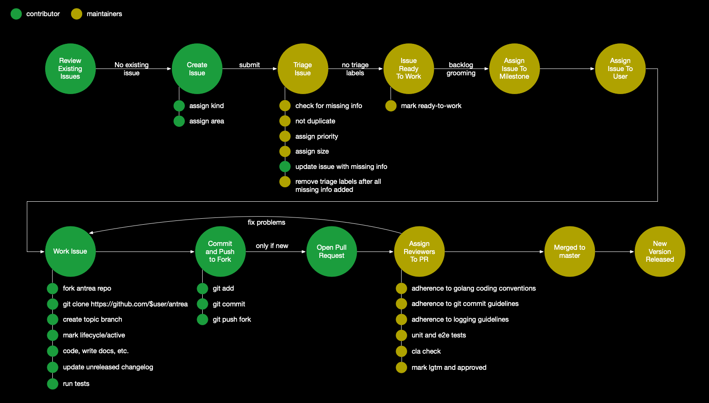

# Developer Guide

Thank you for taking the time out to contribute to project Antrea!

This guide will walk you through the process of making your first commit and how
to effectively get it merged upstream.

- [Developer Guide](#developer-guide)
  - [Getting Started](#getting-started)
    - [CLA](#cla)
    - [Accounts Setup](#accounts-setup)
  - [Contribute](#contribute)
    - [Filing An Issue](#filing-an-issue)
    - [Workflow Overview](#workflow-overview)
    - [GitHub Workflow](#github-workflow)
    - [Getting reviewers](#getting-reviewers)
    - [Building and testing your change](#building-and-testing-your-change)
    - [Running the end-to-end tests](#running-the-end-to-end-tests)
    - [Reverting a commit](#reverting-a-commit)
  - [Issue and PR Management](#issue-and-pr-management)
    - [Issue Workflow](#issue-workflow)
    - [New Issues](#new-issues)
    - [Issue Triage](#issue-triage)
    - [Issue and PR Kinds](#issue-and-pr-kinds)
      - [API Change](#api-change)
      - [Bug](#bug)
      - [Cleanup](#cleanup)
      - [Feature](#feature)
      - [Deprecation](#deprecation)
      - [Design](#design)
      - [Documentation](#documentation)
      - [Failing Test](#failing-test)
      - [Support](#support)
    - [Area Assignment](#area-assignment)
    - [Size](#size)
    - [Triage](#triage)
    - [Lifecycle](#lifecycle)
    - [Priority](#priority)

## Getting Started

To get started, let's ensure you have completed the following prerequisites for
contributing to project Antrea:
1. Read and observe the [code of conduct](CODE_OF_CONDUCT.md).
2. Sign the [CLA](#cla).
3. Check out the [Architecture document](/docs/architecture.md) for the Antrea
   architecture and design.
4. Set up necessary [accounts](#accounts-setup).
5. Set up your [development environment](docs/manual-installation.md)

Now that you're setup, skip ahead to learn how to [contribute](#contribute). 

### CLA

We welcome contributions from everyone but we can only accept them if you sign
our Contributor License Agreement (CLA). If you would like to contribute and you
have not signed it, our CLA-bot will walk you through the process when you open
a Pull Request. For questions about the CLA process, see the
[FAQ](https://cla.vmware.com/faq) or submit a question through the GitHub issue
tracker.

### Accounts Setup

At minimum, you need the following accounts for effective participation:
1. **Github**: Committing any change requires you to have a [github
   account](https://github.com/join).
2. **Slack**: Join the [Kubernetes Slack](http://slack.k8s.io/) and look for our
   [#antrea](https://kubernetes.slack.com/messages/CR2J23M0X) channel.
3. **Google Group**: Join our [mailing list](https://groups.google.com/forum/#!forum/projectantrea-dev).

## Contribute

There are multiple ways in which you can contribute, either by contributing
code in the form of new features or bug-fixes or non-code contributions like
helping with code reviews, triaging of bugs, documentation updates, filing
new issues or writing blogs/manuals etc.

In order to help you get your hands "dirty", there is a list of
[starter](https://github.com/vmware-tanzu/antrea/labels/Good%20first%20issue)
issues from which you can choose.

### Filing An Issue

Help is always appreciated. If you find something that needs fixing, please file
an issue [here](https://github.com/vmware-tanzu/antrea/issues). Please ensure
that the issue is self explanatory and has enough information for an assignee to
get started.

Before picking up a task, go through the existing
[issues](https://github.com/vmware-tanzu/antrea/issues) and make sure that your
change is not already being worked on. If it does not exist, please create a new
issue and discuss it with other members.

For simple contributions to Antrea, please ensure that this minimum set of
labels are included on your issue:

* **kind** -- common ones are `kind/feature`, `kind/support`, `kind/bug`,
  `kind/documentation`, or `kind/design`. For an overview of the different types
  of issues that can be submitted, see [Issue and PR Kinds](#issue-and-pr-kinds).
* **area** (optional) -- if you know the area the issue belongs in, you can assign it.
  Otherwise, another community member will label the issue during triage. For an
  overview of areas, see the [`docs/labels.md`](docs/labels.md).
* **size** (optional) -- if you have an idea of the size (lines of code, complexity,
  effort) of the issue, you can label it using a [size label](#size).

All other labels will be assigned during issue triage.

### Workflow Overview

Once an issue has been filed, our [issue management workflow](#issue-workflow)
will help ensure that the issue is properly triaged, assigned, and tracked.

Details of this workflow are described later in this document.

### GitHub Workflow

Developers work in their own forked copy of the repository and when ready,
submit pull requests to have their changes considered and merged into the
project's repository.

1. Fork your own copy of the repository to your GitHub account by clicking on
   `Fork` button on [Antrea's GitHub repository](https://github.com/vmware-tanzu/antrea).
2. Clone the forked repository on your local setup.
    ```
    git clone https://github.com/$user/antrea
    ```
    Add a remote upstream to track upstream Antrea repository.
    ```
    git remote add upstream https://github.com/vmware-tanzu/antrea
    ```
    Never push to upstream master
    ```
    git remote set-url --push upstream no_push
    ```
3. Create a topic branch.
    ```
    git checkout -b branchName
    ```
4. Make changes and commit it locally.
    ```
    git add <modifiedFile>
    git commit
    ```
5. Update the "Unreleased" section of the [CHANGELOG](CHANGELOG.md) for any
   significant change that impacts users.
6. Keeping branch in sync with upstream.
    ```
    git checkout branchName
    git fetch upstream
    git rebase upstream/master
    ```
7. Push local branch to your forked repository.
    ```
    git push -f $remoteBranchName branchName
    ```
8. Create a Pull request on GitHub.
   Visit your fork at `https://github.com/vmware-tanzu/antrea` and click
   `Compare & Pull Request` button next to your `remoteBranchName` branch.

### Getting reviewers

Once you have opened a Pull Request (PR), reviewers will be assigned to your
PR and they may provide review comments which you need to address.
Commit changes made in response to review comments to the same branch on your
fork. Once a PR is ready to merge, squash any *fix review feedback, typo*
and *merged* sorts of commits.

To make it easier for reviewers to review your PR, consider the following:
1. Follow the golang [coding conventions](https://github.com/golang/go/wiki/CodeReviewComments)
2. Follow [git commit](https://chris.beams.io/posts/git-commit/) guidelines.
3. Follow [logging](https://github.com/kubernetes/community/blob/master/contributors/devel/sig-instrumentation/logging.md) guidelines.

### Building and testing your change

To build the Antrea Docker image together with all Antrea bits, you can simply
do:

1. Checkout your feature branch and `cd` into it.
2. Run `make`

The second step will compile the Antrea code in a `golang` container, and build
a `Ubuntu 18.04` Docker image that includes all the generated binaries. [`Docker`](https://docs.docker.com/install)
must be installed on your local machine in advance.

Alternatively, you can build the Antrea code in your local Go environment. The
Antrea project uses the [Go modules support](https://github.com/golang/go/wiki/Modules) which was introduced in Go 1.11. It
facilitates dependency tracking and no longer requires projects to live inside
the `$GOPATH`.

To develop locally, you can follow these steps:

 1. [Install Go 1.13](https://golang.org/doc/install)
 2. Checkout your feature branch and `cd` into it.
 3. To build all Go files and install them under `bin`, run `make bin`
 4. To run all Go unit tests, run `make test-unit`

### CI testing

For more information about the tests we run as part of CI, please refer to
[ci/README.md](ci/README.md).

### Running the end-to-end tests

In addition to the unit tests, we provide a suite of end-to-end tests, which
require a running Kubernetes cluster. Instructions on how to run these tests,
including how to setup a local Kubernetes cluster, can be found in
[test/e2e/README.md](test/e2e/README.md).

### Reverting a commit

1. Create a branch in your forked repo
    ```
    git checkout -b revertName
    ```
2. Sync the branch with upstream
    ```
    git fetch upstream
    git rebase upstream/master
    ```
3. Create a revert based on the SHA of the commit.
    ```
    git revert SHA
    ```
4. Push this new commit.
    ```
    git push $remoteRevertName revertName
    ```
5. Create a Pull Request on GitHub.
   Visit your fork at `https://github.com/vmware-tanzu/antrea` and click
   `Compare & Pull Request` button next to your `remoteRevertName` branch.

## Issue and PR Management

We use labels and workflows (some manual, some automated with GitHub Actions) to
help us manage triage, prioritize, and track issue progress. 

### Issue Workflow

The purpose of this workflow is to formalize a lightweight set of processes that
will optimize issue triage and management which will lead to better release
predictability and community responsiveness for support and feature
enhancements. Additionally, Antrea must prioritize issues to ensure interlock
alignment and compatibility with other projects including Kubernetes. The
processes described here will aid in accomplishing these goals.



For additional details and to improve the metadata associated with your issues,
please keep reading.

### New Issues

When submitting a new issue, please search the existing set of issues
to see if an issue has already been created that addresses your concern.

When creating your new issue, please ensure that you:

* label the issue with the appropriate [`kind/<?>`](#kinds) label. The kind of
  issue will determine the issue workflow.
* label the issue with the appropriate [`area/<?>`](#area-assigment) label. The
  area label will identify the area of interest an issue or PR belongs in and
  will ensure the appropriate reviewers shepherd the issue or PR through to its
  closure.
* for issues, label the estimated size (if known). The size can be updated
  during backlog grooming by the contributors. This estimate is used to guide
  the number of features selected for a milestone.

### Issue Triage

Once an issue has been submitted, the CI (GitHub actions) or a human will
automatically review the submitted issue or PR to ensure that it has all relevant
information. If information is lacking or there is another problem with the
submitted issue, an appropriate [`triage/<?>`](#triage) label will be
applied.

After an issue has been triaged, the maintainers can prioritize the issue with
an appropriate [`priority/<?>`](#priority) label.

Once an issue has been submitted, categorized, triaged, and prioritized it
is marked as `ready-to-work`. A ready-to-work issue should have labels
indicating assigned areas, prioritization, and should not have any remaining
triage labels.

### Issue and PR Kinds

Use an kind label to describe the kind of issue or PR you are submitting. Valid
kinds include:

* [`kind/api-change`](#api-change) -- for api changes
* [`kind/bug`](#bug) -- for filing a bug
* [`kind/cleanup`](#cleanup) -- for code cleanup and organization
* [`kind/deprecation`](#deprecation) -- for deprecating a feature
* [`kind/design`](#design) -- for proposing a design or architectural change
* [`kind/documentation`](#documentation) -- for updating documentation
* [`kind/failing-test`](#failing-test) -- for reporting a failed test (may
  create with automation in future)
* [`kind/feature`](#feature) -- for proposing a feature
* [`kind/support`](#support) -- to request support. You may also get support by
  using our [Slack](https://kubernetes.slack.com/archives/CR2J23M0X) channel for
  interactive help. If you have not setup the appropriate accounts, please
  follow the instructions in [accounts setup](#accounts-setup).

#### API Change

A `kind/api-change` label categorizes an issue or PR as related to adding, removing,
or otherwise changing an API.

All API changes must be reviewed by MAINTAINERS in addition to the standard code
review and approval workflow.

To create an API change issue or PR:

* label your issue or PR with `kind/api-change`
* describe in the issue or PR body which API you are changing, making sure to include
  * API endpoint and schema (endpoint, Version, APIGroup, etc.)
  * Is this a breaking change?
  * Can new or older clients opt-in to this API?
  * Is there a fallback? What are the implications of not supporting this API version?

Before starting any work on an API change it is important that you have proper
review and approval from the project maintainers.

#### Bug

A `kind/bug` label categorizes an issue or PR as related to a bug.

Any problem encountered when building, configuring, or running Antrea could be a
potential case for submitting a bug.

To create a bug issue or bug fix PR:

* label your issue or PR with `kind/bug`
* describe your bug in the issue or PR body making sure to include:
  * version of Antrea
  * version of Kubernetes
  * version of OS and any relevent environment or system configuration
  * steps and/or configuration to reproduce the bug
  * any tests that demonstrate the presence of the bug
* please attach any relevent logs or diagnostic output

#### Cleanup

A `kind/cleanup` label categorizes an issue or PR as related to cleaning up
code, process, or technical debt.

To create a cleanup issue or PR:

* label your issue or PR with `kind/cleanup`
* describe your cleanup in the issue or PR body being sure to include
  * what is being cleaned
  * for what reason it is being cleaned (technical debt, deprecation, etc.)

Examples of a cleanup include:
* Adding comments to describe code execution
* Making code easier to read and follow
* Removing dead code related to deprecated features or implementations

#### Feature

A `kind/feature` label categorizes an issue or PR as related to a new feature.

To create a feature issue or PR:

* label your issue or PR with `kind/feature`
* describe your proposed feature in the issue or PR body being sure to include
  * a use case for the new feature
  * list acceptance tests for the new feature
  * describe any dependencies for the new feature
* depending on the size and impact of the feature
  * a design proposal may need to be submitted
  * the feature may need to be discussed in the community meeting

Before you begin work on your feature it is import to ensure that you have
proper review and approval from the project maintainers.

Examples of a new feature include:
* Adding a new set of metrics for enabling additional telemetry.
* Adding additional supported transport layer protocol options for network policy.
* Adding support for IPSec.

#### Deprecation

A `kind/deprecation` label categorizes an issue or PR as related to feature
marked for deprecation.

To create a deprecation issue or PR:

* label your issue or PR with `kind/deprecation`
* title the issue or PR with the feature you are deprecating
* describe the deprecation in the issue or PR body making sure to:
  * explain why the feature is being deprecated
  * discuss time-to-live for the feat
  * discuss any impacts to existing APIs

#### Design

A `kind/design` label categorizes issue or PR as related to design.

A design issue or PR is for discussing larger architectural and design proposals.
Approval of a design proposal may result in multiple additional feature,
api-change, or cleanup issues being created to implement the design.

To create a design issue:

* label your issue or PR with `kind/design`
* describe the design in the issue or PR body

Before creating additional issues or PRs that implement the proposed design it is
important to get feedback and approval from the maintainers. Design feedback
could include some of the following:

* needs additional detail
* no, this problem should be solved in another way
* this is desireable but we need help completing other issues or PRs first; then we will
  consider this design

_Note this was previously called `proposal`. We will add the `kind/design` label
to all issues currently labeled with `proposal`._

#### Documentation

A `kind/documentation` label categorizes issue or PR as related to a
documentation.

To create a documentation issue or PR:

* label your issue or PR with `kind/documentation`
* title the issue with a short description of what you are documenting
* provide a brief summary in the issue or PR body of what you are documenting. In some
  cases, it might be useful to include a checklist of changed documentation
  files to indicate your progress.

#### Failing Test

A `kind/failing-test` label categorizes issue or PR as related to a consistently
or frequently failing test.

To create a failing test issue or PR:

* label your issue or PR with `kind/failing-test`

TODO: As more automation is used in the continuous integration pipeline, we will
be able to automatically generate an issue for failing tests.

#### Support

A `kind/support` label categorizes issue as related to a support request.

To create a support issue or PR:

* label your issue or PR with `kind/support`
* title the issue or PR with a short description of your support request
* answer all of the questions in the support issue template

_Note this was previously called `support`. We will add the `kind/support` label
to all issues currently labeled with `support`.

### Area Assignment

Area labels begin with `area/` and identify areas of interest or functionality
to which an issue relates. An issue or PR could have multiple areas. These labels are
used to sort issues and PRs into categories such as:

* operating systems
* cloud platform, 
* functional area,
* operating or legal area (i.e., licensing), 
* etc.

A list of areas is maintained in the [`docs/labels.md`](docs/labels.md) document.

An area may be changed, added or deleted during issue or PR triage.

### Size

Size labels beting with `size/` and estimate the relative complexity or work
required to resolve an issue or PR. 

TODO: For submitted PRs, the size can be automatically calculated and the
appropriate label assigned.

Size labels are specified according to lines of code; however, some issues may
not relate to lines of code submission such as documentation. In those cases,
use the labels to assign an equivalent complexity or size to the task at hand.

Size labels include:

* `size/XS` -- denotes a extra small issue, or PR that changes 0-9 lines, ignoring generated files
* `size/S` -- denotes a small issue, or PR that changes 10-29 lines, ignoring generated files
* `size/M` -- denotes a medium issue, or PR that changes 30-99 lines, ignoring generated files
* `size/L` -- denotes a large issue, or PR that changes 100-499 lines, ignoring generated files
* `size/XL` -- denotes a very large issue, or PR that changes 500+ lines, ignoring generated files

Size labels are defined in the [`docs/labels.md`](docs/labels.md) document.

### Triage

As soon as new issue are submitted, they must be triaged until they are ready to
work. The maintainers may assign the following labels during the issue triage
process:

* `triage/duplicate`  -- indicates an issue is a duplicate of other open issue
* `triage/needs-information` -- indicates an issue needs more information in order to work on it
* `triage/not-reproducible` -- indicates an issue can not be reproduced as described
* `triage/unresolved` -- indicates an issue that can not or will not be resolved

Triage labels are defined in the [`docs/labels.md`](docs/labels.md) document.

### Lifecycle

To track the state of an issue, the following labels will be assigned.

* lifecycle/active -- indicates that an issue or PR is actively being worked on by a contributor
* lifecycle/frozen -- indicates that an issue or PR should not be auto-closed due to staleness
* lifecycle/rotten -- denotes an issue or PR that has aged beyond stale and will be auto-closed
* lifecycle/stale -- denotes an issue or PR has remained open with no activity and has become stale

The following schedule will be used to determine an issue's lifecycle:

* after 90 days of inactivity, an issue will be automatically marked as `lifecycle/stale`
* after 180 days of inactivity, an issue will be automatically marked as
  `lifecycle/rotten` and can then be scheduled for auto closure
* any issue marked as `lifecycle/frozen` will prevent automatic transitions to
  stale or rotten state.
* an issue marked as `lifecycle/active` adds an additional 30 days to the
  scheduled stale and rotten transitions above. If no activity is present, the
  issue can be automatically closed.

Issue lifecycle management ensures that the project backlog remains fresh and
relevent. Project maintainers and contributors will need to revisit issues to
periodically assess their relevence and progress.

TODO: Additional CI automation (GitHub actions) will be used to automatically
assign and manage some of these lifecycle labels.

Lifecycle labels are defined in the [`docs/labels.md`](docs/labels.md) document.

### Priority

A priority label signifies the overall priority that should be given to an
issue or PR. Priorities are considered during backlog grooming and help to
determine the number of features included in a milestone.

* `priority/awaiting-more-evidence` -- lowest priority. Possibly useful, but not yet enough support to actually get it done.
* `priority/backlog` -- higher priority than priority/awaiting-more-evidence.
* `priority/critical-urgent` -- highest priority. Must be actively worked on as someone's top priority right now.
* `priority/important-longterm` -- important over the long term, but may not be staffed and/or may need multiple releases to complete.
* `priority/import-soon` -- must be staffed and worked on either currently, or very soon, ideally in time for the next release.