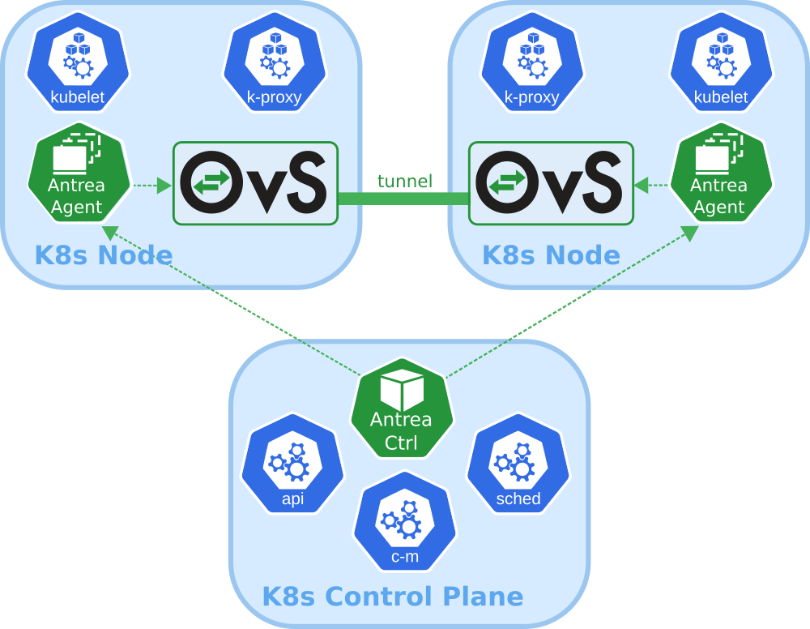

# Antrea

## Overview

Antrea is a [Kubernetes](https://kubernetes.io) networking solution intended
to be Kubernetes native. It operates at Layer3/4 to provide networking and
security services for a Kubernetes cluster, leveraging
[Open vSwitch](https://www.openvswitch.org/) as the networking data plane.

Open vSwitch is a widely adopted high-performance programmable virtual
switch; Antrea leverages it to implement Pod networking and security features.
For instance, Open vSwitch enables Antrea to implement Kubernetes
Network Policies in a very efficient manner.

## Prerequisites

Antrea has been tested with Kubernetes clusters running version 1.16 or later.

* `NodeIPAMController` must be enabled in the Kubernetes cluster.\
  When deploying a cluster with kubeadm the `--pod-network-cidr <cidr>`
  option must be specified.
* Open vSwitch kernel module must be present on every Kubernetes node.

## Getting Started

Getting started with Antrea is very simple, and takes only a few minutes.
See how it's done in the [Getting started](docs/getting-started.md) document.

## Contributing

The Antrea community welcomes new contributors. We are waiting for your PRs!

* Before contributing, please get familiar with our
[Code of Conduct](CODE_OF_CONDUCT.md).
* Check out the Antrea [Contributor Guide](CONTRIBUTING.md) for information
about setting up your development environment and our contribution workflow.
* Learn about Antrea's [Architecture and Design](docs/design/architecture.md).
Your feedback is more than welcome!
* Check out [Open Issues](https://github.com/vmware-tanzu/antrea/issues).
* Join the Antrea [community](#community) and ask us any question you may have.

### Community

* Join the [Kubernetes Slack](http://slack.k8s.io/) and look for our
[#antrea](https://kubernetes.slack.com/messages/CR2J23M0X) channel.
* Check the [Antrea Team Calendar](https://calendar.google.com/calendar/embed?src=uuillgmcb1cu3rmv7r7jrhcrco%40group.calendar.google.com)
  and join the developer and user communities!
  + The [Antrea community meeting](https://VMware.zoom.us/j/823654111?pwd=MEV6blNtUUtqallVSkVFSGZtQ1kwUT09),
every two weeks on Tuesday at 5AM GMT.
    - [Meeting minutes](https://github.com/vmware-tanzu/antrea/wiki/Community-Meetings)
    - [Meeting recordings](https://www.youtube.com/playlist?list=PLH5zTfQ3otSA6EOYDNb-MvcQRXACdCbQw)
  + [Antrea office hours](https://VMware.zoom.us/j/94245798791?pwd=RzRNVXYxdDJnNjZnNjBiUVFHZGlXdz09),
every two weeks on Tuesday at 10PM GMT.
* Join our mailing lists to always stay up-to-date with Antrea development:
  + [projectantrea-announce](https://groups.google.com/forum/#!forum/projectantrea-announce)
for important project announcements.
  + [projectantrea](https://groups.google.com/forum/#!forum/projectantrea)
for updates about Antrea or provide feedback.
  + [projectantrea-dev](https://groups.google.com/forum/#!forum/projectantrea-dev)
to participate in discussions on Antrea development.

Also check out [@ProjectAntrea](https://twitter.com/ProjectAntrea) on Twitter!

## Features

* **Kubernetes-native**: Antrea follows best practices to extend the Kubernetes
  APIs and provide familiar abstractions to users, while also leveraging
  Kubernetes libraries in its own implementation.
* **Powered by Open vSwitch**: Antrea relies on Open vSwitch to implement all
  networking functions, including Kubernetes Service load-balancing, and to
  enable hardware offloading in order to support the most demanding workloads.
* **Run everywhere**: Run Antrea in private clouds, public clouds and on bare
  metal, and select the appropriate traffic mode (with or without overlay) based
  on your infrastructure and use case.
* **Windows Node support**: Thanks to the portability of Open vSwitch, Antrea
  can use the same data plane implementation on both Linux and Windows
  Kubernetes Nodes.
* **Comprehensive policy model**: Antrea provides a comprehensive network policy
  model, which builds upon Kubernetes Network Policies with new features such as
  policy tiering, rule priorities and cluster-level policies.
* **Troubleshooting and monitoring tools**: Antrea comes with CLI and UI tools
  which provide visibility and diagnostics capabilities (packet tracing, policy
  analysis, flow inspection). It exposes Prometheus metrics and supports
  exporting network flow information which can be visualized in Kibana
  dashboards.
* **Encryption**: Encryption of inter-Node Pod traffic with IPsec tunnels when
  using an overlay Pod network.
* **Easy deployment**: Antrea is deployed by applying a single YAML manifest
  file.

Refer to the [Changelog](CHANGELOG.md) for a detailed list of features
introduced for each version release.

## Roadmap

We are adding features very quickly to Antrea. Check out the list of features we
are considering on our [Roadmap](ROADMAP.md) page. Feel free to throw your ideas
in!

## License

Antrea is licensed under the [Apache License, version 2.0](LICENSE)
