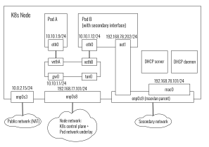

# Using Antrea with Multus

This guide will describe how to use Project Antrea with
[Multus](https://github.com/k8snetworkplumbingwg/multus-cni), in order to attach multiple
network interfaces to Pods. In this scenario, Antrea is used for the default
network, i.e. it is the CNI plugin which provisions the "primary" network
interface ("eth0") for each Pod. For the sake of this guide, we will use the
[macvlan](https://github.com/containernetworking/plugins/tree/master/plugins/main/macvlan)
CNI plugin to provision secondary network interfaces for selected Pods, but
similar steps should apply for other plugins as well,
e.g. [ipvlan](https://github.com/containernetworking/plugins/tree/master/plugins/main/ipvlan).

## Prerequisites

The only prerequisites are:

* a K8s cluster (Linux Nodes) running a K8s version supported by Antrea. At the
  time of writing, we recommend version 1.16 or later. Typically the cluster
  needs to be running on a network infrastructure that you control. For example,
  using macvlan networking will not work on public clouds like AWS.
* [`kubectl`](https://kubernetes.io/docs/tasks/tools/install-kubectl/)

All the required software will be deployed using YAML manifests, and the
corresponding container images will be downloaded from public registries.

For the sake of this guide, we will use macvlan in "bridge" mode, which supports
the creation of multiple subinterfaces on one parent interface, and connects
them all using a bridge. Macvlan in "bridge" mode requires the network to be
able to handle "promiscuous mode", as the same physical interface / virtual
adapter ends up being assigned multiple MAC addresses. When using a virtual
network for the Nodes, some configuration changes are usually required, which
depend on the virtualization technology. For example:

* when using VirtualBox and [Internal
  Networking](https://www.virtualbox.org/manual/ch06.html#network_internal), set
  the `Promiscuous Mode` to `Allow All`
* when using VMware Fusion, enable "promiscuous mode" in the guest (Node) for
  the appropriate interface (e.g. using `ifconfig`); this may prompt for your
  password on the host unless you uncheck `Require authentication to enter
  promiscuous mode` in `Preferences ... > Network`

This needs to be done for every Node VM, so it's best if you can automate this
when provisioning your VMs.

### Suggested test cluster

If you need to create a K8s cluster to test this guide, we suggest you create
one by following [these
steps](https://github.com/antrea-io/antrea/tree/main/test/e2e#creating-the-test-kubernetes-cluster-with-vagrant). You
will need to use a slightly modified Vagrantfile, which you can find
[here](test/Vagrantfile). Note that this Vagrantfile will create 3 VMs on your
machine, and each VM will be allocated 2GB of memory, so make sure you have
enough memory available. You can create the cluster with the following steps:

```bash
git clone https://github.com/antrea-io/antrea.git
cd antrea
cp docs/cookbooks/multus/test/Vagrantfile test/e2e/infra/vagrant/
cd test/e2e/infra/vagrant
./provision.sh
```

The last command will take around 10 to 15 minutes to complete. After that, your
cluster is ready and you can set the `KUBECONFIG` environment variable in order
to use `kubectl`:

```bash
export KUBECONFIG=`pwd`/infra/vagrant/playbook/kube/config
kubectl cluster-info
```

The cluster that you have created by following these steps is the one we will
use as an example in this guide.

## Practical steps

### Step 1: Deploying Antrea

For detailed information on the Antrea requirements and instructions on how to
deploy Antrea, please refer to
[getting-started.md](../../getting-started.md). To deploy the latest version of
Antrea, use:

```bash
kubectl apply -f https://raw.githubusercontent.com/antrea-io/antrea/main/build/yamls/antrea.yml
```

You may also choose a [released Antrea
version](https://github.com/antrea-io/antrea/releases).

### Step 2: Deploy Multus as a DaemonSet

```bash
git clone https://github.com/k8snetworkplumbingwg/multus-cni && cd multus-cni
cat ./images/multus-daemonset.yml | kubectl apply -f -
```

### Step 3: Create a NetworkAttachmentDefinition

Make sure that you are using the correct interface name for `"master"`: it
should be the name of the Node's network interface (e.g. `eth0`) that you want
to use as the parent interface for the macvlan secondary Pod interfaces. If you
are using our [test cluster], `enp0s9` is the correct value.

```bash
cat <<EOF | kubectl create -f -
apiVersion: "k8s.cni.cncf.io/v1"
kind: NetworkAttachmentDefinition
metadata:
  name: macvlan-conf
spec:
  config: '{
      "cniVersion": "0.3.0",
      "type": "macvlan",
      "master": "enp0s9",
      "mode": "bridge",
      "ipam": {
        "type": "dhcp"
      }
    }'
EOF
```

The above definition assumes that DHCP will be used to assign IP addresses to
the macvlan secondary interfaces. For an alternative solution using the
[whereabouts] project, please refer to this
[section](#using-whereabouts-for-ipam).

### Step 4 (optional): Create a macvlan subinterface on each Node

This step is required if you want the Node to be able to communicate with the
Pods using the secondary network:

```bash
wget https://raw.githubusercontent.com/antrea-io/antrea/main/docs/cookbooks/multus/resources/macvlan-host-init.yml
# edit file as needed
kubectl apply -f macvlan-host-init.yml
```

If you are using our [test cluster], no edits are required and you can apply the
file as is. Otherwise, make sure that you replace `enp0s9` with the name of the
parent network interface.

This manifest will create a DaemonSet that will run a bash script once on every
Node. It will:

* Enable promiscuous mode on the parent interface using `ifconfig`; if using a
  virtual network for the Nodes, this needs to be done in addition to enabling
  promiscuous mode in the hypervisor for the virtual adapters, as described in
  the [Prerequisites](#prerequisites).
* Create a macvlan subinterface for the Node
* Move the IP address from the parent interface to the new subinterface

### Step 5: Run a DHCP server

This step is very dependent on the underlying Node network. If the network to
which the macvlan parent interface belongs already uses DHCP, then you can skip
this step. Otherwise (e.g. the parent interface on the Nodes were assigned
statically), you may want to deploy a DHCP server in the K8s cluster,
and use it to assign IP addresses to the macvlan secondary interfaces. In
particular, this is the case if you are using our [test cluster].

Note that in order to deploy the DHCP server in-cluster, [step-4] is
required. You can then apply the following manifest after making the necessary
edits:

```bash
wget https://raw.githubusercontent.com/antrea-io/antrea/main/docs/cookbooks/multus/resources/dhcp-server.yml
# edit file as needed
kubectl apply -f dhcp-server.yml
```

Once again, if you are using our [test cluster], no edits are required and you
can apply the file as is. Otherwise, make sure that you edit the
`dhcp-server-conf` ConfigMap at the top of the file: the
[dhcpd.conf](https://man.openbsd.org/dhcpd.conf.5) configuration data needs to
be correct for our use case. You will need to ensure that the subnet matches the
parent interface's network and that the range of allocatable addresses does not
include the IP addresses assigned to the parent interfaces.

### Step 6: Run the DHCP daemons

When using the [dhcp
plugin](https://github.com/containernetworking/plugins/tree/master/plugins/ipam/dhcp)
to assign IP addresses to Pod interfaces, a separate daemon needs to run on each
Node, which will notably ensure that local DHCP leases are renewed
periodically. To deploy the DHCP daemon (as a DaemonSet), you can use the
following command:

```bash
kubectl apply -f https://raw.githubusercontent.com/antrea-io/antrea/main/docs/cookbooks/multus/resources/dhcp-daemon.yml
```

No edits to the manifest should be required, regardless of which K8s cluster you
are using.

### Testing

To test that the secondary interfaces are functional, you can create Pods with
the `k8s.v1.cni.cncf.io/networks: macvlan-conf` annotation. We suggest creating
a set of Pods (as a Deployment) which all request a macvlan secondary interface,
using the provided manifest:

```bash
kubectl apply -f https://raw.githubusercontent.com/antrea-io/antrea/main/docs/cookbooks/multus/resources/test.yml
```

You can then `kubectl exec` into the Pods to inspect the networking
configuration and have Pods ping each other using the secondary network.

``` bash
$ kubectl get pods -o wide
NAME                        READY   STATUS    RESTARTS   AGE   IP           NODE                NOMINATED NODE   READINESS GATES
samplepod-7956c4498-65v6m   1/1     Running   0          68s   10.10.2.10   k8s-node-worker-2   <none>           <none>
samplepod-7956c4498-9dz98   1/1     Running   0          68s   10.10.1.12   k8s-node-worker-1   <none>           <none>
samplepod-7956c4498-ghrdg   1/1     Running   0          68s   10.10.1.13   k8s-node-worker-1   <none>           <none>
samplepod-7956c4498-n65bn   1/1     Running   0          68s   10.10.2.12   k8s-node-worker-2   <none>           <none>
samplepod-7956c4498-q6vp2   1/1     Running   0          68s   10.10.1.11   k8s-node-worker-1   <none>           <none>
samplepod-7956c4498-xztf4   1/1     Running   0          68s   10.10.2.11   k8s-node-worker-2   <none>           <none>
```

```bash
$ kubectl exec samplepod-7956c4498-65v6m -- ip addr
1: lo: <LOOPBACK,UP,LOWER_UP> mtu 65536 qdisc noqueue state UNKNOWN group default qlen 1000
    link/loopback 00:00:00:00:00:00 brd 00:00:00:00:00:00
    inet 127.0.0.1/8 scope host lo
       valid_lft forever preferred_lft forever
3: eth0@if18: <BROADCAST,MULTICAST,UP,LOWER_UP> mtu 1450 qdisc noqueue state UP group default
    link/ether c2:ce:36:6b:ba:2d brd ff:ff:ff:ff:ff:ff link-netnsid 0
    inet 10.10.2.10/24 brd 10.10.2.255 scope global eth0
       valid_lft forever preferred_lft forever
4: net1@if4: <BROADCAST,MULTICAST,UP,LOWER_UP> mtu 1500 qdisc noqueue state UP group default
    link/ether be:a0:35:f2:08:2d brd ff:ff:ff:ff:ff:ff link-netnsid 0
    inet 192.168.78.205/24 brd 192.168.78.255 scope global net1
       valid_lft forever preferred_lft forever
```

```bash
$ kubectl exec samplepod-7956c4498-9dz98 -- ip addr
1: lo: <LOOPBACK,UP,LOWER_UP> mtu 65536 qdisc noqueue state UNKNOWN group default qlen 1000
    link/loopback 00:00:00:00:00:00 brd 00:00:00:00:00:00
    inet 127.0.0.1/8 scope host lo
       valid_lft forever preferred_lft forever
3: eth0@if20: <BROADCAST,MULTICAST,UP,LOWER_UP> mtu 1450 qdisc noqueue state UP group default
    link/ether 92:8f:8a:1d:a0:f5 brd ff:ff:ff:ff:ff:ff link-netnsid 0
    inet 10.10.1.12/24 brd 10.10.1.255 scope global eth0
       valid_lft forever preferred_lft forever
4: net1@if4: <BROADCAST,MULTICAST,UP,LOWER_UP> mtu 1500 qdisc noqueue state UP group default
    link/ether 22:6e:b1:0a:f3:ab brd ff:ff:ff:ff:ff:ff link-netnsid 0
    inet 192.168.78.202/24 brd 192.168.78.255 scope global net1
       valid_lft forever preferred_lft forever
```

```bash
$ kubectl exec samplepod-7956c4498-9dz98 -- ping -c 3 192.168.78.205
PING 192.168.78.205 (192.168.78.205) 56(84) bytes of data.
64 bytes from 192.168.78.205: icmp_seq=1 ttl=64 time=0.846 ms
64 bytes from 192.168.78.205: icmp_seq=2 ttl=64 time=0.410 ms
64 bytes from 192.168.78.205: icmp_seq=3 ttl=64 time=0.507 ms

--- 192.168.78.205 ping statistics ---
3 packets transmitted, 3 received, 0% packet loss, time 2013ms
rtt min/avg/max/mdev = 0.410/0.587/0.846/0.186 ms
```

### Overview of a test cluster Node

The diagram below shows an overview of a K8s Node when using the [test cluster]
and following all the steps above. For the sake of completeness, we show the
DHCP server running on that Node, but as we use a Deployment with a single
replica, the server may be running on any worker Node in the cluster.



## Using [whereabouts] for IPAM

If you do not already have a DHCP server for the underlying parent network and
you find that deploying one in-cluster is impractical, you may want to consider
using [whereabouts] to assign IP addresses to the secondary interfaces. When
using [whereabouts], follow steps 1 and 2 above, along with step 4 if you want
the Nodes to be able to communicate with the Pods using the secondary
network.

The next step is to install the [whereabouts] plugin as follows:

```bash
git clone https://github.com/dougbtv/whereabouts && cd whereabouts
kubectl apply -f ./doc/daemonset-install.yaml -f ./doc/whereabouts.cni.cncf.io_ippools.yaml
```

Then create a NetworkAttachmentDefinition like the one below, after ensuring
that `"master"` matches the name of the parent interface on the Nodes, and that
the `range` and `exclude` configuration parameters are correct for your cluster
(in particular, make sure that you exclude IP addresses assigned to Nodes). If
you are using our [test cluster], you can use the NetworkAttachmentDefinition
below as is.

```bash
cat <<EOF | kubectl create -f -
apiVersion: "k8s.cni.cncf.io/v1"
kind: NetworkAttachmentDefinition
metadata:
  name: macvlan-conf
spec:
  config: '{
      "cniVersion": "0.3.0",
      "type": "macvlan",
      "master": "enp0s9",
      "mode": "bridge",
      "ipam": {
        "type": "whereabouts",
        "datastore": "kubernetes",
        "kubernetes": { "kubeconfig": "/etc/cni/net.d/whereabouts.d/whereabouts.kubeconfig" },
        "range": "192.168.78.0/24",
        "exclude": [
           "192.168.78.0/25",
           "192.168.78.128/26",
           "192.168.78.192/29",
           "192.168.78.250/31",
           "192.168.78.252/30"
        ],
        "log_file" : "/tmp/whereabouts.log",
        "log_level" : "debug"
      }
    }'
EOF
```

You can then validate that the configuration works by running the same
[test](#testing) as above.

[whereabouts]: https://github.com/dougbtv/whereabouts
[test cluster]: #suggested-test-cluster
[step-1]: #step-1-deploying-antrea
[step-2]: #step-2-deploy-multus-as-a-daemonset
[step-3]: #step-3-create-a-networkattachmentdefinition
[step-4]: #step-4-optional-create-a-macvlan-subinterface-on-each-node
[step-5]: #step-5-run-a-dhcp-server
[step-6]: #step-6-run-the-dhcp-daemons
