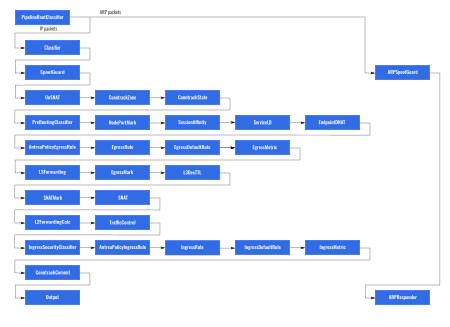

# Antrea OVS Pipeline (AntreaProxy enabled)

**This document currently makes the following assumptions:**

* Antrea is used in encap mode (an overlay network is created between all Nodes)
* AntreaProxy is enabled and supports all types of Service.
* AntreaProxy is disabled.
* IPv6 is disabled.
* All the Nodes are Linux Nodes

## Registers

We use 4 32-bit OVS registers to carry information throughout the pipeline:

* reg0 (NXM_NX_REG0):
  - bits [0..3] are used to store the traffic source (from tunnel: 0, from
    local gateway: 1, from local Pod: 2). It is set in the [ClassifierTable].
  - bit 16 is used to indicate whether the destination MAC address of a packet
    is "known", i.e. corresponds to an entry in [L2ForwardingCalcTable], which
    is essentially a "dmac" table.
  - bit 19 is used to indicate whether the destination and source MACs of the
    packet should be rewritten in the [l3ForwardingTable]. The bit is set for
    packets received from the tunnel port in the [ClassifierTable]. The
    destination MAC of such packets is the Global Virtual MAC and should be
    rewritten to the destination port's MAC before output to the port. When such
    a packet is destined to a Pod, its source MAC should be rewritten to the
    local gateway port's MAC too.
* reg1 (NXM_NX_REG1): it is used to store the egress OF port for the packet. It
  is set by [L2ForwardingCalcTable]. It is consumed by [L2ForwardingOutTable] to
  output each packet to the correct port.
* reg3 (NXM_NX_REG3): it is used to store the selected Service Endpoint IP. It
  is set in OVS group and used in table [EndpointDNATTable].
* reg4 
  * bits [0..16]: it is used to store the selected Endpoint port number of Service.
    It is set in OVS group and used in table [EndpointDNATTable].
  * bits [17..18]: it is used to store the state of a packet accessing a Service. 
    Marks in this field include,
    * 0b001: packet of Service needs to do Endpoint selection.
    * 0b010: packet of Service has done Endpoint selection.
    * 0b011: packet of Service has done Endpoint selection and the selection result
      needs to be cached.
  * bit 19: it is used to mark that whether Service type is NodePort. If it is 0x1,
    this means that the Service type of the packet is NodePort. It is set in table
    [ServiceClassifierTable] used in table [ServiceLBTable] to match NodePort packet.
  * bit 20: it is used to mark that whether the packet of Service NodePort/LoadBalancer
    from gateway requires SNAT. It is set in table [ServiceLBTable] or [sessionAffinityTable]
    and used in table [ServiceConntrackCommitTable].

## Tables



### ClassifierTable (0)

This table is used to determine which "category" of traffic (tunnel, local
gateway or local Pod) the packet belongs to. This is done by matching on the
ingress port for the packet. The appropriate value is then written to bits
[0..3] of the NXM_NX_REG0 register: 0 for tunnel, 1 for local gateway and 2 for
local Pod. This information is used by matches in subsequent tables. For a
packet received from the tunnel port, bit 19 of the NXM_NX_REG0 is set to 1, to
indicate MAC rewrite should be performed for the packet in the [L3ForwardingTable].

If you dump the flows for this table, you may see the following:

```text
1. priority=200,in_port=2 actions=load:0x1->NXM_NX_REG0[0..3],resubmit(,10)
2. priority=200,in_port=1 actions=load:0->NXM_NX_REG0[0..3],load:0x1->NXM_NX_REG0[19],resubmit(,24)
3. priority=190,in_port=18 actions=load:0x2->NXM_NX_REG0[0..3],resubmit(,10)
4. priority=190,in_port=19 actions=load:0x2->NXM_NX_REG0[0..3],resubmit(,10)
5. priority=0 actions=drop
```

Flow 1 is for traffic coming in on the local gateway. Flow 2 is for traffic
coming in through an overlay tunnel (i.e. from another Node). The next two
flows (3 and 4) are for local Pods (in this case Pods from the CoreDNS
deployment).

Local traffic then goes to [SpoofGuardTable], while tunnel traffic from other
Nodes goes to [ServiceConntrackTable]. The table-miss flow entry will drop all
unmatched packets (in practice this flow entry should almost never be used).

### SpoofGuardTable (10)

This table prevents IPv4/IPv6 and ARP
[spoofing](https://en.wikipedia.org/wiki/Spoofing_attack) from local Pods. For
each Pod (as identified by the ingress port), we ensure that:

* For IP traffic, the source IP and MAC addresses are correct, i.e. match the
  values configured on the interface when Antrea set-up networking for the Pod.
* For ARP traffic, the advertised IP and MAC addresses are correct, i.e. match
  the values configured on the interface when Antrea set-up networking for the
  Pod.

If you dump the flows for this table, you may see the following:

```text
1. table=10, priority=200,ip,in_port=2 actions=resubmit(,23)
2. table=10, priority=200,arp,in_port=2,arp_spa=10.10.0.1,arp_sha=ce:e2:d9:da:84:ff actions=resubmit(,20)
3. table=10, priority=200,arp,in_port=18,arp_spa=10.10.0.17,arp_sha=c2:6f:f8:a0:7e:a1 actions=resubmit(,20)
4. table=10, priority=200,arp,in_port=19,arp_spa=10.10.0.18,arp_sha=6e:c7:01:a0:a9:23 actions=resubmit(,20)
5. table=10, priority=200,ip,in_port=18,dl_src=c2:6f:f8:a0:7e:a1,nw_src=10.10.0.17 actions=resubmit(,23)
6. table=10, priority=200,ip,in_port=19,dl_src=6e:c7:01:a0:a9:23,nw_src=10.10.0.18 actions=resubmit(,23)
7. table=10, priority=0 actions=drop
```

### ARPResponderTable (20)

The main purpose of this table is to reply to ARP requests from the local
gateway. There are two cases:

* For the MAC address of a remote peer gateway (another Node's gateway). This
  ensures that the local Node can reach any remote Pod. Note that this is
  programmed to reply to such ARP requests with a "Global Virtual MAC"
  ("Global" because it is used by all Antrea OVS bridges), and not with the actual
  MAC address of the remote gateway. This ensures that once the traffic is received
  by the remote OVS bridge, it can be directly forwarded to the appropriate Pod
  without actually going through the gateway. The Virtual MAC is used as the
  destination MAC address for all the traffic being tunnelled.
* For the MAC address of Service traffic from host forwarding to OVS pipelien through
  local gateway. This ensures that Service traffic can be forwarded to OVS pipeline
  through local gateway. This is also programmed to reply to such ARP requests with
  a "Global Virtual MAC".

If you dump the flows for this table, you may see the following:

```text
1. table=20, priority=200,arp,arp_tpa=10.10.1.1,arp_op=1 actions=move:NXM_OF_ETH_SRC[]->NXM_OF_ETH_DST[],mod_dl_src:aa:bb:cc:dd:ee:ff,load:0x2->NXM_OF_ARP_OP[],move:NXM_NX_ARP_SHA[]->NXM_NX_ARP_THA[],load:0xaabbccddeeff->NXM_NX_ARP_SHA[],move:NXM_OF_ARP_SPA[]->NXM_OF_ARP_TPA[],load:0xa0a0101->NXM_OF_ARP_SPA[],IN_PORT
2. table=20, priority=200,arp,arp_tpa=169.254.169.253,arp_op=1 actions=move:NXM_OF_ETH_SRC[]->NXM_OF_ETH_DST[],mod_dl_src:aa:bb:cc:dd:ee:ff,load:0x2->NXM_OF_ARP_OP[],move:NXM_NX_ARP_SHA[]->NXM_NX_ARP_THA[],load:0xaabbccddeeff->NXM_NX_ARP_SHA[],move:NXM_OF_ARP_SPA[]->NXM_OF_ARP_TPA[],load:0xa0a0101->NXM_OF_ARP_SPA[],IN_PORT
3. table=20, priority=190,arp actions=NORMAL
4. table=20, priority=0 actions=drop
```

Flow 1 is the "ARP responder" for the peer Node whose local Pod subnet is
10.10.1.0/24. If we were to look at the routing table for the local Node, we
would see the following "onlink" route:

```text
1. 10.10.1.0/24 via 10.10.1.1 dev antrea-gw0 onlink
```

A similar route is installed on the gateway (antrea-gw0) interface every time the
Antrea Node Route Controller is notified that a new Node has joined the
cluster. The route must be marked as "onlink" since the kernel does not have a
route to the peer gateway 10.10.1.1: we trick the kernel into believing that
10.10.1.1 is directly connected to the local Node, even though it is on the
other side of the tunnel.

Like flow 1, flow 2 is the "ARP responder" for routes which forwards Service
traffic to OVS pipeline through local gateway. The "onlink" routes will be
installed at routing table like this:

```text
1. 169.254.169.253 via 169.254.169.253 dev antrea-gw0 onlink
2. 10.96.0.0/12 via 169.254.169.253 dev antrea-gw0 onlink
3. 192.168.3.1 via 169.254.169.253 dev antrea-gw0 onlink
4. 192.168.3.2 via 169.254.169.253 dev antrea-gw0 onlink
```

* Route 1 is used to forward Service traffic whose destination is virtual Service
  IP back to OVS pipeline through local gateway. For Service traffic from gateway
  and its Endpoint is on host, SNAT should be performed with virtual Service IP in table
  [serviceConntrackCommitTable], and the reply packets should be routed back to
  OVS pipeline with the route.
* Route 2 is used to forward ClusterIP traffic from host to OVS pipeline through
  local gateway.
* Route 3, 4 are used to forward LoadBalancer traffic to OVS pipeline through
  local gateway. Similar route will be installed when new LoadBalancer Service is
  created.

Flow 3 ensures that OVS handle the remainder of ARP traffic as a regular L2
learning switch (using the `normal` action). In particular, this takes care of
forwarding ARP requests and replies between local Pods.

The table-miss flow entry (flow 4) will drop all other packets. This flow should
never be used because only ARP traffic should go to this table, and ARP traffic will
either match flow 1 or flow 2.

### ServiceHairpinTable (23)

If a Pod accesses a Service whose Endpoint is the current Pod, the source should be
SNATed with a virtual hairpin IP in table [hairpinSNATTable] since the source and
destination IP addresses cannot be the same. For response packets, the destination
IP is the virtual hairpin IP. The destination IP should be changed back to the real IP.
If you dump the flows for this table, you should see the flows:

```text
1. table=23, priority=200,ip,nw_dst=169.254.169.252 actions=move:NXM_OF_IP_SRC[]->NXM_OF_IP_DST[],load:0x1->NXM_NX_REG0[18],resubmit(,24)
2. table=23, priority=0 actions=resubmit(,24)
```

Flow 1 is used to set source IP as destination IP and set register NXM_NX_REG0[18]
with 0x1, which is used for IPv4 traffic whose destination is Service virtual IP
(169.264.169.252). NXM_NX_REG0[18] is used in table [L2ForwardingOutTable] to match
hairpin packets and an INPORT action will be used.

### ServiceConntrackTable (24)

This table is used to invoke the `ct` action on all packets and set the `ct_zone`
(connection tracking context which is used to perform SNAT for Service packet) to a
hard-coded value, then forward traffic to [ConntrackTable]. If you dump the flow for
this table, you should see the flow:

```text
1. table=24, priority=200,ip actions=ct(table=30,zone=65521,nat)
```

### ConntrackTable (30)

This table is used to invoke the `ct` action on all packets and set the `ct_zone` 
(connection tracking context which is used to perform DNAT for Service packet) to a
hard-coded value (this hard-coded value is different from the one in table 
[ServiceConntrackTable]), then forward traffic to [ConntrackStateTable]. If you 
dump the flows for this table, you should only see 1 flow:

```text
1. table=30, priority=200,ip actions=ct(table=31,zone=65520)
```

### ConntrackStateTable (31)

This table handles all "tracked" packets (all packets are moved to the tracked
state by the previous table, [ConntrackTable] and [ServiceConntrackTable]). It serves
the following purposes:

* Forward tracked Service traffic to table [EgressRuleTable] directly and set bit 19 
  of NXM_NX_REG0.
* Drop packets reported as invalid by conntrack.
* Forward other tracked traffic to table [EgressRuleTable] directly.
* Forward the first packet of Service traffic to tables [ServiceClassifierTable], 
  [SessionAffinityTable], [ServiceLBTable].

If you dump the flows for this table, you should see the following:

```text
1. table=31, priority=200,ct_state=-new+trk,ct_mark=0x21,ip actions=load:0x1->NXM_NX_REG0[19],resubmit(,50)
2. table=31, priority=190,ct_state=+inv+trk,ip actions=drop
3. table=31, priority=190,ct_state=-new+trk,ip actions=resubmit(,50)
4. table=31, priority=0 actions=resubmit(,35),resubmit(,40),resubmit(,41)
```

Flow 1 is used to forward tracked Service traffic to table [EgressRuleTable] directly,
without passing table [ServiceClassifierTable], [SessionAffinityTable], [ServiceLBTable], 
[EndpointDNATTable]. The flow also sets bit 19 of NXM_NX_REG0, which indicates that the
destination and source MACs of the packet should be rewritten in the [l3ForwardingTable].

Flow 2 is used to drop packets which is reported as invalid by conntrack.

Flow 3 is used to forward other tracked traffic to [EgressRuleTable] directly,
without passing table [ServiceClassifierTable], [SessionAffinityTable], [ServiceLBTable], 
[EndpointDNATTable].

Flow 4 is used to match the first packet of Service and forward it to table
[ServiceClassifierTable], [SessionAffinityTable], [ServiceLBTable].

### ServiceClassifierTable (35)

This table is used to match the first packet of Service NodePort and set bit 19
of NXM_NX_REG0. The register will be used in [serviceLBTable] to match NodePort packet.

If you dump the flows for this table, you should see something like this:

```text
1. table=35, priority=200,ip,nw_dst=10.176.25.28 actions=load:0x1->NXM_NX_REG4[19]
2. table=35, priority=200,ip,nw_dst=192.168.77.100 actions=load:0x1->NXM_NX_REG4[19]
3. table=35, priority=200,ip,nw_dst=172.17.0.1 actions=load:0x1->NXM_NX_REG4[19]
4. table=35, priority=200,ip,nw_dst=10.10.0.1 actions=load:0x1->NXM_NX_REG4[19]
5. table=35, priority=200,ip,nw_dst=169.254.169.253 actions=load:0x1->NXM_NX_REG4[19]
```

Flow 1-4 are used to match the first packet of Service NodePort from client on a Pod.
Flow 5 is used to match the first packet of Service NodePort from remote since before
forwarding to OVS the destination IP of the packet has been performed DNAT with the
virtual Service IP `169.254.169.253`.

### SessionAffinityTable (40)

For Service whose SessionAffinity is None, this table is used to set bits [16..18] of
NXM_NX_REG4 as 0b001, which means the packet needs to do Endpoint selection. If you 
dump the flow, you should see the flow like following:

```text
table=40, priority=0 actions=load:0x1->NXM_NX_REG4[16..18]
```

For Service whose SessionAffinity is ClientIP, when a client accesses the Service for
the first time, a learned flow with hard timeout which equals SessionAffinity timeout
will be generated in this table. This will be explained in detail in next chapter.

### ServiceLBTable (41)

This table is used to implement Service Endpoint selection with OVS group.

#### ClusterIP ####
When a ClusterIP Service whose SessionAffinity is None is created, you should see the
following flow:

```text
1. table=41, priority=200,tcp,reg4=0x10000/0x70000,nw_dst=10.107.100.231,tp_dst=443 actions=load:0x2->NXM_NX_REG4[16..18],load:0x1->NXM_NX_REG0[19],group:5
```

For flow 1, the match conditions:
* `reg4=0x10000/0x70000`, bits [16..18] of NXM_NX_REG4 is 0b001, which is used to
  match the packet whose status of Service packet is to do Endpoint selection. The
  register is set in table [SessionAffinityTable] by flow
  `table=40, priority=0 actions=load:0x1->NXM_NX_REG4[16..18]`
* `nw_dst=10.107.100.231` is used to match the IP address of ClusterIP.
* `tcp` is used to match TCP protocol.
* `tp_dst=443` is used to match the port number of ClusterIP.

the actions:
* `load:0x2->NXM_NX_REG4[16..18]` is to set the status of Service as 0b002, which 
  means that Endpoint selection has been done. Note that, the Endpoint selection is
  not done yet. Endpoint selection will be done in the target OVS group. More strictly
  speaking, this action should be in the OVS group entry. However, according to PR
  [#2101](https://github.com/antrea-io/antrea/pull/2101), to hold more Endpoints in an
  OVS group entry, this action is moved here.
* `load:0x1->NXM_NX_REG0[19]` is used to set bit 19 of NXM_NX_REG0, which means that
  the source and destination MACs should be rewritten.
* `group:5` is used to set the target OVS group. Group 5 should be created first before
  the flow is created.

Dump the group entry with command `ovs-ofctl dump-groups br-int 5`, you can see the
following:

```text
group_id=5,type=select,\
bucket=bucket_id:0,weight:100,actions=load:0xa0a0002->NXM_NX_REG3[],load:0x23c1->NXM_NX_REG4[0..15],resubmit(,42),\
bucket=bucket_id:1,weight:100,actions=load:0xa0a0003->NXM_NX_REG3[],load:0x23c1->NXM_NX_REG4[0..15],resubmit(,42),\
bucket=bucket_id:2,weight:100,actions=load:0xa0a0004->NXM_NX_REG3[],load:0x23c1->NXM_NX_REG4[0..15],resubmit(,42)
```

There are three buckets which have the same weight. Every bucket has the same
possibility to be selected since they have the same weight. The selected bucket
will load Endpoint IP to NXM_NX_REG3, Endpoint port number to bits [0..15] of
NXM_NX_REG4. Then the packet goes to table [EndpointDNATTable].

If SessionAffinity of the ClusterIP is ClientIP, you should see the following flows:

```text
1. table=41, priority=200,tcp,reg4=0x10000/0x70000,nw_dst=10.107.100.231,tp_dst=443 actions=load:0x3->NXM_NX_REG4[16..18],load:0x1->NXM_NX_REG0[19],group:5
2. table=41, priority=190,tcp,reg4=0x30000/0x70000,nw_dst=10.107.100.231,tp_dst=443 actions=\
   learn(table=40,hard_timeout=300,priority=200,delete_learned,cookie=0x2040000000008, \
     eth_type=0x800,nw_proto=6,NXM_OF_TCP_DST[],NXM_OF_IP_DST[],NXM_OF_IP_SRC[],\
     load:NXM_NX_REG3[]->NXM_NX_REG3[],load:NXM_NX_REG4[0..15]->NXM_NX_REG4[0..15],load:0x2->NXM_NX_REG4[16..18],load:0x1->NXM_NX_REG0[19]),\
   load:0x2->NXM_NX_REG4[16..18],\
   resubmit(,42)
```

When a client accesses the ClusterIP for the first time, the first packet will be
matched flow 1. Note the action `load:0x3->NXM_NX_REG4[16..18]`, this means that
the Service Endpoint selection result needs to be cached. Due to the same reason,
the Endpoint selection is not done yet. 

Dump the group entry with command `ovs-ofctl dump-groups br-int 5`, you can see the
following:

```text
group_id=5,type=select,\
bucket=bucket_id:0,weight:100,actions=load:0xa0a0002->NXM_NX_REG3[],load:0x23c1->NXM_NX_REG4[0..15],resubmit(,41),\
bucket=bucket_id:1,weight:100,actions=load:0xa0a0003->NXM_NX_REG3[],load:0x23c1->NXM_NX_REG4[0..15],resubmit(,41),\
bucket=bucket_id:2,weight:100,actions=load:0xa0a0004->NXM_NX_REG3[],load:0x23c1->NXM_NX_REG4[0..15],resubmit(,41)
```

Note the action `resubmit(,41)`, the first packet of the ClusterIP goes back to table
[ServiceLBTable], not goes to table [EndpointDNATTable], then the packet will be matched
by flow 2 since bits [16..18] of NXM_NX_REG4 is 0b011. One action of the flow is
to generate a learned flow in table [SessionAffinityTable], the other one is to resubmit
the packet to table [EndpointDNATTable].

Then if you dump flows of table [SessionAffinityTable], you should see the flow:

```text
table=40, hard_timeout=300, priority=200,tcp,nw_src=10.10.0.1,nw_dst=10.107.100.231,tp_dst=443 \
actions=load:0xa0a0002->NXM_NX_REG3[],load:0x23c1->NXM_NX_REG4[0..15],load:0x2->NXM_NX_REG4[16..18],load:0x1->NXM_NX_REG0[19]
```

Note that, the above flow has higher priority than the flow `table=40, priority=0 actions=load:0x1->NXM_NX_REG4[16..18]`
in table [SessionAffinityTable]. When the same client accesses the ClusterIP again, the
first packet will be matched by the generated flow. The actions:

* `load:0xa0a0004->NXM_NX_REG3[]` is to load Endpoint IP to NXM_NX_REG3.
* `load:0x50->NXM_NX_REG4[0..15]` is to load Endpoint port number to bits [0..15] of
  NXM_NX_REG4.
* `load:0x2->NXM_NX_REG4[16..18]` is to set bits [16..18] of NXM_NX_REG4 as 0b010,
  which means that Service has done Endpoint selection.
* `load:0x1->NXM_NX_REG0[19]` is to bit 19 of NXM_NX_REG4, which means the source and
  destination MACs should be rewritten.

Note that, bits [16..18] of NXM_NX_REG4 is 0b010, then the packet will not matched by
any flows in table [ServiceLBTable] except the last one. The last one just forwards
the packet to the next table [EndpointDNATTable]. The client will access the same
Endpoint within the session timeout of SessionAffinity.

#### NodePort ####
When a NodePort Service whose SessionAffinity is None is created, externalTrafficPolicy
is Cluster, you should see the following flows:

```text
1. table=41, priority=200,tcp,reg4=0x10000/0x70000,nw_dst=10.101.112.140,tp_dst=80 actions=load:0x2->NXM_NX_REG4[16..18],load:0x1->NXM_NX_REG0[19],group:9
2. table=41, priority=200,tcp,reg4=0x90000/0xf0000,tp_dst=30001 actions=load:0x2->NXM_NX_REG4[16..18],load:0x1->NXM_NX_REG0[19],load:0x1->NXM_NX_REG4[20],group:9
```

For flow 1, when creating a NodePort Service, a ClusterIP flow will be also created.
For flow 2, the match conditions:
* `reg4=0x90000/0xf0000`, bits [16..20] of NXM_NX_REG4 is 0b1001, this is a union value.
  Bit [16..18] is 0b001, which is used to match the packet whose status of Service packet
  is to do Endpoint selection, and it is set in table [SessionAffinityTable] by flow
  `table=40, priority=0 actions=load:0x1->NXM_NX_REG4[16..18]`. Bit 20 is 0b1, which is
  used to match the packet whose Service type is NodePort, and it is set in table [serviceClassifierTable].
* `tcp` is used to match TCP protocol.
* `tp_dst=30001` is used to match the port number of NodePort.

the actions:
* `load:0x2->NXM_NX_REG4[16..18]` is as above [ClusterIP].
* `load:0x1->NXM_NX_REG0[19]` is as above [ClusterIP].
* `group:5` is as above [ClusterIP].
* `load:0x1->NXM_NX_REG4[20]` is used to mark that the packet requires SNAT. This mark
  will be consumed in table [serviceConntrackCommitTable]. 

If externalTrafficPolicy of the NodePort Service is Local, you should see the following
flow:

```text
1. table=41, priority=200,tcp,reg4=0x10000/0x70000,nw_dst=10.101.112.140,tp_dst=80 actions=load:0x2->NXM_NX_REG4[16..18],load:0x1->NXM_NX_REG0[19],group:9
2. table=41, priority=200,tcp,reg4=0x90000/0xf0000,tp_dst=30001 actions=load:0x2->NXM_NX_REG4[16..18],load:0x1->NXM_NX_REG0[19],group:10
```

Note that, one difference of flow 2 is that the action which is used to set SNAT mark is
not needed. Another difference is that the target OVS group number is a new one.

If you dump the OVS group 9, 10, you should see the following:

```text
group_id=9,type=select,\
bucket=bucket_id:0,weight:100,actions=load:0xa0a0002->NXM_NX_REG3[],load:0x50->NXM_NX_REG4[0..15],resubmit(,42),\
bucket=bucket_id:1,weight:100,actions=load:0xa0a0a03->NXM_NX_REG3[],load:0x50->NXM_NX_REG4[0..15],resubmit(,42),\
bucket=bucket_id:2,weight:100,actions=load:0xa0a0a04->NXM_NX_REG3[],load:0x50->NXM_NX_REG4[0..15],resubmit(,42)

group_id=10,type=select,\
bucket=bucket_id:0,weight:100,actions=load:0xa0a0002->NXM_NX_REG3[],load:0x50->NXM_NX_REG4[0..15],resubmit(,42)
```

Since externalTrafficPolicy of the Service NodePort is Local, only local Node Endpoints are
in OVS group 10. OVS group 9 includes all Endpoints from all Nodes.

If SessionAffinity of theNodePort Service is ClientIP, externalTrafficPolicy is Cluster,
you should see the following flows:

```text
1. table=41, priority=200,tcp,reg4=0x10000/0x70000,nw_dst=10.101.112.140,tp_dst=80 actions=load:0x3->NXM_NX_REG4[16..18],load:0x1->NXM_NX_REG0[19],group:9
2. table=41, priority=190,tcp,reg4=0x30000/0x70000,nw_dst=10.101.112.140,tp_dst=80 actions=\
   learn(table=40,hard_timeout=300,priority=200,delete_learned,cookie=0x2040000000008, \
     eth_type=0x800,nw_proto=6,NXM_OF_TCP_DST[],NXM_OF_IP_DST[],NXM_OF_IP_SRC[],\
     load:NXM_NX_REG3[]->NXM_NX_REG3[],load:NXM_NX_REG4[0..15]->NXM_NX_REG4[0..15],load:0x2->NXM_NX_REG4[16..18],load:0x1->NXM_NX_REG0[19]),load:0x2->NXM_NX_REG4[16..18],\
   resubmit(,42)
3. table=41, priority=200,tcp,reg4=0x90000/0xf0000,tp_dst=30001 actions=load:0x3->NXM_NX_REG4[16..18],load:0x1->NXM_NX_REG0[19],load:0x1->NXM_NX_REG4[20],group:9
4. table=41, priority=190,tcp,reg4=0xb0000/0xf0000,tp_dst=30001 actions=\
   load:0x1->NXM_NX_REG4[20],\
   learn(table=40,hard_timeout=300,priority=200,delete_learned,cookie=0x3040000000002,\
     eth_type=0x800,nw_proto=6,NXM_OF_TCP_DST[],load:0x1->NXM_NX_REG4[20],NXM_OF_IP_DST[],NXM_OF_IP_SRC[],\
     load:NXM_NX_REG3[]->NXM_NX_REG3[],load:NXM_NX_REG4[0..15]->NXM_NX_REG4[0..15],load:0x2->NXM_NX_REG4[16..18],load:0x1->NXM_NX_REG0[19]),\
   load:0x2->NXM_NX_REG4[16..18],\
   resubmit(,42)
```

If SessionAffinity of theNodePort Service is ClientIP, externalTrafficPolicy is Local,
you should see the following flows:

```text
1. table=41, priority=200,tcp,reg4=0x10000/0x70000,nw_dst=10.101.112.140,tp_dst=80 actions=load:0x3->NXM_NX_REG4[16..18],load:0x1->NXM_NX_REG0[19],group:9
2. table=41, priority=190,tcp,reg4=0x30000/0x70000,nw_dst=10.101.112.140,tp_dst=80 actions=\
   learn(table=40,hard_timeout=300,priority=200,delete_learned,cookie=0x2040000000008, \
     eth_type=0x800,nw_proto=6,NXM_OF_TCP_DST[],NXM_OF_IP_DST[],NXM_OF_IP_SRC[],\
     load:NXM_NX_REG3[]->NXM_NX_REG3[],load:NXM_NX_REG4[0..15]->NXM_NX_REG4[0..15],load:0x2->NXM_NX_REG4[16..18],load:0x1->NXM_NX_REG0[19]),load:0x2->NXM_NX_REG4[16..18],\
   resubmit(,42)
3. table=41, priority=200,tcp,reg4=0x90000/0xf0000,tp_dst=30001 actions=load:0x3->NXM_NX_REG4[16..18],load:0x1->NXM_NX_REG0[19],group:10
4. table=41, priority=190,tcp,reg4=0xb0000/0xf0000,tp_dst=30001 actions=\
   learn(table=40,hard_timeout=300,priority=200,delete_learned,cookie=0x3040000000002,\
     eth_type=0x800,nw_proto=6,NXM_OF_TCP_DST[],load:0x1->NXM_NX_REG4[20],NXM_OF_IP_DST[],NXM_OF_IP_SRC[],\
     load:NXM_NX_REG3[]->NXM_NX_REG3[],load:NXM_NX_REG4[0..15]->NXM_NX_REG4[0..15],load:0x2->NXM_NX_REG4[16..18],load:0x1->NXM_NX_REG0[19]),\
   load:0x2->NXM_NX_REG4[16..18],\
   resubmit(,42)
```

#### LoadBalancer ####
When a LoadBalancer Service whose SessionAffinity is None is created, externalTrafficPolicy
is Cluster, you should see the following flows:

```text
1. table=41, priority=200,tcp,reg4=0x10000/0x70000,nw_dst=10.105.172.64,tp_dst=50000 actions=load:0x2->NXM_NX_REG4[16..18],load:0x1->NXM_NX_REG0[19],group:11
2. table=41, priority=200,tcp,reg4=0x90000/0xf0000,tp_dst=30720 actions=load:0x2->NXM_NX_REG4[16..18],load:0x1->NXM_NX_REG0[19],load:0x1->NXM_NX_REG4[20],group:11
3. table=41, priority=200,tcp,reg4=0x10000/0x70000,nw_dst=192.168.3.1,tp_dst=50000 actions=load:0x2->NXM_NX_REG4[16..18],load:0x1->NXM_NX_REG0[19],group:11
```

For flow 1, when creating a LoadBalancer Service, a ClusterIP flow will be also created.
For flow 2, when creating a LoadBalancer Service, a NodePort flow will be also created.
For flow 3, a flow is created to match the ingress IP of the LoadBalancer. `192.168.3.1`
is the ingress IP, and the actions have nothing different.

For other cases, like SessionAffinity is ClientIP, or externalTrafficPolicy is Local, 
it is almost the same as [ClusterIP] or [NodePort].

### EndpointDNATTable (42)

The table implements DNAT for Service traffic after Endpoint selection for the first
packet of Service.

If you dump the flows for this table, you should see flows like the following:

```text
1. table=42, priority=200,tcp,reg3=0xc0a84d64,reg4=0x2192b/0x7ffff actions=ct(commit,table=45,zone=65520,nat(dst=192.168.77.100:6443),exec(load:0x21->NXM_NX_CT_MARK[]))
2. table=42, priority=200,tcp,reg3=0xc0a84d65,reg4=0x2286d/0x7ffff actions=ct(commit,table=45,zone=65520,nat(dst=192.168.77.101:10349),exec(load:0x21->NXM_NX_CT_MARK[]))
3. table=42, priority=200,tcp,reg3=0xa0a0004,reg4=0x20050/0x7ffff actions=ct(commit,table=45,zone=65520,nat(dst=10.10.0.4:80),exec(load:0x21->NXM_NX_CT_MARK[]))
4. table=42, priority=200,tcp,reg3=0xa0a0102,reg4=0x20050/0x7ffff actions=ct(commit,table=45,zone=65520,nat(dst=10.10.1.2:80),exec(load:0x21->NXM_NX_CT_MARK[]))
5. table=42, priority=200,udp,reg3=0xa0a0002,reg4=0x20035/0x7ffff actions=ct(commit,table=45,zone=65520,nat(dst=10.10.0.2:53),exec(load:0x21->NXM_NX_CT_MARK[]))
6. table=42, priority=190,reg4=0x20000/0x70000 actions=load:0x1->NXM_NX_REG4[16..18],resubmit(,41)
7. table=42, priority=0 actions=resubmit(,45)
```

For Flow 1-5, DNAT is performed with the IP stored in NXM_NX_REG3 and port stored in bits
[0..15] of NXM_NX_REG4 by `ct` action. Note that, the match condition `reg4=0x2192b/0x7ffff`
is a union value. Bits [0..15] is the port. Bits [16..18] is 0b010, which means the Service
has done Endpoint selection. The zone number is `65520`, which is the same as the flow
`table=30, priority=200,ip actions=ct(table=31,zone=65520)` in table [ConntrackTable].
Service ct_mark `0x21` is also marked.

For flow 6, if none of the flows described above are hit, send the packet back to table
[ServiceLBTable] to select the Endpoint.

Flow 7 is used to match non-Service traffic.

### L3ForwardingTable (70)

This is the L3 routing table. If you dump flows for the table, you may see the following
flows:

```text
1. table=70, priority=210,ct_state=+rpl+trk,ct_mark=0x20,ip actions=mod_dl_dst:ea:b8:5e:a6:c2:4c,resubmit(,80)
2. table=70, priority=200,ip,reg0=0x80000/0x80000,nw_dst=10.10.0.1 actions=mod_dl_dst:ea:b8:5e:a6:c2:4c,resubmit(,80)
3. table=70, priority=200,ip,reg0=0x80000/0x80000,nw_dst=10.10.0.2 actions=mod_dl_src:ea:b8:5e:a6:c2:4c,mod_dl_dst:b6:05:af:5f:55:6d,resubmit(,72)
4. table=70, priority=200,ip,reg0=0x80000/0x80000,nw_dst=10.10.0.4 actions=mod_dl_src:ea:b8:5e:a6:c2:4c,mod_dl_dst:ae:75:24:c1:44:6f,resubmit(,72)
5. table=70, priority=200,ip,reg0=0x80000/0x80000,nw_dst=10.10.0.3 actions=mod_dl_src:ea:b8:5e:a6:c2:4c,mod_dl_dst:ce:f2:73:e6:af:8f,resubmit(,72)
6. table=70, priority=200,ip,nw_dst=10.10.1.0/24 actions=mod_dl_src:ea:b8:5e:a6:c2:4c,mod_dl_dst:aa:bb:cc:dd:ee:ff,load:0xc0a8990a->NXM_NX_TUN_IPV4_DST[],resubmit(,72)
7. table=70, priority=190,ct_state=+trk,ct_mark=0x21,ip,reg0=0x80000/0x80000 actions=mod_dl_dst:ea:b8:5e:a6:c2:4c,resubmit(,72)
8. table=70, priority=0 actions=resubmit(,80)
```

For flow 1-6, flow 8, documented in [ovs-pipeline.md](./ovs-pipeline.md).

For flow 8, if `ct_state` is `+trk` and `ct_mark` is `0x21`, this means that it is Service
traffic and its destination is not a Pod. The traffic should be forwarded to local gateway
by rewriting the destination MAC to local gateway's MAC.

### ConntrackCommitTable (105)

As mentioned before, this table is in charge of committing all new connections
which are not dropped because of Network Policies. If you dump the flows for this
table, you should see something like this:

```text
1. table=105, priority=210,ct_mark=0x21,ip,reg0=0x1/0xf actions=resubmit(,106)
2. table=105, priority=200,ct_state=+new+trk,ip,reg0=0x1/0xf actions=ct(commit,table=108,zone=65520,exec(load:0x20->NXM_NX_CT_MARK[]))
3. table=105, priority=190,ct_state=+new+trk,ip actions=ct(commit,table=108,zone=65520)
4. table=105, priority=190,ct_state=+trk,ct_mark=0x21,ip,reg4=0x20000/0x70000 actions=resubmit(,108)
6. table=105, priority=0 actions=resubmit(,108)
```

For flow 2-3, documented in [ovs-pipeline.md](./ovs-pipeline.md).

Flow 1 is used to match the Service traffic from local gateway, then the matched traffic
goes to table [ServiceConntrackCommitTable]. Flow 4 is used to match the Service traffic
from Pods and the matched traffic goes to table [HairpinSNATTable].

### ServiceConntrackCommitTable (106)

The table is used to process Service traffic from local gateway. If you dump the flows for
this table, you should see something like this:

```text
1. table=106, priority=210,ct_state=+new+trk,ip,reg1=0x2 actions=ct(commit,table=108,zone=65521,nat(src=169.254.169.253))
2. table=106, priority=200,ct_state=+new+trk,ip,reg4=0x100000/0x100000 actions=ct(commit,table=108,zone=65521,nat(src=10.10.0.1))
3. table=106, priority=200,ct_state=-new+trk,ip actions=ct(table=108,zone=65521,nat)
4. table=106, priority=0 actions=resubmit(,108)
```

Flow 1 is used to perform SNAT with a virtual IP `169.254.169.253` for the first packet of
Service. Since the packet is from gateway, and its output interface is also gateway, so
SNAT must be performed with an IP which is not gateway IP anyway. It is used for the following cases:
* The first packet of NodePort/LoadBalancer and the Endpoint is on host network. Note that,
  this flow will change the behavior of the packet that NodePort/LoadBalancer whose
  externalTrafficPolicy is Local and the Endpoint is on host network. According to the
  definition of externalTrafficPolicy Local, the source IP should be retained. If the
  Endpoint is on host network, there should be only one backend Pod of the Service on
  a Node (It is impossible to have more than one Pods which listen on the same port on
  host network), so it is not useful to expose the Pod as NodePort Service, as it makes
  no difference to access it directly.
* The first packet of ClusterIP and the Endpoint is on host network.

Flow 2 is used to perform SNAT with gateway IP for the first packet of Service
NodePort/LoadBalancer whose externalTrafficPolicy is Cluster.

The zone number is `65521` in operation `ct` of flow 1 and flow 2, which is the same as
the flow `table=24, priority=200,ip actions=ct(table=30,zone=65521,nat)` in table [ServiceConntrackTable].
The zone number is different from the that which is used for DNAT.

Flow 3 is used to perform SANT for the consequent request packets of Service traffic whose
first packet has been committed by flow 1 or flow 2. For example:

Assumed that:
* 192.168.77.1 is the IP address of client.
* 192.168.77.100 is the IP address of K8s Node.
* 30001 is a NodePort port.
* 10.10.0.1 is the IP address of Antrea gateway.
* 10.10.0.3 is the Endpoint of NodePort Service.

```text
* packet 1 (request)
  * client                     192.168.77.1:12345->192.168.77.100:30001
  * ct zone SNAT 65521         192.168.77.1:12345->192.168.77.100:30001
  * ct zone DNAT 65520         192.168.77.1:12345->192.168.77.100:30001
  * ct commit DNAT zone 65520  192.168.77.1:12345->192.168.77.100:30001  =>  192.168.77.1:12345->10.10.0.3:80
  * ct commit SNAT zone 65521  192.168.77.1:12345->10.10.0.3:80          =>  10.10.0.1:12345->10.10.0.3:80
  * output
* packet 2 (response)
  * Pod                         10.10.0.3:80->10.10.0.1:12345
  * ct zone SNAT 65521          10.10.0.3:80->10.10.0.1:12345            =>  10.10.0.3:80->192.168.77.1:12345
  * ct zone DNAT 65520          10.10.0.3:80->192.168.77.1:12345         =>  192.168.77.1:30001->192.168.77.1:12345
  * output
* packet 3 (request)
  * client                     192.168.77.1:12345->192.168.77.100:30001
  * ct zone SNAT 65521         192.168.77.1:12345->192.168.77.100:30001
  * ct zone DNAT 65520         192.168.77.1:12345->10.10.0.3:80
  * ct zone SNAT 65521         192.168.77.1:12345->10.10.0.3:80          =>  10.10.0.1:12345->10.10.0.3:80
  * output
* pkt ...
```

We can see that the source IP address of packet 3 cannot be transformed through zone
65521 as there is no connection track of `192.168.77.1:12345<->192.168.77.100:30001`,
and the source IP is still 192.168.77.100. Before output, packet 3 requires SNAT,
however the connection has been committed, so this flow is used to perform SNAT for
packets like packet 3.

Flow 4 is used to match the Service packets that don't require SNAT.

### HairpinSNATTable (108)

The table is used to handle the two following scenarios:
* Packet of Service from local gateway, and its Endpoint is on host network, which
  means the output interface is also local gateway.
* A Pod accesses a Service whose Endpoint is the current Pod, which means the input
  and output interfaces are the same.

If you dump the flows for this table, you should see the flows:

```text
1. table=108, priority=200,ip,reg0=0x1/0xf,reg1=0x2 actions=load:0x1->NXM_NX_REG0[18],resubmit(,110)
2. table=108, priority=200,ip,nw_src=10.10.0.4,nw_dst=10.10.0.4 actions=mod_nw_src:169.254.169.252,load:0x1->NXM_NX_REG0[18],resubmit(,110)
3. table=108, priority=200,ip,nw_src=10.10.0.2,nw_dst=10.10.0.2 actions=mod_nw_src:169.254.169.252,load:0x1->NXM_NX_REG0[18],resubmit(,110)
4. table=108, priority=200,ip,nw_src=10.10.0.3,nw_dst=10.10.0.3 actions=mod_nw_src:169.254.169.252,load:0x1->NXM_NX_REG0[18],resubmit(,110)
5. table=108, priority=0 actions=resubmit(,110)
```

Flow 1 is used to match the packet of Service from local gateway and the Endpoint
is on host network. Bit 18 of NXM_NX_REG0 should be set, and it will be consumed
in table [L2ForwardingOutTable]. The matched packets will be output with action
INPORT instead of action output.

Flow 2-4 are used to match the packet of Service from Pods. The source IP should be
SNATed with a virtual hairpin IP since the source and destination IP addresses cannot
be the same. For response packets, the destination IP is the virtual hairpin IP and
will be changed back to the real IP in table [ServiceHairpinTable].  Bit 18 of
NXM_NX_REG0 should be also set because the input and output interfaces are the
same.

[ClassifierTable]: #classifiertable-0
[SpoofGuardTable]: #spoofguardtable-10
[ARPResponderTable]: #arprespondertable-20
[ConntrackTable]: #conntracktable-30
[serviceConntrackTable]: #serviceConntrackTable-24
[ConntrackStateTable]: #conntrackstatetable-31
[ServiceClassifierTable]: #serviceClassifierTable-35
[SessionAffinityTable]: #sessionAffinityTable-40
[ServiceLBTable]: #serviceLBTable-41
[EndpointDNATTable]: #endpointDNATTable-42
[L3ForwardingTable]: #l3forwardingtable-70
[ConntrackCommitTable]: #conntrackcommittable-105
[ServiceConntrackCommitTable]: #serviceConntrackCommitTable-106
