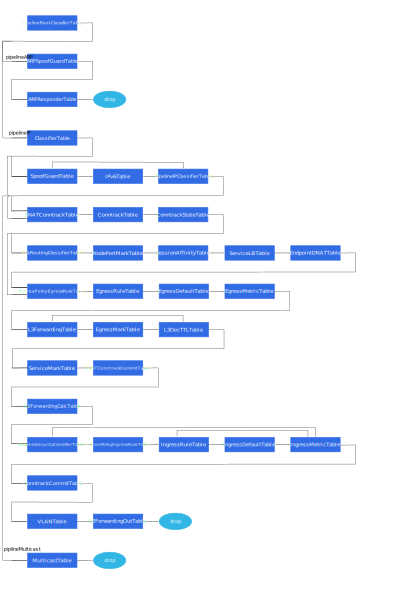

# Antrea OVS Pipeline

## Terminology

* *Node Route Controller*: the [K8s
  controller](https://kubernetes.io/docs/concepts/architecture/controller/)
  which is part of the Antrea Agent and watches for updates to Nodes. When a
  Node is added, it updates the local networking configuration (e.g. configure
  the tunnel to the new Node). When a Node is deleted, it performs the necessary
  clean-ups.
* *peer Node*: this is how we refer to other Nodes in the cluster, to which the
  local Node is connected through a Geneve, VXLAN, GRE, or STT tunnel.
* *Global Virtual MAC*: a virtual MAC address which is used as the destination
  MAC for all tunnelled traffic across all Nodes. This simplifies networking by
  enabling all Nodes to use this MAC address instead of the actual MAC address
  of the appropriate remote gateway. This enables each vSwitch to act as a
  "proxy" for the local gateway when receiving tunnelled traffic and directly
  take care of the packet forwarding. At the moment, we use an hard-coded value
  of `aa:bb:cc:dd:ee:ff`.
* *Antrea-native Policies*: Antrea ClusterNetworkPolicy and Antrea NetworkPolicy
  CRDs, as documented [here](../antrea-network-policy.md).
* *`normal` action*: OpenFlow defines this action to submit a packet to "the
  traditional non-OpenFlow pipeline of the switch". That is, if a flow uses this
  action, then the packets in the flow go through the switch in the same way
  that they would if OpenFlow was not configured on the switch. Antrea uses this
  action to process ARP traffic as a regular learning L2 switch would.
* *table-miss flow entry*: a "catch-all" entry in a OpenFlow table, which is
  used if no other flow is matched. If the table-miss flow entry does not exist,
  by default packets unmatched by flow entries are dropped (discarded).
* *conjunctive match fields*: an efficient way in OVS to implement conjunctive
  matches, that is a match for which we have multiple fields, each one with a
  set of acceptable values. See [OVS
  fields](http://www.openvswitch.org/support/dist-docs/ovs-fields.7.txt) for
  more information.
* *conntrack*: a connection tracking module that can be used by OVS to match on
  the state of a TCP, UDP, ICMP, etc., connection. See the [OVS Conntrack
  tutorial](http://docs.openvswitch.org/en/latest/tutorials/ovs-conntrack/) for
  more information.
* *dmac table*: a traditional L2 switch has a "dmac" table which maps
  learned destination MAC address to the appropriate egress port. It is often
  the same physical table as the "smac" table (which matches on the source MAC
  address and initiate MAC learning if the address is unknown).
* *group action*: an action which is used to process forwarding decisions
  on multiple OVS ports. Examples include: load-balancing, multicast, and active/standby.
  See [OVS group action](https://docs.openvswitch.org/en/latest/ref/ovs-actions.7/?highlight=group#the-group-action)
  for more information.
* *IN_PORT action*: an action to output the packet to the port on which it was
  received. This is the only standard way to output the packet to the input port.
* *session affinity*: a load balancer feature that always selects the same backend
  Pod for connections from a particular client. For a K8s Service, session
  affinity can be enabled by setting `service.spec.sessionAffinity` to `ClientIP`
  (default is `None`). See [K8s Service](https://kubernetes.io/docs/concepts/services-networking/service/)
  for more information about session affinity.

## Dumping the Flows

This guide includes a representative flow dump for every table in the pipeline,
in order to illustrate the function of each table. If you have a cluster running
Antrea, you can dump the flows for a given Node as follows:

```bash
kubectl exec -n kube-system <ANTREA_AGENT_POD_NAME> -c antrea-ovs -- ovs-ofctl dump-flows <BRIDGE_NAME> [--no-stats] [--names]
```

where `<ANTREA_AGENT_POD_NAME>` is the name of the Antrea Agent Pod running on
that Node and `<BRIDGE_NAME>` is the name of the bridge created by Antrea
(`br-int` by default).

## Registers

We use some 32-bit OVS registers to carry information throughout the pipeline:

### NXM_NX_REG0

- bits [0..3] (PktSourceField): this field is used to store the packet source.
  It is set in [ClassifierTable]. Marks in this field include,
  - 1 (FromTunnelRegMark): from tunnel port.
  - 2 (FromGatewayRegMark): from Antrea gateway port.
  - 3 (FromLocalRegMark): from local Pods.
  - 4 (FromUplinkRegMark): from uplink port.
  - 5 (FromBridgeRegMark): from local bridge port.
- bits [4..7] (PktDestinationField), this field is used to store the packet
  destination. It is set in [l3ForwardingTable] (or [EgressMarkTable] if feature
  Egress is enabled). Marks in this field include,
  - 1 (ToTunnelRegMark): to tunnel port.
  - 2 (ToGatewayRegMark): to Antrea gateway port.
  - 3 (ToLocalRegMark): to local Pods.
  - 4 (ToUplinkRegMark): to uplink port.
  - 5 (ToBridgeRegMark): to bridge local port.
- bit 8, 0b1 (OFPortFoundRegMark): this mark is used to indicate whether the
  destination MAC address of a packet is "known", i.e. corresponds to an entry
  in [L2ForwardingCalcTable], which is essentially a "dmac" table.
- bit 9: this field is indicate whether the packet's source / destination MAC
  address needs to be rewritten.
  - 0 (NotRewriteMACRegMark): MAC address needs to be rewritten.
  - 1 (RewriteMACRegMark): MAC address doesn't need to be rewritten.
- bit 10, 0b1 (CnpDenyRegMark), mark to indicate the packet is denied(Drop/Reject).
- bit [11..12] (APDispositionField): this field is used to indicate disposition
  of Antrea Policy. It could have more bits to support more disposition that Antrea
  Policy support in the future. Marks in this field include,
  - 0b00 (DispositionAllowRegMark): allow.
  - 0b01 (DispositionDropRegMark): drop.
  - 0b11 (DispositionPassRegMark): pass.
- bit [13..17] (CustomReasonField): this field is used to indicate the reasons
  of sending packet to the controller. Marks in this field include,
  - 0b00001 (CustomReasonLoggingRegMark): logging.
  - 0b00010 (CustomReasonRejectRegMark): reject.
  - 0b00100 (CustomReasonDenyRegMark): deny (used by Flow Exporter).
  - 0b01000 (CustomReasonDNSRegMark): DNS packet (used by FQDN).
  - 0b10000 (CustomReasonIGMPRegMark): IGMP packet (used by Multicast).

### NXM_NX_REG1 

- bits [0..31] (TargetOFPortField): this field is used to store the egress OF
  port for the packet. It is set in [DNATTable] for traffic destined to
  Services and in [L2ForwardingCalcTable] otherwise. It is consumed in
  [L2ForwardingOutTable] to output each packet to the correct port.

### NXM_NX_REG2 

- bits [0..31] (SwapField): this field is used to help swap values in two
  different flow fields in the OpenFlow actions. This field is only used in
  func `arpResponderStaticFlow`.

### NXM_NX_REG3

- bits [0..31] (EndpointIPField): this field is used to store the selected
  Service Endpoint IP.
- bits [0..31] (CNPDenyConjIDField): this field is used to store the conjunction
  ID which is for "deny" rule in CNP. It shares the same register with
  EndpointIPField, since the service selection will finish when a packet hitting
  NetworkPolicy related rules.

### NXM_NX_REG4

- bits [0..15] (EndpointPortField): this field is used to store selected Service
  Endpoint port number in OVS group entry. They are consumed in [EndpointDNATTable].
- bits [16..18] (ServiceEPStateField): this field is used to store the state of
  a packet accessing a Service. Marks in this field include,
  - 0b001 (EpToSelectRegMark): packet needs to do service selection.
  - 0b010 (EpSelectedRegMark): packet has done service selection.
  - 0b011 (EpToLearnRegMark): packet has done service selection and the selection
    result needs to be cached.
- bits [0..18] (EpUnionField): this field is used to store the union value of
  Endpoint port and Endpoint status. It is used as a single match when needed.
- bit 19, 0b1 (ToNodePortAddressRegMark): this mark is used to indicate the
  Service type is NodePort.
- bit 20: this field is used to indicate whether the packet is from local Antrea
  IPAM Pods.
  - 0b0 (NotAntreaFlexibleIPAMRegMark): not from Antrea IPAM Pods.
  - 0b1 (AntreaFlexibleIPAMRegMark): from Antrea IPAM Pods.
- bit 21, 0b1 (ToClusterServiceRegMark): mark to indicate externalTrafficPolicy
  of the Service is Cluster.

### NXM_NX_REG5

- bits [0..31] (TFEgressConjIDField): this field is used to cache the Egress
  conjunction ID hit by TraceFlow packet.

### NXM_NX_REG6

- bits [0..31] (TFIngressConjIDField): this field is used to store the Ingress
  conjunction ID hit by TraceFlow packet.

### NXM_NX_REG7

- bits [0..31] (ServiceGroupIDField): this field is used to store the GroupID
  corresponding to the Service.

### NXM_NX_REG8

- bits [0..11] (VLANIDField): this field is used to store the VLAN ID. Valid
  value is 0~4094. value=0 indicates packet without 802.1q header. VLANIDField
  for all incoming IP/IPv6 traffic with VLAN must be set explicitly at
  [ClassifierTable] or [SpoofGuardTable].
- bits [12..15] (CtZoneTypeField): this field is used to store the CtZone type.
  It must be explicitly at [ClassifierTable] or [SpoofGuardTable] for all incoming
  IPv4/IPv6 traffic.
- bits [0..15] (CtZoneField): this field is used to store the CtZone ID, which is
  a union of VLANIDField and CtZoneTypeField to indicate CtZone for DstNAT.

## CT Marks

- bits [0..3] (ConnSourceCTMarkField): field to mark the source of the connection.
  This field has the same bits and positions as PktSourceField for persisting the
  value from NXM_NX_REG0 to CTMark when committing the first packet of the connection
  with CT action. CT marks of this field are only used in CtZone / CtZoneV6. Marks
  in this CT mark include,
  - 2 (FromGatewayCTMark): connection initiated through Antrea gateway port.
  - 5 (FromBridgeCTMark): connection initiated through bridge local port.
- bit 4: field to indicate whether DNAT is performed on the connection for Service.
  Marks in this field are used in CtZone / CtZoneV6 and SNATCtZone / SNATCtZoneV6.
  Marks in this field include,
  - 0b1 (ServiceCTMark): mark to indicate DNAT is performed on the connection for
    Service.
  - 0b0 (NotServiceCTMark), mark to indicate the connection is non-Service.
- bit 5, 0b1 (ConnSNATCTMark): mark to indicate SNAT is performed on the connection
  for Service. This mark is only used in CtZone / CtZoneV6.
- bit 6, 0b1 (HairpinCTMark): mark to indicate the connection is hairpin. The CT
  mark is used in CtZone / CtZoneV6 and SNATCtZone / SNATCtZoneV6.

## Network Policy Implementation

Several tables of the pipeline are dedicated to [K8s Network
Policy](https://kubernetes.io/docs/concepts/services-networking/network-policies/)
implementation ([EgressRuleTable], [EgressDefaultTable], [IngressRuleTable] and
[IngressDefaultTable]).

The Antrea implementation of K8s Network Policy, including the communication
channel between the Controller and Agents, and how a Network Policy is mapped to
OVS flows at each Node, will be described in details in a separate document. For
the present document, we will use the Network Policy example below, and explain
how these simple ingress and egress rules map to individual flows as we describe
the relevant tables of our pipeline.

```yaml
apiVersion: networking.k8s.io/v1
kind: NetworkPolicy
metadata:
  name: test-network-policy
  namespace: default
spec:
  podSelector:
    matchLabels:
      app: nginx
  policyTypes:
  - Ingress
  - Egress
  ingress:
  - from:
    - podSelector:
        matchLabels:
          app: nginx
    ports:
    - protocol: TCP
      port: 80
  egress:
  - to:
    - podSelector:
        matchLabels:
          app: nginx
    ports:
    - protocol: TCP
      port: 80
```

This Network Policy is applied to all Pods with the `nginx` app label in the
`default` Namespace. For these Pods, it only allows TCP traffic on port 80 from
and to Pods which also have the `nginx` app label. Because Antrea will only
install OVS flows for this Network Policy on Nodes for which some of the Pods
are the target of the policy, we have scheduled 2 `nginx` Pods on the same
Node. They received IP addresses 10.10.1.2 and 10.10.1.3 from the Antrea CNI, so
you will see these addresses show up in the OVS flows.

## Antrea-native Policies Implementation

In addition to the above tables created for K8s NetworkPolicy, Antrea creates
additional dedicated tables to support the [Antrea-native policies](../antrea-network-policy.md)
([AntreaPolicyEgressRuleTable] and [AntreaPolicyIngressRuleTable]).

Consider the following Antrea ClusterNetworkPolicy (ACNP) in the Application tier as an
example for the remainder of this document.

```yaml
apiVersion: crd.antrea.io/v1alpha1
kind: ClusterNetworkPolicy
metadata:
  name: cnp0
spec:
  priority: 10
  tier: application # defaults to application tier if not specified
  appliedTo:
    - podSelector:
        matchLabels:
          app: server
  ingress:
    - action: Drop
      from:
        - podSelector:
            matchLabels:
              app: notClient
      ports:
        - protocol: TCP
          port: 80
  egress:
    - action: Allow
      to:
        - podSelector:
            matchLabels:
              app: dns
      ports:
        - protocol: UDP
          port: 53
```

This ACNP is applied to all Pods with the `app: server` label in all
Namespaces. For these Pods, it drops TCP traffic on port 80 from all
Pods which have the `app: notClient` label. In addition to the ingress rules,
this policy also allows egress UDP traffic on port 53 to all Pods with the
label `app: dns`. Similar to K8s NetworkPolicy, Antrea will only install OVS
flows for this ACNP on Nodes for which some of the Pods are the target of the
policy. Thus, we have scheduled three Pods (appServer, appDns, appNotClient)
on the same Node and they have the following IP addresses:

- appServer: 10.10.1.6
- appNotClient: 10.10.1.7
- appDns: 10.10.1.8

## Flexible Pipeline

OVS pipelines are generated by a framework called Flexible Pipeline. There are some
abstractions introduced in this framework.

### Stage

Stage is used to group tables which implement similar functions in a pipeline. At this 
moment, we have the following stages:

- stageStart: to initialize PipelineRootClassifierTable.
- stageClassifier: to classify packets "category" (tunnel, local gateway or local Pod,
  etc).
- stageValidation: to validate packets.
- stageConntrackState: to transform committed packets in CT zones.
- stagePreRouting: similar to PREROUTING chain of nat table in iptables. DNAT for
  Service connections is performed in this stage.
- stageEgressSecurity: to install egress rules for K8s NetworkPolicy and Antrea
  NetworkPolicy.
- stageRouting: L3 Forwarding of packets.
- stagePostRouting: similar to POSTROUTING chain of nat table in iptables. SNAT for
  Service connections is performed in this stage.
- stageSwitching: L2 Forwarding of packets.
- stageIngressSecurity: to install ingress rules for K8s NetworkPolicy and Antrea
  NetworkPolicy.
- stageConntrack: to commit non-Service connections.
- stageOutput: to output packets to target port.

### Feature

Feature is the interface to program a major function in Antrea data path. At this
moment, we have the following features:

- featurePodConnectivity: to implement connectivity for Pods.
- featureNetworkPolicy, to implement K8s NetworkPolicy and Antrea NetworkPolicy.
- featureService, to implement K8s Service.
- featureEgress, to implement Egress.
- featureMulticast, to implement multicast.
- featureTraceflow, to implement Traceflow.

### Pipeline

Pipeline is used to implement a major function in Antrea data path. At this moment,
we have the following pipelines:

- pipelineRoot: to classify packets to pipelineARP / pipelineIP.
- pipelineARP: to process ARP packets.
- pipelineIP: to process IPv4/IPv6 packets.
- pipelineMulticast: to process multicast packets.

### Table

Table in Flexible Pipeline is the basic unit to build OVS pipelines. A Table can
be referenced by one or more features, but its member struct ofTable will be
initialized and realized on OVS only when it is referenced by any activated
features.

Flows of a flow table can vary under different conditions of operating systems,
traffic modes, feature gates and flags. For a table, there are common flows for
all conditions, and there are also special flows for a special condition.

## Flow Tables



### PipelineRootClassifierTable

- Pipeline: pipelineRoot
- Stage: stageStart

This table is the only table of pipelineRoot at this moment and its table ID
should be 0. Packets are forwarded to pipelineIP or pipelineARP in this table.

For all conditions, flows in this table are as follows:

```text
1. table=PipelineRootClassifier, priority=200,ip actions=resubmit(,Classifier)
2. table=PipelineRootClassifier, priority=200,arp actions=resubmit(,ARPSpoofGuard)
3. table=PipelineRootClassifier, priority=0 actions=drop
```

- Flow 1 is used to forward IPv4 / IPv6 packets to the first table of pipelineIP
  ([ClassifierTable]). 
- Flow 2 is used to forward ARP packets to the first table of pipelineARP
  ([ARPSpoofGuardTable]).
- Flow 3 is the default drop flow.

### ARPSpoofGuardTable

- Pipeline: pipelineARP
- Stage: stageValidation
- Required by features
  - featurePodConnectivity

This table prevents ARP [spoofing](https://en.wikipedia.org/wiki/Spoofing_attack)
from local Pods and local Antrea gateway. For each Pod (as identified by the ingress
port), we ensure that: for ARP traffic, the advertised IP and MAC addresses are
correct, i.e. match the values configured on the interface when Antrea set-up
networking for the Pod.

For Linux and encap/noEncap/networkPolicyOnly mode, flows in this table are like
as follows:

```text
1. table=ARPSpoofGuard, priority=200,arp,in_port="antrea-gw0",arp_spa=10.10.0.1,arp_sha=d2:35:24:7f:3a:f8 actions=resubmit(,ARPResponder)
2. table=ARPSpoofGuard, priority=200,arp,in_port="nginx-1--47898e",arp_spa=10.10.0.96,arp_sha=1a:f2:ae:2f:6e:42 actions=resubmit(,ARPResponder)
3. table=ARPSpoofGuard, priority=0 actions=resubmit(,ARPResponder)
```

Flow 1, 2, 3 are common flows for all conditions.

- Flow 1 is used to ensure that the advertised IP and MAC address of ARP packets
  from antrea-gw0 are correct.
- Flow 2 is used to ensure that the advertised IP and MAC address of ARP
  packets from a local Pod are correct.
- Flow 3 is the default flow to forward packets to [ARPResponderTable].

For Windows and encap/noEncap/networkPolicyOnly mode, flows in this table are like
as follows:

```text
4. table=ARPSpoofGuard, priority=200,in_port=Ethernet1 actions=LOCAL
5. table=ARPSpoofGuard, priority=200,in_port=LOCAL actions=output:Ethernet1
```

Flow 4, 5 are special flows for Windows and encap/noEncap/networkPolicyOnly mode.
These two flows are used to ensure that Windows host can send and receive ARP
packets normally. Note that, uplink port is configurated with NO_FLOOD.

- Flow 4 is used to forward ARP packets from uplink port (Ethernet1) to bridge
  local port.
- Flow 5 is used to forward ARP packets from bridge local port to uplink port
  (Ethernet1).

For Linux and noEncap mode, and AntreaIPAM is enabled, flows in this table are like
as follows:

```text
A. table=ARPSpoofGuard, priority=210,arp,in_port=ens224 actions=NORMAL
B. table=ARPSpoofGuard, priority=210,arp,in_port=LOCAL actions=NORMAL
C. table=ARPSpoofGuard, priority=200,arp,in_port="antrea-gw0",arp_spa=192.168.240.200,arp_sha=d2:35:24:7f:3a:f8 actions=resubmit(,ARPResponder)
D. table=ARPSpoofGuard, priority=200,arp,in_port="nginx-1--e6c539",arp_spa=192.168.240.102,arp_sha=be:e0:a0:2e:6a:f7 actions=resubmit(,ARPResponder)
```

Flow A, B, C, D are special flows for Linux and noEncap mode, and AntreaIPAM
is enabled. Note that, uplink port is configurated without NO_FLOOD.

- Flow A, B are used to forward the ARP packets from uplink port (ens224) and local
  bridge port normally.
- When NodePort/HostPort is accessed, Node will send ARP request to antrea-gw0
  with arp_spa=NodeIP. Flow C is used to accept these ARP requests.
- Flow D is used to ensure that the advertised IP and MAC address of ARP packets
  from local an AntreaIPAM Pod are correct.

### ARPResponderTable

- Pipeline: pipelineARP
- Stage: stageOutput
- Required by features
  - featurePodConnectivity

The main purpose of this table is to reply to ARP requests from the local
gateway asking for the MAC address of a remote peer gateway (another Node's
gateway). This ensures that the local Node can reach any remote Pod, which in
particular is required for Service traffic which has been load-balanced to a
remote Pod backend by kube-proxy. Note that the table is programmed to reply to
such ARP requests with a "Global Virtual MAC" ("Global" because it is used by
all Antrea OVS bridges), and not with the actual MAC address of the remote
gateway. This ensures that once the traffic is received by the remote OVS
bridge, it can be directly forwarded to the appropriate Pod without actually
going through the gateway. The Virtual MAC is used as the destination MAC
address for all the traffic being tunnelled.

For Linux/Windows and encap/noEncap mode, flows in this table are like as follows:

```text
a. table=ARPResponder, priority=200,arp,arp_tpa=10.10.1.1,arp_op=1 actions=move:NXM_OF_ETH_SRC[]->NXM_OF_ETH_DST[],mod_dl_src:aa:bb:cc:dd:ee:ff,load:0x2->NXM_OF_ARP_OP[],move:NXM_NX_ARP_SHA[]->NXM_NX_ARP_THA[],load:0xaabbccddeeff->NXM_NX_ARP_SHA[],move:NXM_OF_ARP_SPA[]->NXM_OF_ARP_TPA[],load:0xa0a0101->NXM_OF_ARP_SPA[],IN_PORT
1. table=ARPResponder, priority=190,arp actions=NORMAL
2. table=ARPResponder, priority=0 actions=drop
```

For Linux and noEncap mode, and AntreaIPAM is enabled, flows in this table are like
as follows:

```text
A. table=ARPResponder, priority=200,arp,arp_tpa=10.10.0.1,arp_op=1 actions=move:NXM_OF_ETH_SRC[]->NXM_OF_ETH_DST[],mod_dl_src:d2:35:24:7f:3a:f8,load:0x2->NXM_OF_ARP_OP[],move:NXM_NX_ARP_SHA[]->NXM_NX_ARP_THA[],load:0xd235247f3af8->NXM_NX_ARP_SHA[],move:NXM_OF_ARP_SPA[]->NXM_OF_ARP_TPA[],load:0xa0a0001->NXM_OF_ARP_SPA[],IN_PORT
a. table=ARPResponder, priority=200,arp,arp_tpa=10.10.1.1,arp_op=1 actions=move:NXM_OF_ETH_SRC[]->NXM_OF_ETH_DST[],mod_dl_src:aa:bb:cc:dd:ee:ff,load:0x2->NXM_OF_ARP_OP[],move:NXM_NX_ARP_SHA[]->NXM_NX_ARP_THA[],load:0xaabbccddeeff->NXM_NX_ARP_SHA[],move:NXM_OF_ARP_SPA[]->NXM_OF_ARP_TPA[],load:0xa0a0101->NXM_OF_ARP_SPA[],IN_PORT
1. table=ARPResponder, priority=190,arp actions=NORMAL
2. table=ARPResponder, priority=0 actions=drop
```

For Linux/Windows and networkPolicyOnly mode, flows in this table are like as follows:

```text
Ⅰ. table=ARPResponder, priority=200,arp,arp_op=1 actions=move:NXM_OF_ETH_SRC[]->NXM_OF_ETH_DST[],mod_dl_src:aa:bb:cc:dd:ee:ff,load:0x2->NXM_OF_ARP_OP[],move:NXM_NX_ARP_SHA[]->NXM_NX_ARP_THA[],load:0xaabbccddeeff->NXM_NX_ARP_SHA[],move:NXM_OF_ARP_TPA[]->NXM_NX_REG2[],move:NXM_OF_ARP_SPA[]->NXM_OF_ARP_TPA[],move:NXM_NX_REG2[]->NXM_OF_ARP_SPA[],IN_PORT
1. table=ARPResponder, priority=190,arp actions=NORMAL
2. table=ARPResponder, priority=0 actions=drop
```

Flow 1, 2 are common flows for all condtions.

- Flow 1 ensures that OVS handle the remainder of ARP traffic as a regular L2
  learning switch (using the `normal` action). In particular, this takes care of
  forwarding ARP requests and replies between local Pods.
- The table-miss flow entry (flow 3) will drop all other packets. This flow should
  never be used because only ARP traffic should go to this table, and ARP traffic
  will either match flow 1 or flow 2.

Flow a is special flow for Linux/Windows and encap/noEncap mode. Note that, it's
useless for noEncap mode, but we still install the flow.

Flow a is the "ARP responder" for the peer Node whose local Pod subnet is
10.10.1.0/24. If we were to look at the routing table for the local Node, we
would see the following "onlink" route:

```text
10.10.1.0/24 via 10.10.1.1 dev antrea-gw0 onlink
```

A similar route is installed on the gateway (antrea-gw0) interface every time the
Antrea Node Route Controller is notified that a new Node has joined the
cluster. The route must be marked as "onlink" since the kernel does not have a
route to the peer gateway 10.10.1.1: we trick the kernel into believing that
10.10.1.1 is directly connected to the local Node, even though it is on the
other side of the tunnel.

Flow A is special flow for Linux and noEncap mode, and AntreaIPAM is enabled.
When uplink port is connected to OVS, flow A is used to reply ARP requests from
local Pods for local Antrea gateway (antrea-gw0) MAC and avoid multiple ARP replies
from antrea-gw0 and uplink.

Flow I is special flow for Linux/Windows and networkPolicyOnly mode. It is used to
reply any ARP request with the same global virtual MAC in networkPolicyOnly mode.

### ClassifierTable

- Pipeline: pipelineIP
- Stage: stageClassifier
- Required by features
  - featurePodConnectivity

This table is used to determine which "category" of traffic (tunnel, local
gateway, uplink, bridge local or local Pod, etc) the packet belongs to. This is done
by matching on the ingress port for the packet. The appropriate value is then
written to bits [0..3] in NXM_NX_REG0 and all possible values are listed as follows.
This information is used by matches in subsequent tables. 

- 1 for tunnel port
- 2 for local gateway port
- 3 for local Pods
- 4 for uplink port
- 5 for bridge local port
- 6 for traffic control return port

For Linux and encap mode, flows in this table are like as follows:

```text
1. table=Classifier, priority=200,in_port="antrea-gw0" actions=load:0x2->NXM_NX_REG0[0..3],resubmit(,SpoofGuard)
2. table=Classifier, priority=200,in_port="antrea-tun0" actions=load:0x1->NXM_NX_REG0[0..3],load:0x1->NXM_NX_REG0[9],resubmit(,SNATConntrackZone)
3. table=Classifier, priority=190,in_port="nginx-1--47898e" actions=load:0x3->NXM_NX_REG0[0..3],resubmit(,SpoofGuard)
4. table=Classifier, priority=0 actions=drop
```

For Linux and noEncap mode, flows in this table are like as follows:

```text
1. table=Classifier, priority=200,in_port="antrea-gw0" actions=load:0x2->NXM_NX_REG0[0..3],resubmit(,SpoofGuard)
3. table=Classifier, priority=190,in_port="nginx-1--47898e" actions=load:0x3->NXM_NX_REG0[0..3],resubmit(,SpoofGuard)
4. table=Classifier, priority=0 actions=drop
```

For For Linux, noEncap mode and AntreaIPAM is enabled, flows in this table are
like as follows:

```text
A. table=Classifier, priority=200,in_port=ens224 actions=LOCAL
B. table=Classifier, priority=200,in_port=LOCAL actions=output:ens224
1. table=Classifier, priority=200,in_port="antrea-gw0" actions=load:0x2->NXM_NX_REG0[0..3],resubmit(,SpoofGuard)
2. table=Classifier, priority=190,in_port="nginx-1--47898e" actions=load:0x3->NXM_NX_REG0[0..3],resubmit(,SpoofGuard)
C. table=Classifier, priority=190,in_port="nginx-1--e6c539" actions=load:0x3->NXM_NX_REG0[0..3],load:0x1->NXM_NX_REG4[20],load:0x1->NXM_NX_REG0[9],resubmit(,SpoofGuard)
3. table=Classifier, priority=0 actions=drop
```

For Windows and encap mode, flows in this table are like as follows:

```text
I. table=Classifier, priority=200,in_port=Ethernet1 actions=LOCAL
II. table=Classifier, priority=200,in_port=LOCAL actions=output:Ethernet1
1. table=Classifier, priority=200,in_port="antrea-gw0" actions=load:0x2->NXM_NX_REG0[0..3],resubmit(,SpoofGuard)
2. table=Classifier, priority=200,in_port="antrea-tun0" actions=load:0x1->NXM_NX_REG0[0..3],load:0x1->NXM_NX_REG0[9],resubmit(,SNATConntrackZone)
3. table=Classifier, priority=190,in_port="nginx-1--47898e" actions=load:0x3->NXM_NX_REG0[0..3],resubmit(,SpoofGuard)
4. table=Classifier, priority=0 actions=drop
```

For Windows and noEncap mode, flows in this table are like as follows:

```text
I. table=Classifier, priority=200,in_port=Ethernet1 actions=LOCAL
II. table=Classifier, priority=200,in_port=LOCAL actions=output:Ethernet1
1. table=Classifier, priority=200,in_port="antrea-gw0" actions=load:0x2->NXM_NX_REG0[0..3],resubmit(,SpoofGuard)
3. table=Classifier, priority=190,in_port="nginx-1--47898e" actions=load:0x3->NXM_NX_REG0[0..3],resubmit(,SpoofGuard)
4. table=Classifier, priority=0 actions=drop
```

Flow 1, 2, 4 are common flows for all conditions.

- Flow 1 is used to mark the packets sourced from the local gateway.
- Flow 2 is used to mark the packets sourced from a local Pod.
- Flow 4 is the default drop flow.


For a packet received from the tunnel port, bit 19 in NXM_NX_REG0 is set to 1, to indicate MAC rewrite
should be performed for the packet in [L3ForwardingTable].

 Flow 2 is for traffic
coming in through an overlay tunnel (i.e. from another Node). The next two
flows (3 and 4) are for local Pods.

Local traffic then goes to [SpoofGuardTable], while tunnel traffic from other
Nodes goes to [ConntrackTable]. The table-miss flow entry will drop all
unmatched packets (in practice this flow entry should almost never be used).

### SpoofGuardTable

This table prevents IP and ARP
[spoofing](https://en.wikipedia.org/wiki/Spoofing_attack) from local Pods. For
each Pod (as identified by the ingress port), we ensure that:

* for IP traffic, the source IP and MAC addresses are correct, i.e. match the
  values configured on the interface when Antrea set-up networking for the Pod.
* for ARP traffic, the advertised IP and MAC addresses are correct, i.e. match
  the values configured on the interface when Antrea set-up networking for the
  Pod.

Because Antrea currently relies on kube-proxy to load-balance traffic destined
to Services, implementing that kind of IP spoofing check for traffic coming-in
on the local gateway port is not as trivial. Traffic from local Pods destined to
Services will first go through the gateway, get load-balanced by the kube-proxy
datapath (DNAT) then sent back through the gateway. This means that legitimate
traffic can be received on the gateway port with a source IP belonging to a
local Pod. We may add some fine-grained rules in the future to accommodate for
this, but for now we just allow all IP traffic received from the gateway. We do
have an ARP spoofing check for the gateway however, since there is no reason for
the host to advertise a different MAC address on antrea-gw0.

If you dump the flows for this table, you may see the following:

```text
1. table=SpoofGuard, priority=200,ip,in_port="antrea-gw0" actions=resubmit(,SNATConntrackZone)
2. table=SpoofGuard, priority=200,ip,in_port="coredns--9ef516",dl_src=7a:90:53:40:87:2b,nw_src=10.10.0.2 actions=resubmit(,SNATConntrackZone)
3. table=SpoofGuard, priority=200,ip,in_port="ng1-p-7d-dc0e88",dl_src=f2:8b:60:1a:62:e5,nw_src=10.10.0.3 actions=resubmit(,SNATConntrackZone)
4. table=SpoofGuard, priority=200,ip,in_port="coredns--98e216",dl_src=06:14:66:2f:63:20,nw_src=10.10.0.4 actions=resubmit(,SNATConntrackZone)
5. table=SpoofGuard, priority=0 actions=drop
```

After this table, ARP traffic goes to [ARPResponderTable], while IP
traffic goes to [ServiceHairpinTable]. Traffic which does not match
any of the rules described above will be dropped by the table-miss flow entry.

### SNATConntrackZone

```text
1. table=SNATConntrackZone, priority=210,reg0=0x10000/0x3e000 actions=resubmit(,L2ForwardingCalc)
2. table=SNATConntrackZone, priority=200,ip actions=ct(table=ConntrackZone,zone=65521,nat)
3. table=SNATConntrackZone, priority=0 actions=resubmit(,ConntrackZone)
```

### ConntrackTable

The sole purpose of this table is to invoke the `ct` action on all packets and
set the `ct_zone` (connection tracking context) to a hard-coded value, then
forward traffic to [ConntrackStateTable]. If you dump the flows for this table,
you should only see 1 flow:

```text
1. table=ConntrackZone, priority=200,ip actions=ct(table=ConntrackState,zone=65520,nat)
2. table=ConntrackZone, priority=0 actions=resubmit(,ConntrackState)
```

A `ct_zone` is simply used to isolate connection tracking rules. It is similar
in spirit to the more generic Linux network namespaces, but `ct_zone` is
specific to conntrack and has less overhead.

After invoking the ct action, packets will be in the "tracked" (`trk`) state and
all [connection tracking
fields](http://www.openvswitch.org//support/dist-docs/ovs-fields.7.txt) will be
set to the correct value. Packets will then move on to [ConntrackStateTable].

Refer to [this
document](http://docs.openvswitch.org/en/latest/tutorials/ovs-conntrack/) for
more information on connection tracking in OVS.

### ConntrackStateTable

This table handles "tracked" packets (packets which are moved to the tracked
state by the previous table [ConntrackTable]) and "untracked" packets (packets
is not in tracked state).

This table serves the following purposes:

* For tracked Service packets, bit 19 in NXM_NX_REG0 will be set to 0x1, then
  the tracked packet will be forwarded to [EgressRuleTable] directly.
* Drop packets reported as invalid by conntrack.
* Non-Service tracked packets goes to [EgressRuleTable] directly.
* Untracked packets goes to [SessionAffinityTable] and [ServiceLBTable].

If you dump the flows for this table, you should see the following:

```text
1. table=ConntrackState, priority=200,ct_state=-new+trk,ct_mark=0x10/0x10,ip actions=load:0x1->NXM_NX_REG0[9],resubmit(,AntreaPolicyEgressRule)
2. table=ConntrackState, priority=190,ct_state=-new+trk,ip actions=resubmit(,AntreaPolicyEgressRule)
3. table=ConntrackState, priority=190,ct_state=+inv+trk,ip actions=drop
4. table=ConntrackState, priority=0 actions=resubmit(,PreRoutingClassifier)
```

Flow 1 is used to forward tracked Service packets to [EgressRuleTable] directly,
without passing [SessionAffinityTable], [ServiceLBTable] and [EndpointDNATTable].
The flow also sets bit 19 in NXM_NX_REG0 to 0x1, which indicates that the destination
and source MACs of the matched packets should be rewritten in [l3ForwardingTable].

Flow 2 is used to drop packets which is reported as invalid by conntrack.

Flow 3 is used to forward tracked non-Service packets to [EgressRuleTable] directly,
without passing [SessionAffinityTable], [ServiceLBTable] and [EndpointDNATTable].

Flow 4 is used to match the first packet of untracked connection and forward it to
[SessionAffinityTable] and [ServiceLBTable].


### PreRoutingClassifier

```text
1. table=PreRoutingClassifier, priority=200,ip actions=resubmit(,NodePortMark),resubmit(,SessionAffinity),resubmit(,ServiceLB)
2. table=PreRoutingClassifier, priority=0 actions=resubmit(,NodePortMark)
```

### NodePortMark

```text
1. table=NodePortMark, priority=200,ip,nw_dst=127.0.0.1 actions=load:0x1->NXM_NX_REG4[19]
2. table=NodePortMark, priority=200,ip,nw_dst=10.176.25.28 actions=load:0x1->NXM_NX_REG4[19]
3. table=NodePortMark, priority=200,ip,nw_dst=192.168.77.100 actions=load:0x1->NXM_NX_REG4[19]
4. table=NodePortMark, priority=200,ip,nw_dst=172.18.0.1 actions=load:0x1->NXM_NX_REG4[19]
5. table=NodePortMark, priority=200,ip,nw_dst=172.17.0.1 actions=load:0x1->NXM_NX_REG4[19]
6. table=NodePortMark, priority=200,ip,nw_dst=169.254.0.253 actions=load:0x1->NXM_NX_REG4[19]
7. table=NodePortMark, priority=0 actions=resubmit(,SessionAffinity)
```

### SessionAffinityTable

If `service.spec.sessionAffinity` of a Service is `None`, this table will set the value
of bits [16..18] in NXM_NX_REG4 to 0b001, which indicates that the Service needs to do
Endpoint selection. If you dump the flow, you should see the flow:

```text
1. table=SessionAffinity, priority=0 actions=load:0x1->NXM_NX_REG4[16..18]
```

If `service.spec.sessionAffinity` of a Service is `ClientIP`, when a client accesses
the Service for the first time, a learned flow with hard timeout which equals
`service.spec.sessionAffinityConfig.clientIP.timeoutSeconds` of the Service will be
generated in this table. This will be explained in detail in chapter [ServiceLBTable].

### ServiceLBTable

This table is used to implement Service Endpoint selection. Note that, currently, only
ClusterIP Service request from Pods is supported. NodePort, LoadBalancer and ClusterIP
whose client is from K8s Node will be supported in the future.

When a ClusterIP Service is created with `service.spec.sessionAffinity` set to `None`, if you
dump the flows, you should see the following flow:

```text
table=ServiceLB, priority=200,tcp,reg4=0x10000/0x70000,nw_dst=10.96.0.1,tp_dst=443 actions=load:0x2->NXM_NX_REG4[16..18],load:0x1->NXM_NX_REG0[9],load:0x7->NXM_NX_REG7[],group:7
table=ServiceLB, priority=200,tcp,reg4=0x10000/0x70000,nw_dst=10.105.154.97,tp_dst=50002 actions=load:0x2->NXM_NX_REG4[16..18],load:0x1->NXM_NX_REG0[9],load:0x8->NXM_NX_REG7[],group:8
table=ServiceLB, priority=200,tcp,reg4=0x10000/0x70000,nw_dst=192.168.77.151,tp_dst=50002 actions=load:0x2->NXM_NX_REG4[16..18],load:0x1->NXM_NX_REG0[9],load:0x9->NXM_NX_REG7[],group:9
table=ServiceLB, priority=200,tcp,reg4=0x10000/0x70000,nw_dst=10.111.248.143,tp_dst=80 actions=load:0x2->NXM_NX_REG4[16..18],load:0x1->NXM_NX_REG0[9],load:0x1->NXM_NX_REG7[],group:1
table=ServiceLB, priority=200,tcp,reg4=0x10000/0x70000,nw_dst=10.103.244.210,tp_dst=80 actions=load:0x2->NXM_NX_REG4[16..18],load:0x1->NXM_NX_REG0[9],load:0x2->NXM_NX_REG7[],group:2
table=ServiceLB, priority=200,tcp,reg4=0x10000/0x70000,nw_dst=10.101.38.88,tp_dst=443 actions=load:0x2->NXM_NX_REG4[16..18],load:0x1->NXM_NX_REG0[9],load:0x3->NXM_NX_REG7[],group:3
table=ServiceLB, priority=200,udp,reg4=0x10000/0x70000,nw_dst=10.96.0.10,tp_dst=53 actions=load:0x2->NXM_NX_REG4[16..18],load:0x1->NXM_NX_REG0[9],load:0x4->NXM_NX_REG7[],group:4
table=ServiceLB, priority=200,tcp,reg4=0x10000/0x70000,nw_dst=10.96.0.10,tp_dst=53 actions=load:0x2->NXM_NX_REG4[16..18],load:0x1->NXM_NX_REG0[9],load:0x5->NXM_NX_REG7[],group:5
table=ServiceLB, priority=200,tcp,reg4=0x10000/0x70000,nw_dst=10.96.0.10,tp_dst=9153 actions=load:0x2->NXM_NX_REG4[16..18],load:0x1->NXM_NX_REG0[9],load:0x6->NXM_NX_REG7[],group:6
table=ServiceLB, priority=200,tcp,reg4=0x90000/0xf0000,tp_dst=30915 actions=load:0x2->NXM_NX_REG4[16..18],load:0x1->NXM_NX_REG0[9],load:0x9->NXM_NX_REG7[],group:9
table=ServiceLB, priority=200,tcp,reg4=0x90000/0xf0000,tp_dst=30001 actions=load:0x2->NXM_NX_REG4[16..18],load:0x1->NXM_NX_REG0[9],load:0x1->NXM_NX_REG4[21],load:0x1->NXM_NX_REG7[],group:1
table=ServiceLB, priority=200,tcp,reg4=0x90000/0xf0000,tp_dst=30002 actions=load:0x2->NXM_NX_REG4[16..18],load:0x1->NXM_NX_REG0[9],load:0xa->NXM_NX_REG7[],group:10
```

Among the match conditions of the above flow:

* `reg4=0x10000/0x70000`, value of bits [16..18] in NXM_NX_REG4 is 0b001, which is used
  to match Service packet whose state is to do Endpoint selection. The value of
  bits [16..18] in NXM_NX_REG4 is set in [SessionAffinityTable] by flow `table=40, priority=0 actions=load:0x1->NXM_NX_REG4[16..18]`.

The actions of the above flow:

* `load:0x2->NXM_NX_REG4[16..18]` is used to set the value of bits [16..18] in NXM_NX_REG4
  to 0b002, which indicates that Endpoint selection "is performed". Note that, Endpoint
  selection has not really been done yet - it will be done by group action. The current
  action should have been done in target OVS group entry after Endpoint selection. However,
  we set the bits here, for the purpose of supporting more Endpoints in an OVS group.
  Please check PR [#2101](https://github.com/antrea-io/antrea/pull/2101) to learn more information.
* `load:0x1->NXM_NX_REG0[19]` is used to set the value of bit 19 in NXM_NX_REG0 to 0x1,
  which means that the source and destination MACs need to be rewritten.
* `group:5` is used to set the target OVS group. Note that, the target group needs to be
  created first before the flow is created.

Dump the group entry with command `ovs-ofctl dump-groups br-int 5`, you should see the
following:

```text
group_id=5,type=select,\
bucket=bucket_id:0,weight:100,actions=load:0xa0a0002->NXM_NX_REG3[],load:0x23c1->NXM_NX_REG4[0..15],resubmit(,42),\
bucket=bucket_id:1,weight:100,actions=load:0xa0a0003->NXM_NX_REG3[],load:0x23c1->NXM_NX_REG4[0..15],resubmit(,42),\
bucket=bucket_id:2,weight:100,actions=load:0xa0a0004->NXM_NX_REG3[],load:0x23c1->NXM_NX_REG4[0..15],resubmit(,42)
```

For the above OVS group, there are three buckets which have the same weight. Every bucket
has the same chance to be selected since they have the same weight. The selected bucket
will load Endpoint IPv4 address to NXM_NX_REG3, Endpoint port number to bits [0..15]
in NXM_NX_REG4. Then the matched packet will be resubmitted to [EndpointDNATTable].

When a ClusterIP Service is created with `service.spec.sessionAffinity` set to `ClientIP`, you may
see the following flows:

```text
1. table=41, priority=200,tcp,reg4=0x10000/0x70000,nw_dst=10.107.100.231,tp_dst=443 actions=load:0x3->NXM_NX_REG4[16..18],load:0x1->NXM_NX_REG0[19],group:5
2. table=41, priority=190,tcp,reg4=0x30000/0x70000,nw_dst=10.107.100.231,tp_dst=443 actions=\
   learn(table=40,hard_timeout=300,priority=200,delete_learned,cookie=0x2040000000008, \
     eth_type=0x800,nw_proto=6,NXM_OF_TCP_DST[],NXM_OF_IP_DST[],NXM_OF_IP_SRC[],\
     load:NXM_NX_REG3[]->NXM_NX_REG3[],load:NXM_NX_REG4[0..15]->NXM_NX_REG4[0..15],load:0x2->NXM_NX_REG4[16..18],load:0x1->NXM_NX_REG0[19]),\
   load:0x2->NXM_NX_REG4[16..18],\
   resubmit(,42)
```

When a client (assumed that the source IP is 10.10.0.2) accesses the ClusterIP for the first
time, the first packet of the connection will be matched by flow 1. Note that the action
`load:0x3->NXM_NX_REG4[16..18]` indicates that the Service Endpoint selection result needs
to be cached.

Dump the group entry with command `ovs-ofctl dump-groups br-int 5`, you should see the
following:

```text
group_id=5,type=select,\
bucket=bucket_id:0,weight:100,actions=load:0xa0a0002->NXM_NX_REG3[],load:0x23c1->NXM_NX_REG4[0..15],resubmit(,41),\
bucket=bucket_id:1,weight:100,actions=load:0xa0a0003->NXM_NX_REG3[],load:0x23c1->NXM_NX_REG4[0..15],resubmit(,41),\
bucket=bucket_id:2,weight:100,actions=load:0xa0a0004->NXM_NX_REG3[],load:0x23c1->NXM_NX_REG4[0..15],resubmit(,41)
```

Note the action `resubmit(,41)` resubmits the first packet of a ClusterIP Service connection
back to [ServiceLBTable], not resubmits the packet to [EndpointDNATTable]. Then the
packet will be matched by flow 2 since value of bits [16..18] in NXM_NX_REG4 is 0b011. One
action of the flow is to generate a learned flow in [SessionAffinityTable], the other
action is to resubmit the packet to [EndpointDNATTable].

Now if you dump flows of table [SessionAffinityTable], you may see the following flows:

```text
1. table=40, hard_timeout=300, priority=200,tcp,nw_src=10.10.0.2,nw_dst=10.107.100.231,tp_dst=443 \
   actions=load:0xa0a0002->NXM_NX_REG3[],load:0x23c1->NXM_NX_REG4[0..15],load:0x2->NXM_NX_REG4[16..18],load:0x1->NXM_NX_REG0[19]
2. table=40, priority=0 actions=load:0x1->NXM_NX_REG4[16..18]
```

Note that, flow 1 (the generated learned flow) has higher priority than flow 2 in table
[SessionAffinityTable]. When a particular client accesses the ClusterIP once again, the first
packet of the connection will be matched by flow 1 due to the match condition `nw_src=10.10.0.2`.

The actions of flow 1:

* `load:0xa0a0004->NXM_NX_REG3[]` is used to load Endpoint IPv4 address to NXM_NX_REG3.
* `load:0x50->NXM_NX_REG4[0..15]` is used to load Endpoint port number to bits [0..15] in
  NXM_NX_REG4.
* `load:0x2->NXM_NX_REG4[16..18]` is used to set the value of bits [16..18] in NXM_NX_REG4 to
  0b010, which indicates that the Service has done Endpoint selection.
* `load:0x1->NXM_NX_REG0[18]` is used to set the value of bit 18 in NXM_NX_REG4 to 0x1, which
  indicates that the source and destination MACs need to be rewritten.

Note that, if the value of bits [16..18] in NXM_NX_REG4 is 0b010 (set by action `load:0x2->NXM_NX_REG4[16..18]`
in table [SessionAffinityTable]), then packet will not be matched by any flows in table
[ServiceLBTable] except the last one. The last one just forwards the packet to table
[EndpointDNATTable] without selecting target OVS group. Then connections from a particular
client will always access the same backend Pod within the session timeout setting by
`service.spec.sessionAffinityConfig.clientIP.timeoutSeconds`.

### EndpointDNATTable

The table implements DNAT for Service traffic after Endpoint selection for the first
packet of a Service connection.

If you dump the flows for this table, you should see flows like the following:

```text
table=EndpointDNAT, priority=200,tcp,reg3=0xc0a84d64,reg4=0x2192b/0x7ffff actions=ct(commit,table=AntreaPolicyEgressRule,zone=65520,nat(dst=192.168.77.100:6443),exec(load:0x1->NXM_NX_CT_MARK[4],move:NXM_NX_REG0[0..3]->NXM_NX_CT_MARK[0..3]))
table=EndpointDNAT, priority=200,tcp,reg3=0xa0a0003,reg4=0x20050/0x7ffff actions=ct(commit,table=AntreaPolicyEgressRule,zone=65520,nat(dst=10.10.0.3:80),exec(load:0x1->NXM_NX_CT_MARK[4],move:NXM_NX_REG0[0..3]->NXM_NX_CT_MARK[0..3]))
table=EndpointDNAT, priority=200,tcp,reg3=0xa0a0102,reg4=0x20050/0x7ffff actions=ct(commit,table=AntreaPolicyEgressRule,zone=65520,nat(dst=10.10.1.2:80),exec(load:0x1->NXM_NX_CT_MARK[4],move:NXM_NX_REG0[0..3]->NXM_NX_CT_MARK[0..3]))
table=EndpointDNAT, priority=200,tcp,reg3=0xc0a84d64,reg4=0x2286d/0x7ffff actions=ct(commit,table=AntreaPolicyEgressRule,zone=65520,nat(dst=192.168.77.100:10349),exec(load:0x1->NXM_NX_CT_MARK[4],move:NXM_NX_REG0[0..3]->NXM_NX_CT_MARK[0..3]))
table=EndpointDNAT, priority=200,udp,reg3=0xa0a0002,reg4=0x20035/0x7ffff actions=ct(commit,table=AntreaPolicyEgressRule,zone=65520,nat(dst=10.10.0.2:53),exec(load:0x1->NXM_NX_CT_MARK[4],move:NXM_NX_REG0[0..3]->NXM_NX_CT_MARK[0..3]))
table=EndpointDNAT, priority=200,tcp,reg3=0xa0a0002,reg4=0x20035/0x7ffff actions=ct(commit,table=AntreaPolicyEgressRule,zone=65520,nat(dst=10.10.0.2:53),exec(load:0x1->NXM_NX_CT_MARK[4],move:NXM_NX_REG0[0..3]->NXM_NX_CT_MARK[0..3]))
table=EndpointDNAT, priority=200,tcp,reg3=0xa0a0002,reg4=0x223c1/0x7ffff actions=ct(commit,table=AntreaPolicyEgressRule,zone=65520,nat(dst=10.10.0.2:9153),exec(load:0x1->NXM_NX_CT_MARK[4],move:NXM_NX_REG0[0..3]->NXM_NX_CT_MARK[0..3]))
table=EndpointDNAT, priority=200,udp,reg3=0xa0a0004,reg4=0x20035/0x7ffff actions=ct(commit,table=AntreaPolicyEgressRule,zone=65520,nat(dst=10.10.0.4:53),exec(load:0x1->NXM_NX_CT_MARK[4],move:NXM_NX_REG0[0..3]->NXM_NX_CT_MARK[0..3]))
table=EndpointDNAT, priority=200,tcp,reg3=0xa0a0004,reg4=0x20035/0x7ffff actions=ct(commit,table=AntreaPolicyEgressRule,zone=65520,nat(dst=10.10.0.4:53),exec(load:0x1->NXM_NX_CT_MARK[4],move:NXM_NX_REG0[0..3]->NXM_NX_CT_MARK[0..3]))
table=EndpointDNAT, priority=200,tcp,reg3=0xa0a0004,reg4=0x223c1/0x7ffff actions=ct(commit,table=AntreaPolicyEgressRule,zone=65520,nat(dst=10.10.0.4:9153),exec(load:0x1->NXM_NX_CT_MARK[4],move:NXM_NX_REG0[0..3]->NXM_NX_CT_MARK[0..3]))
table=EndpointDNAT, priority=190,reg4=0x20000/0x70000 actions=load:0x1->NXM_NX_REG4[16..18],resubmit(,ServiceLB)
table=EndpointDNAT, priority=0 actions=resubmit(,AntreaPolicyEgressRule)
```

For flow 1-5, DNAT is performed with the IPv4 address stored in NXM_NX_REG3 and port number stored in
bits[0..15] in NXM_NX_REG4 by `ct commit` action. Note that, the match condition `reg4=0x2192b/0x7ffff`
is a union value. The value of bits [0..15] is port number. The value of bits [16..18] is 0b010,
which indicates that Service has done Endpoint selection. Service ct_mark `0x21` is also marked.

If none of the flows described above are hit, flow 6 is used to forward packet back to table [ServiceLBTable]
to select Endpoint again.

Flow 7 is used to match non-Service packet.

### AntreaPolicyEgressRuleTable

For this table, you will need to keep in mind the ACNP
[specification](#antrea-networkpolicy-crd-implementation)
that we are using.

This table is used to implement the egress rules across all Antrea-native policies,
except for policies that are created in the Baseline Tier. Antrea-native policies
created in the Baseline Tier will be enforced after K8s NetworkPolicies, and their
egress rules are installed in the [EgressDefaultTable] and [EgressRuleTable]
respectively, i.e.

```text
Baseline Tier     ->  EgressDefaultTable(60)
K8s NetworkPolicy ->  EgressRuleTable(50)
All other Tiers   ->  AntreaPolicyEgressRuleTable(45)
```

Since the example ACNP resides in the Application tier, if you dump the flows for
table 45, you should see something like this:

```text
1. table=45, priority=64990,ct_state=-new+est,ip actions=resubmit(,61)
2. table=45, priority=14000,conj_id=1,ip actions=load:0x1->NXM_NX_REG5[],ct(commit,table=61,zone=65520,exec(load:0x1->NXM_NX_CT_LABEL[32..63]))
3. table=45, priority=14000,ip,nw_src=10.10.1.6 actions=conjunction(1,1/3)
4. table=45, priority=14000,ip,nw_dst=10.10.1.8 actions=conjunction(1,2/3)
5. table=45, priority=14000,udp,tp_dst=53 actions=conjunction(1,3/3)
6. table=45, priority=0 actions=resubmit(,50)
```

Similar to [K8s NetworkPolicy implementation](#egressruletable-50),
AntreaPolicyEgressRuleTable also relies on the OVS built-in `conjunction` action to
implement policies efficiently.

The above example flows read as follow: if the source IP address is in set
{10.10.1.6}, and the destination IP address is in the set {10.10.1.8}, and the
destination TCP port is in the set {53}, then use the `conjunction` action with
id 1, which stores the `conj_id` 1 in `ct_label[32..63]` for egress metrics collection
purposes, and forwards the packet to EgressMetricsTable, then [L3ForwardingTable].
Otherwise, go to [EgressRuleTable] if no conjunctive flow above priority 0 is matched.
This corresponds to the case where the packet is not matched by any of the Antrea-native
policy egress rules in any tier (except for the "baseline" tier).

If the `conjunction` action is matched, packets are "allowed" or "dropped"
based on the `action` field of the policy rule. If allowed, they follow a similar
path as described in the following [EgressRuleTable] section.

Unlike the default of K8s NetworkPolicies, Antrea-native policies have no such
default rules. Hence, they are evaluated as-is, and there is no need for a
AntreaPolicyEgressDefaultTable.

### EgressRuleTable (50)

For this table, you will need to keep mind the Network Policy
[specification](#network-policy-implementation) that we are using. We have 2
Pods running on the same Node, with IP addresses 10.10.1.2 to 10.10.1.3. They
are allowed to talk to each other using TCP on port 80, but nothing else.

This table is used to implement the egress rules across all Network Policies. If
you dump the flows for this table, you should see something like this:

```text
1. table=50, priority=210,ct_state=-new+est,ip actions=goto_table:70
2. table=50, priority=200,ip,nw_src=10.10.1.2 actions=conjunction(2,1/3)
3. table=50, priority=200,ip,nw_src=10.10.1.3 actions=conjunction(2,1/3)
4. table=50, priority=200,ip,nw_dst=10.10.1.2 actions=conjunction(2,2/3)
5. table=50, priority=200,ip,nw_dst=10.10.1.3 actions=conjunction(2,2/3)
6. table=50, priority=200,tcp,tp_dst=80 actions=conjunction(2,3/3)
7. table=50, priority=190,conj_id=2,ip actions=load:0x2->NXM_NX_REG5[],ct(commit,table=61,zone=65520,exec(load:0x2->NXM_NX_CT_LABEL[32..63]))
8. table=50, priority=0 actions=goto_table:60
```

Notice how we use the OVS built-in `conjunction` action to implement policies
efficiently. This enables us to do a conjunctive match across multiple
dimensions (source IP, destination IP, port) efficiently without "exploding" the
number of flows. By definition of a conjunctive match, we have at least 2
dimensions. For our use-case we have at most 3 dimensions.

The only requirements on `conj_id` is for it to be a unique 32-bit integer
within the table. At the moment we use a single custom allocator, which is
common to all tables that can have NetworkPolicy flows installed (45, 50,
60, 85, 90 and 100). This is why `conj_id` is set to 2 in the above example
(1 was allocated for the egress rule of our Antrea-native NetworkPolicy example
in the previous section).

The above example flows read as follow: if the source IP address is in set
{10.10.1.2, 10.10.1.3}, and the destination IP address is in the set {10.10.1.2,
10.10.1.3}, and the destination TCP port is in the set {80}, then use the
`conjunction` action with id 2, which goes to [EgressMetricsTable], and then
[L3ForwardingTable]. Otherwise, packet goes to [EgressDefaultTable].

If the Network Policy specification includes exceptions (`except` field), then
the table will include multiple flows with conjunctive match, corresponding to
each CIDR that is present in `from` or `to` fields, but not in `except` field.
Network Policy implementation details are not covered in this document.

If the `conjunction` action is matched, packets are "allowed" and forwarded
directly to [L3ForwardingTable]. Other packets go to [EgressDefaultTable]. If a
connection is established - as a reminder all connections are committed in
[ConntrackCommitTable] - its packets go straight to [L3ForwardingTable], with no
other match required (see flow 1 above, which has the highest priority). In
particular, this ensures that reply traffic is never dropped because of a
Network Policy rule. However, this also means that ongoing connections are not
affected if the K8s Network Policies are updated.

One thing to keep in mind is that for Service traffic, these rules are applied
after the packets have gone through the local gateway and through kube-proxy. At
this point the ingress port is no longer the Pod port, but the local gateway
port. Therefore we cannot use the port as the match condition to identify if the
Pod has been applied a Network Policy - which is what we do for the
[IngressRuleTable] -, but instead have to use the source IP address.

### EgressDefaultTable (60)

This table complements [EgressRuleTable] for Network Policy egress rule
implementation. In K8s, when a Network Policy is applied to a set of Pods, the
default behavior for these Pods become "deny" (it becomes an [isolated Pod](
https://kubernetes.io/docs/concepts/services-networking/network-policies/#isolated-and-non-isolated-pods)).
This table is in charge of dropping traffic originating from Pods to which a Network
Policy (with an egress rule) is applied, and which did not match any of the
allowlist rules.

Accordingly, based on our Network Policy example, we would expect to see flows
to drop traffic originating from our 2 Pods (10.10.1.2 and 10.10.1.3), which is
confirmed by dumping the flows:

```text
1. table=60, priority=200,ip,nw_src=10.10.1.2 actions=drop
2. table=60, priority=200,ip,nw_src=10.10.1.3 actions=drop
3. table=60, priority=0 actions=goto_table:61
```

This table is also used to implement Antrea-native policy egress rules that are
created in the Baseline Tier. Since the Baseline Tier is meant to be enforced
after K8s NetworkPolicies, the corresponding flows will be created at a lower
priority than K8s default drop flows. For example, a baseline rule to drop
egress traffic to 10.0.10.0/24 for a Namespace will look like the following:

```text
1. table=60, priority=80,ip,nw_src=10.10.1.11 actions=conjunction(5,1/2)
2. table=60, priority=80,ip,nw_src=10.10.1.10 actions=conjunction(5,1/2)
3. table=60, priority=80,ip,nw_dst=10.0.10.0/24 actions=conjunction(5,2)
4. table=60, priority=80,conj_id=5,ip actions=load:0x3->NXM_NX_REG5[],load:0x1->NXM_NX_REG0[20],resubmit(,61)
```

The table-miss flow entry, which is used for non-isolated Pods, forwards
traffic to the next table EgressMetricsTable, then ([L3ForwardingTable]).

### L3ForwardingTable

```text
1. table=L3Forwarding, priority=210,ip,nw_dst=10.10.0.1 actions=mod_dl_dst:72:ad:ca:33:30:aa,load:0x2->NXM_NX_REG0[4..7],resubmit(,L3DecTTL)
1. table=L3Forwarding, priority=210,ct_state=+rpl+trk,ct_mark=0x2/0xf,ip actions=mod_dl_dst:72:ad:ca:33:30:aa,load:0x2->NXM_NX_REG0[4..7],resubmit(,L3DecTTL)
1. table=L3Forwarding, priority=200,ip,nw_dst=10.10.1.0/24 actions=mod_dl_src:72:ad:ca:33:30:aa,mod_dl_dst:aa:bb:cc:dd:ee:ff,load:0xc0a84d65->NXM_NX_TUN_IPV4_DST[],load:0x1->NXM_NX_REG0[4..7],resubmit(,L3DecTTL)
1. table=L3Forwarding, priority=200,ip,reg0=0x200/0x200,nw_dst=10.10.0.2 actions=mod_dl_src:72:ad:ca:33:30:aa,mod_dl_dst:7a:90:53:40:87:2b,resubmit(,L3DecTTL)
1. table=L3Forwarding, priority=200,ip,reg0=0x200/0x200,nw_dst=10.10.0.3 actions=mod_dl_src:72:ad:ca:33:30:aa,mod_dl_dst:f2:8b:60:1a:62:e5,resubmit(,L3DecTTL)
1. table=L3Forwarding, priority=200,ip,reg0=0x200/0x200,nw_dst=10.10.0.4 actions=mod_dl_src:72:ad:ca:33:30:aa,mod_dl_dst:06:14:66:2f:63:20,resubmit(,L3DecTTL)
1. table=L3Forwarding, priority=190,ip,reg0=0/0x200,nw_dst=10.10.0.0/24 actions=resubmit(,L2ForwardingCalc)
1. table=L3Forwarding, priority=190,ct_mark=0x10/0x10,reg0=0x200/0x200 actions=mod_dl_dst:72:ad:ca:33:30:aa,load:0x2->NXM_NX_REG0[4..7],resubmit(,L3DecTTL)
1. table=L3Forwarding, priority=190,ct_state=-rpl+trk,ip,reg0=0x3/0xf actions=resubmit(,EgressMark)
1. table=L3Forwarding, priority=190,ct_state=-rpl+trk,ip,reg0=0x1/0xf actions=mod_dl_dst:72:ad:ca:33:30:aa,resubmit(,EgressMark)
1. table=L3Forwarding, priority=0 actions=load:0x2->NXM_NX_REG0[4..7],resubmit(,L2ForwardingCalc)

```

This is the L3 routing table. It implements the following functionality:

* Tunnelled traffic coming-in from a peer Node and destined to a local Pod is
  directly forwarded to the Pod. This requires setting the source MAC to the MAC
  of the local gateway interface and setting the destination MAC to the Pod's
  MAC address. Then the packets will go to [L3DecTTLTable] for decrementing
  the IP TTL value. Such packets can be identified by bit 19 of the NXM_NX_REG0
  register (which was set to 1 in the [ClassifierTable]) and the destination IP
  address (which should match the IP address of a local Pod). We therefore
  install one flow for each Pod created locally on the Node. For example:

```text
table=70, priority=200,ip,reg0=0x80000/0x80000,nw_dst=10.10.0.2 actions=mod_dl_src:e2:e5:a4:9b:1c:b1,mod_dl_dst:12:9e:a6:47:d0:70,goto_table:72
```

* All tunnelled traffic destined to the local gateway (i.e. for which the
  destination IP matches the local gateway's IP) is forwarded to the gateway
  port by rewriting the destination MAC (from the Global Virtual MAC to the
  local gateway's MAC).

```text
table=70, priority=200,ip,reg0=0x80000/0x80000,nw_dst=10.10.0.1 actions=mod_dl_dst:e2:e5:a4:9b:1c:b1,goto_table:80
```

* All reply traffic of connections initiated through the gateway port, i.e. for
  which the first packet of the connection (SYN packet for TCP) was received
  through the gateway. Such packets can be identified by the packet's direction
  in `ct_state` and the `ct_mark` value `0x20` which is committed in
  [ConntrackCommitTable] when the first packet of the connection was handled.
  A flow will overwrite the destination MAC to the local gateway MAC to ensure
  that they get forwarded through the gateway port. This is required to handle
  the following cases:
  - reply traffic for connections from a local Pod to a ClusterIP Service, which
    are handled by kube-proxy and go through DNAT. In this case the destination
    IP address of the reply traffic is the Pod which initiated the connection to
    the Service (no SNAT by kube-proxy). We need to make sure that these packets
    are sent back through the gateway so that the source IP can be rewritten to
    the ClusterIP ("undo" DNAT). If we do not use connection tracking and do not
    rewrite the destination MAC, reply traffic from the backend will go directly
    to the originating Pod without going first through the gateway and
    kube-proxy. This means that the reply traffic will arrive at the originating
    Pod with the incorrect source IP (it will be set to the backend's IP instead
    of the Service IP).
  - when hair-pinning is involved, i.e. connections between 2 local Pods, for
    which NAT is performed. One example is a Pod accessing a NodePort Service
    for which `externalTrafficPolicy` is set to `Local` using the local Node's
    IP address, as there will be no SNAT for such traffic. Another example could
    be `hostPort` support, depending on how the feature is implemented.

```text
table=70, priority=210,ct_state=+rpl+trk,ct_mark=0x20,ip actions=mod_dl_dst:e2:e5:a4:9b:1c:b1,goto_table:80
```

* All traffic destined to a remote Pod is forwarded through the appropriate
  tunnel. This means that we install one flow for each peer Node, each one
  matching the destination IP address of the packet against the Pod subnet for
  the Node. In case of a match the source MAC is set to the local gateway MAC,
  the destination MAC is set to the Global Virtual MAC and we set the OF
  `tun_dst` field to the appropriate value (i.e. the IP address of the remote
  gateway). Traffic then goes to [L3DecTTLTable].
  For a given peer Node, the flow may look like this:

```text
table=70, priority=200,ip,nw_dst=10.10.1.0/24 actions=mod_dl_src:e2:e5:a4:9b:1c:b1,mod_dl_dst:aa:bb:cc:dd:ee:ff,load:0x1->NXM_NX_REG1[],load:0x1->NXM_NX_REG0[16],load:0xc0a80102->NXM_NX_TUN_IPV4_DST[],goto_table:72
```

If none of the flows described above are hit, traffic goes directly to
[L2ForwardingCalcTable]. This is the case for external traffic, whose
destination is outside the cluster (such traffic has already been
forwarded to the local gateway by the local source Pod, and only L2 switching
is required), as well as for local Pod-to-Pod traffic.

```text
table=70, priority=0 actions=goto_table:80
```

When the Egress feature is enabled, extra flows will be added to
[L3ForwardingTable], which send the egress traffic from Pods to external network
to [SNATTable]. The following two flows match traffic to local Pods and traffic
to the local Node IP respectively, and keep them in the normal forwarding path
(to [L2ForwardingCalcTable]), so they will not be sent to [SNATTable]:

```text
table=70, priority=200,ip,reg0=0/0x80000,nw_dst=10.10.1.0/24 actions=goto_table:80
table=70, priority=200,ip,reg0=0x2/0xffff,nw_dst=192.168.1.1 actions=goto_table:80
```

The following two flows send the traffic not matched by other flows to
[SNATTable]. One of the flows is for egress traffic from local Pods; another
one is for egress traffic from remote Pods, which is tunnelled to this Node to
be SNAT'd with a SNAT IP configured on the Node. In the latter case, the flow
also rewrites the destination MAC to the local gateway interface MAC.

```text
table=70, priority=190,ip,reg0=0x2/0xf actions=goto_table:71
table=70, priority=190,ip,reg0=0/0xf actions=mod_dl_dst:e2:e5:a4:9b:1c:b1,goto_table:71
```

### SNATTable (71)

This table is created only when the Egress feature is enabled. It includes flows
to implement Egresses and select the right SNAT IPs for egress traffic from Pods
to external network.

When no Egress applies to Pods on the Node, and no SNAT IP is configured on the
Node, [SNATTable] just has two flows. One drops egress traffic tunnelled from
remote Nodes that does not match any SNAT IP configured on this Node, and the
default flow that sends egress traffic from local Pods, which do not have any
Egress applied, to [L2ForwardingCalcTable]. Such traffic will be SNAT'd with
the default SNAT IP (by an iptables masquerade rule).

```text
table=71, priority=190,ct_state=+new+trk,ip,reg0=0/0xf actions=drop
table=71, priority=0 actions=goto_table:80
```

When there is an Egress applied to a Pod on the Node, a flow will be added for
the Pod's egress traffic. If the SNAT IP of the Egress is configured on the
local Node, the flow sets an 8 bits ID allocated for the SNAT IP to pkt_mark.
The ID is for iptables SNAT rules to match the packets and perfrom SNAT with
the right SNAT IP (Antrea Agent adds an iptables SNAT rule for each local SNAT
IP that matches the ID).

```text
table=71, priority=200,ct_state=+new+trk,ip,in_port="pod1-7e503a" actions=load:0x1->NXM_NX_PKT_MARK[0..7],goto_table:80
```

When the SNAT IP of the Egress is on a remote Node, the flow will tunnel the
packets to the remote Node with the tunnel's destination IP to be the SNAT IP.
The packets will be SNAT'd on the remote Node. The same as a normal tunnel flow
in [L3ForwardingTable], the flow will rewrite the packets' source and
destination MAC addresses, load the SNAT IP to NXM_NX_TUN_IPV4_DST, and send the
packets to [L3DecTTLTable].

```text
table=71, priority=200,ct_state=+new+trk,ip,in_port="pod2-357c21" actions=mod_dl_src:e2:e5:a4:9b:1c:b1,mod_dl_dst:aa:bb:cc:dd:ee:ff,load:0x1->NXM_NX_REG1[],load:0x1->NXM_NX_REG0[16],load:0xc0a80a66->NXM_NX_TUN_IPV4_DST[],goto_table:72
```

Last, when a SNAT IP configured for Egresses is on the local Node, an additional
flow is added in [SNATTable] for egress traffic from remote Node that should
use the SNAT IP. The flow matches the tunnel destination IP (which should be
equal to the SNAT IP), and sets the 8 bits ID of the SNAT IP to pkt_mark.

```text
table=71, priority=200,ct_state=+new+trk,ip,tun_dst="192.168.10.101" actions=load:0x1->NXM_NX_PKT_MARK[0..7],goto_table:80
```

### L3DecTTLTable (72)

This is the table to decrement TTL for the IP packets destined to remote Nodes
through a tunnel, or the IP packets received from a tunnel. But for the packets
that enter the OVS pipeline from the local gateway and are destined to a remote
Node, TTL should not be decremented in OVS on the source Node, because the host
IP stack should have already decremented TTL if that is needed.

If you dump the flows for this table, you should see flows like the following:

```text
1. table=72, priority=210,ip,reg0=0x1/0xf, actions=goto_table:80
2. table=72, priority=200,ip, actions=dec_ttl,goto_table:80
3. table=72, priority=0, actions=goto_table:80
```

The first flow is to bypass the TTL decrement for the packets from the gateway
port.

### L2ForwardingCalcTable (80)

This is essentially the "dmac" table of the switch. We program one flow for each
port (tunnel port, gateway port, and local Pod ports), as you can see if you
dump the flows:

```text
1. table=80, priority=200,dl_dst=aa:bb:cc:dd:ee:ff actions=load:0x1->NXM_NX_REG1[],load:0x1->NXM_NX_REG0[16],goto_table:105
2. table=80, priority=200,dl_dst=e2:e5:a4:9b:1c:b1 actions=load:0x2->NXM_NX_REG1[],load:0x1->NXM_NX_REG0[16],goto_table:105
3. table=80, priority=200,dl_dst=12:9e:a6:47:d0:70 actions=load:0x3->NXM_NX_REG1[],load:0x1->NXM_NX_REG0[16],goto_table:90
4. table=80, priority=200,dl_dst=ba:a8:13:ca:ed:cf actions=load:0x4->NXM_NX_REG1[],load:0x1->NXM_NX_REG0[16],goto_table:90
5. table=80, priority=0 actions=goto_table:105
```

For each port flow (1 through 5 in the example above), we set bit 16 of the
NXM_NX_REG0 register to indicate that there was a matching entry for the
destination MAC address and that the packet must be forwarded. In the last table
of the pipeline ([L2ForwardingOutTable]), we will drop all packets for which
this bit is not set. We also use the NXM_NX_REG1 register to store the egress
port for the packet, which will be used as a parameter to the `output` OpenFlow
action in [L2ForwardingOutTable].

The packets that match local Pods' MAC entries will go to the first table
([AntreaPolicyIngressRuleTable] when AntreaPolicy is enabled, or
[IngressRuleTable] when AntreaPolicy is not enabled) for NetworkPolicy ingress
rules. Other packets will go to [ConntrackCommitTable]. Specifically, packets
to the gateway port or the tunnel port will also go to [ConntrackCommitTable]
and bypass the NetworkPolicy ingress rule tables, as NetworkPolicy ingress rules
are not enforced for these packets on the source Node.

What about L2 multicast / broadcast traffic? ARP requests will never reach this
table, as they will be handled by the OpenFlow `normal` action in the
[ArpResponderTable]. As for the rest, if it is IP traffic, it will hit the
"last" flow in this table and go to [ConntrackCommitTable]; and finally the last
table of the pipeline ([L2ForwardingOutTable]), and get dropped there since bit
16 of the NXM_NX_REG0 will not be set. Traffic which is non-ARP and non-IP
(assuming any can be received by the switch) is actually dropped much earlier in
the pipeline ([SpoofGuardTable]). In the future, we may need to support more
cases for L2 multicast / broadcast traffic.

### AntreaPolicyIngressRuleTable (85)

This table is very similar to [AntreaPolicyEgressRuleTable], but implements
the ingress rules of Antrea-native Policies. Depending on the tier to which the policy
belongs to, the rules will be installed in a table corresponding to that tier.
The ingress table to tier mappings is as follows:

```text
Baseline Tier     ->  IngressDefaultTable(100)
K8s NetworkPolicy ->  IngressRuleTable(90)
All other Tiers   ->  AntreaPolicyIngressRuleTable(85)
```

Again for this table, you will need to keep in mind the ACNP
[specification](#antrea-networkpolicy-crd-implementation) that we are using.
Since the example ACNP resides in the Application tier, if you dump the flows
for table 85, you should see something like this:

```text
1. table=85, priority=64990,ct_state=-new+est,ip actions=resubmit(,105)
2. table=85, priority=14000,conj_id=4,ip actions=load:0x4->NXM_NX_REG3[],load:0x1->NXM_NX_REG0[20],resubmit(,101)
3. table=85, priority=14000,ip,nw_src=10.10.1.7 actions=conjunction(4,1/3)
4. table=85, priority=14000,ip,reg1=0x19c actions=conjunction(4,2/3)
5. table=85, priority=14000,tcp,tp_dst=80 actions=conjunction(4,3/3)
6. table=85, priority=0 actions=resubmit(,90)
```

As for [AntreaPolicyEgressRuleTable], flow 1 (highest priority) ensures that for
established connections packets go straight to IngressMetricsTable,
then [L2ForwardingOutTable], with no other match required.

The rest of the flows read as follows: if the source IP address is in set
{10.10.1.7}, and the destination OF port is in the set {412} (which
correspond to IP addresses {10.10.1.6}), and the destination TCP port
is in the set {80}, then use `conjunction` action with id 4, which loads
the `conj_id` 4 into NXM_NX_REG3, a register used by Antrea internally to
indicate the disposition of the packet is Drop, and forward the packet to
IngressMetricsTable for it to be dropped.

Otherwise, go to [IngressRuleTable] if no conjunctive flow above priority 0 is matched.
This corresponds to the case where the packet is not matched by any of the Antrea-native
policy ingress rules in any tier (except for the "baseline" tier).
One notable difference is how we use OF ports to identify the destination of
the traffic, while we use IP addresses in [AntreaPolicyEgressRuleTable] to
identify the source of the traffic. More details regarding this can be found
in the following [IngressRuleTable] section.

As seen in [AntreaPolicyEgressRuleTable], the default action is to evaluate K8s
Network Policy [IngressRuleTable] and a AntreaPolicyIngressDefaultTable does not exist.

### IngressRuleTable (90)

This table is very similar to [EgressRuleTable], but implements ingress rules
for Network Policies. Once again, you will need to keep mind the Network Policy
[specification](#network-policy-implementation) that we are using. We have 2
Pods running on the same Node, with IP addresses 10.10.1.2 to 10.10.1.3. They
are allowed to talk to each other using TCP on port 80, but nothing else.

If you dump the flows for this table, you should see something like this:

```text
1. table=90, priority=210,ct_state=-new+est,ip actions=goto_table:101
2. table=90, priority=210,pkt_mark=0x1/0x1 actions=goto_table:105
3. table=90, priority=200,ip,nw_src=10.10.1.2 actions=conjunction(3,1/3)
4. table=90, priority=200,ip,nw_src=10.10.1.3 actions=conjunction(3,1/3)
5. table=90, priority=200,ip,reg1=0x3 actions=conjunction(3,2/3)
6. table=90, priority=200,ip,reg1=0x4 actions=conjunction(3,2/3)
7. table=90, priority=200,tcp,tp_dst=80 actions=conjunction(3,3/3)
8. table=90, priority=190,conj_id=3,ip actions=load:0x3->NXM_NX_REG6[],ct(commit,table=101,zone=65520,exec(load:0x3->NXM_NX_CT_LABEL[0..31]))
9. table=90, priority=0 actions=goto_table:100
```

As for [EgressRuleTable], flow 1 (highest priority) ensures that for established
connections - as a reminder all connections are committed in
[ConntrackCommitTable] - packets go straight to IngressMetricsTable,
then [L2ForwardingOutTable], with no other match required.

Flow 2 ensures that the traffic initiated from the host network namespace cannot
be dropped because of Network Policies. This ensures that K8s [liveness
probes](https://kubernetes.io/docs/tasks/configure-pod-container/configure-liveness-readiness-startup-probes/)
can go through. An iptables rule in the mangle table of the host network
namespace is responsible for marking the locally-generated packets with the
`0x1/0x1` mark. Note that the flow will be different for Windows worker Node or
when OVS userspace (netdev) datapath is used. This is because either there is no
way to add mark for particular traffic (i.e. Windows) or matching the mark in
OVS is not properly supported (i.e. netdev datapath). As a result, the flow will
match source IP instead, however, NodePort Service access by external clients
will be masqueraded as a local gateway IP to bypass Network Policies. This may
be fixed after AntreaProxy can serve NodePort traffic.

The rest of the flows read as follows: if the source IP address is in set
{10.10.1.2, 10.10.1.3}, and the destination OF port is in the set {3, 4} (which
correspond to IP addresses {10.10.1.2, 10.10.1.3}, and the destination TCP port
is in the set {80}, then use `conjunction` action with id 3, which stores the
`conj_id` 3 in `ct_label[0..31]` for egress metrics collection purposes, and forwards
the packet to IngressMetricsTable, then [L2ForwardingOutTable]. Otherwise, go to
[IngressDefaultTable]. One notable difference is how we use OF ports to identify
the destination of the traffic, while we use IP addresses in [EgressRuleTable]
to identify the source of the traffic. We do this as an increased security measure
in case a local Pod is misbehaving and trying to access another local Pod using
the correct destination MAC address but a different destination IP address to bypass
an egress Network Policy rule. This is also why the Network Policy ingress rules
are enforced after the egress port has been determined.

### IngressDefaultTable (100)

This table is similar in its purpose to [EgressDefaultTable], and it complements
[IngressRuleTable] for Network Policy ingress rule implementation. In K8s, when
a Network Policy is applied to a set of Pods, the default behavior for these
Pods become "deny" (it becomes an [isolated
Pod](https://kubernetes.io/docs/concepts/services-networking/network-policies/#isolated-and-non-isolated-pods)). This
table is in charge of dropping traffic destined to Pods to which a Network
Policy (with an ingress rule) is applied, and which did not match any of the
allowlist rules.

Accordingly, based on our Network Policy example, we would expect to see flows
to drop traffic destined to our 2 Pods (3 and 4), which is confirmed by dumping
the flows:

```text
1. table=100, priority=200,ip,reg1=0x3 actions=drop
2. table=100, priority=200,ip,reg1=0x4 actions=drop
3. table=100, priority=0 actions=goto_table:105
```

Similar to the [EgressDefaultTable], this table is also used to implement
Antrea-native policy ingress rules that are created in the Baseline Tier.
Since the Baseline Tier is meant to be enforced after K8s NetworkPolicies, the
corresponding flows will be created at a lower priority than K8s default drop flows.
For example, a baseline rule to isolate ingress traffic for a Namespace will look
like the following:

```text
table=100, priority=80,ip,reg1=0xb actions=conjunction(6,2/3)
table=100, priority=80,ip,reg1=0xc actions=conjunction(6,2/3)
table=100, priority=80,ip,nw_src=10.10.1.9 actions=conjunction(6,1/3)
table=100, priority=80,ip,nw_src=10.10.1.7 actions=conjunction(6,1/3)
table=100, priority=80,tcp,tp_dst=8080 actions=conjunction(6,3/3)
table=100, priority=80,conj_id=6,ip actions=load:0x6->NXM_NX_REG3[],load:0x1->NXM_NX_REG0[20],resubmit(,101)
```

The table-miss flow entry, which is used for non-isolated Pods, forwards
traffic to the next table ([ConntrackCommitTable]).

### ConntrackCommitTable (105)

As mentioned before, this table is in charge of committing all new connections
which are not dropped because of Network Policies. If you dump the flows for this
table, you should see something like this:

```text
1. table=105, priority=200,ct_state=+new+trk,ip,reg0=0x1/0xf actions=ct(commit,table=108,zone=65520,exec(load:0x20->NXM_NX_CT_MARK[]))
2. table=105, priority=190,ct_state=+new+trk,ip actions=ct(commit,table=108,zone=65520)
3. table=105, priority=0 actions=goto_table:108
```

Flow 1 ensures that we commit connections initiated through the gateway
interface and mark them with a `ct_mark` of `0x20`. This ensures that
[ConntrackStateTable] can perform its functions correctly and rewrite the
destination MAC address to the gateway's MAC address for connections which
require it. Such connections include Pod-to-ClusterIP traffic. Note that the
`0x20` mark is applied to *all* connections initiated through the gateway
(i.e. for which the first packet of the connection was received through the
gateway) and that [ConntrackStateTable] will perform the destination MAC address
for the reply traffic of *all* such connections. In some cases (the ones
described for [ConntrackStateTable]), this rewrite is necessary. For others
(e.g. a connection from the host to a local Pod), this rewrite is not necessary
but is also harmless, as the destination MAC is already correct.

Flow 2 commits all other new connections.

All traffic then goes to [HairpinSNATTable].

### HairpinSNATTable (108)

The table is used to handle Service hairpin case, which indicates that the
packet should be output to the port on which it was received.

If you dump the flows for this table, you should see the flows:

```text
1. table=108, priority=200,ip,nw_src=10.10.0.4,nw_dst=10.10.0.4 actions=mod_nw_src:169.254.169.252,load:0x1->NXM_NX_REG0[18],resubmit(,110)
2. table=108, priority=200,ip,nw_src=10.10.0.2,nw_dst=10.10.0.2 actions=mod_nw_src:169.254.169.252,load:0x1->NXM_NX_REG0[18],resubmit(,110)
3. table=108, priority=200,ip,nw_src=10.10.0.3,nw_dst=10.10.0.3 actions=mod_nw_src:169.254.169.252,load:0x1->NXM_NX_REG0[18],resubmit(,110)
4. table=108, priority=0 actions=resubmit(,110)
```

Flow 1-3 are used to match Service packets from Pods. The source IP of the matched
packets by flow 1-3 should be SNAT'd with a virtual hairpin IP since the source and
destination IP addresses should not be the same. Without SNAT, response packets from
a Pod will not be forwarded back to OVS pipeline as the destination IP is the Pod's
own IP, then the connection is interrupted because the conntrack state is only stored
in OVS ct zone, not in the Pod. With SNAT, the destination IP will be the virtual
hairpin IP and forwarded back to OVS pipeline. Note that, bit 18 in NXM_NX_REG0 is
set to 0x1, and it is consumed in [L2ForwardingOutTable] to output the packet
to the port on which it was received with action `IN_PORT`.

### L2ForwardingOutTable (110)

It is a simple table and if you dump the flows for this table, you should only
see 2 flows:

```text
1. table=110, priority=200,ip,reg0=0x10000/0x10000 actions=output:NXM_NX_REG1[]
2. table=110, priority=0, actions=drop
```

The first flow outputs all unicast packets to the correct port (the port was
resolved by the "dmac" table, [L2ForwardingCalcTable]). IP packets for which
[L2ForwardingCalcTable] did not set bit 16 of NXM_NX_REG0 will be dropped.

## Tables (AntreaProxy is disabled)


### DNATTable (40)

This table is created only when AntreaProxy is disabled. Its only job is to
send traffic destined to Services through the local gateway interface, without any
modifications. kube-proxy will then take care of load-balancing the connections
across the different backends for each Service.

If you dump the flows for this table, you should see something like this:

```text
1. table=40, priority=200,ip,nw_dst=10.96.0.0/12 actions=load:0x2->NXM_NX_REG1[],load:0x1->NXM_NX_REG0[16],goto_table:105
2. table=40, priority=0 actions=goto_table:45
```

In the example above, 10.96.0.0/12 is the Service CIDR (this is the default
value used by `kubeadm init`). This flow is not actually required for
forwarding, but to bypass [EgressRuleTable] and [EgressDefaultTable] for Service
traffic on its way to kube-proxy through the gateway. If we omitted this flow,
such traffic would be unconditionally dropped if a Network Policy is applied on
the originating Pod. For such traffic, we instead enforce Network Policy egress
rules when packets come back through the gateway and the destination IP has been
rewritten by kube-proxy (DNAT to a backend for the Service). We cannot output
the Service traffic to the gateway port directly as we haven't committed the
connection yet; instead we store the port in NXM_NX_REG1 - similarly to how we
process non-Service traffic in [L2ForwardingCalcTable] - and forward it to
[ConntrackCommitTable]. By committing the connection we ensure that reply
traffic (traffic from the Service backend which has already gone through
kube-proxy for source IP rewrite) will not be dropped because of Network
Policies.

The table-miss flow entry (flow 2) for this table forwards all non-Service
traffic to the next table, [AntreaPolicyEgressRuleTable].

[PipelineRootClassifierTable]: #PipelineRootClassifierTable
[ARPSpoofGuardTable]: #ARPSpoofGuardTable
[ARPResponderTable]: #ARPResponderTable
[ClassifierTable]: #ClassifierTable
[SpoofGuardTable]: #SpoofGuardTable
[IPv6Table]: #IPv6Table
[SNATConntrackZoneTable]: #SNATConntrackZoneTable
[ConntrackZoneTable]: #ConntrackZoneTable
[ConntrackStateTable]: #ConntrackStateTable
[PreRoutingClassifierTable]: #PreRoutingClassifierTable
[NodePortMarkTable]: #NodePortMarkTable
[SessionAffinityTable]: #SessionAffinityTable
[ServiceLBTable]: #ServiceLBTable
[EndpointDNATTable]: #EndpointDNATTable
[AntreaPolicyEgressRuleTable]: #AntreaPolicyEgressRuleTable
[EgressRuleTable]: #EgressRuleTable
[EgressDefaultRuleTable]: #EgressDefaultRuleTable
[EgressMetricTable]: #EgressMetricTable
[L3ForwardingTable]: #L3ForwardingTable
[EgressMarkTable]: #EgressMarkTable
[L3DecTTLTable]: #L3DecTTLTable
[ServiceMarkTable]: #ServiceMarkTable
[SNATConntrackCommitTable]: #SNATConntrackCommitTable
[L2ForwardingCalcTable]: #L2ForwardingCalcTable
[IngressSecurityClassifierTable]: #IngressSecurityClassifierTable
[AntreaPolicyIngressRuleTable]: #AntreaPolicyIngressRuleTable
[IngressRuleTable]: #IngressRuleTable
[IngressDefaultRuleTable]: #IngressDefaultRuleTable
[IngressMetricTable]: #IngressMetricTable
[ConntrackCommitTable]: #ConntrackCommitTable
[VLANTable]: #VLANTable
[OutputTable]: #OutputTable
[MulticastTable]: #MulticastTable