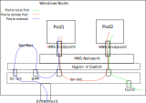
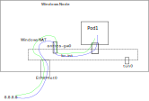

# Running Antrea on Windows

Antrea supports running on Windows worker Nodes. On Windows Nodes, Antrea sets up an overlay
network to forward packets between Nodes and implements NetworkPolicies.

## Design

On Windows, the Host Networking Service (HNS) is a necessary component to support container
networking. For Antrea on Windows, "Transparent" mode is chosen for the HNS network. In this
mode, containers will be directly connected to the physical network through an **external**
Hyper-V switch.

OVS is working as a forwarding extension for the external Hyper-V switch which was created by
HNS. Hence, the packets that are sent from/to the containers can be processed by OVS.
The network adapter used in the HNS Network is also added to the OVS bridge as the uplink
interface. An internal interface for the OVS bridge is created, and the original networking
configuration (e.g., IP, MAC and routing entries) on the host network adapter is moved to
this new interface. Some extra OpenFlow entries are needed to ensure the host traffic can be
forwarded correctly.



SNAT based on OpenFlow is needed to make sure the containers can access the external address.
The SNATed address is using the IP configured on the OVS bridge. Some additional OpenFlow entries
are installed to assist in identifying and forwarding the external traffic.

Antrea implements the Kubernetes ClusterIP Service leveraging OVS. Pod-to-ClusterIP-Service traffic
is load-balanced and forwarded directly inside the OVS pipeline. And kube-proxy is running
on each Windows Node to implement Kubernetes NodePort Service. Kube-proxy captures NodePort Service
traffic and sets up a connection to a backend Pod to forwards the request using this connection.
The forwarded request enters the OVS pipeline through "antrea-gw0" and is then forwarded to the
Pod. To be compatible with OVS, kube-proxy on Windows must be configured to run in **userspace**
mode, and a specific network adapter is required, on which Service IP addresses will be configured
by kube-proxy.

### HNS Network configuration

HNS Network is created during the Antrea Agent initialization phase, and it should be created before
the OVS bridge is created. This is because OVS is working as the Hyper-V Switch Extension, and the
ovs-vswitchd process cannot work correctly until the OVS Extension is enabled on the new created
Hyper-V Switch.

When creating the HNS Network, the local subnet CIDR and the uplink network adapter are required.
Antrea Agent finds the network adapter from the Windows host using the Node's internal IP as a filter,
and retrieves the local Subnet CIDR from the Node spec.

After the HNS Network is created, OVS extension should be enabled at once on the Hyper-V Switch.

### Container network configuration

[**host-local**](https://github.com/containernetworking/plugins/tree/master/plugins/ipam/host-local)
plugin is used to provide IPAM for containers, and the address is allocated from the subnet CIDR
configured on the HNS Network.

Windows HNS Endpoint is leveraged as the vNIC for each container. A single HNS Endpoint with the
IP allocated by the IPAM plugin is created for each Pod. The HNS Endpoint should be attached to all
containers in the same Pod to ensure that the network configuration can be correctly accessed (this
operation is to make sure the DNS configuration is readable from all containers).

One OVS internal port with the same name as the HNS Endpoint is also needed, in order to handle
container traffic with OpenFlow rules. OpenFlow entries are installed to implement Pod-to-Pod,
Pod-to-external and Pod-to-ClusterIP-Service connectivity.

CNIAdd request might be called multiple times for a given Pod. This is because kubelet on Windows
assumes CNIAdd is an idempotent event, and it uses this event to query the Pod networking status.
Antrea needs to identify the container type (sandbox or workload) from the CNIAdd request:

* we create the HNS Endpoint only when the request is for the sandbox container
* we attach the HNS Endpoint no matter whether it is a sandbox container or a workload container.

### Gateway port configuration

The gateway port is created during the Antrea Agent initialization phase, and the address of the interface
should be the first IP in the subnet. The port is an OVS internal port and its default name is "antrea-gw0".

The gateway port is used to help implement L3 connectivity for the containers, including Pod-to-external,
and Node-to-Pod. For the Pod-to-external case, OpenFlow entries are
installed in order to output these packets to the host on the gateway port. To ensure the packet is forwarded
correctly on the host, the IP-Forwarding feature should be enabled on the network adapter of the
gateway port.

A routing entry for traffic from the Node to the local Pod subnet is needed on the Windows host to ensure
that the packet can enter the OVS pipeline on the gateway port. This routing entry is added when "antrea-gw0"
is created.

Every time a new Node joins the cluster, a host routing entry on the gateway port is required, and the
remote subnet CIDR should be routed with the remote gateway address as the nexthop.

### Tunnel port configuration

Tunnel port configuration should be similar to Antrea on Linux:

* tunnel port is added after OVS bridge is created;
* a flow-based tunnel with the appropriate remote address is created for each Node in the cluster with OpenFlow.

The only difference with Antrea on Linux is that the tunnel local address is required when creating the tunnel
port (provided with `local_ip` option). This local address is the one configured on the OVS bridge.

### OVS bridge interface configuration

Since OVS is also responsible for taking charge of the network of the host, an interface for the OVS bridge
is required on which the host network settings are configured. It is created and enabled when creating
the OVS bridge, and the MAC address should be changed to be the same as the uplink interface. Then the IP
address and the route entries originally configured on the uplink interface should also be migrated to
the interface.

The packets that are sent to/from the Windows host should be forwarded on this interface. So the OVS bridge
is also a valid entry point into the OVS pipeline. A special ofport number 65534 (named as LOCAL) for the
OVS bridge is used in OpenFlow spec.

In the OVS `Classifier` table, new OpenFlow entries are needed to match the packets from this interface. The
packet entering OVS from this interface is output to the uplink interface directly.

### OVS uplink interface configuration

After the OVS bridge is created, the original physical adapter is added to the OVS bridge as the uplink interface.
The uplink interface is used to support traffic from Pods accessing the world outside current host.

We should differentiate the traffic if it is entering OVS from the uplink interface in OVS `Classifier`
table. In encap mode, the packets entering OVS from the uplink interface is output to the bridge interface directly.
In noEncap mode, there are three kinds of packets entering OVS from the uplink interface:

 1) traffic that is sent to local Pods from Pod on a different Node,
 2) traffic that is sent to local Pods from a different Node according to the routing configuration,
 3) traffic on the host network

For 1 and 2, the packet enters the OVS pipeline, and the `macRewriteMark` is set to ensure the destination MAC can be
modified.
For 3, the packet is output to the OVS bridge interface directly.

The packet is always output to the uplink interface if it is entering OVS from the bridge interface. We
also output the Pod traffic to the uplink interface in noEncap mode, if the destination is a Pod on a different Node,
or if it is a reply packet to the request which is sent from a different Node. Then we can reduce the cost that the
packet enters OVS twice (OVS -> Windows host -> OVS).

Following are the OpenFlow entries for uplink interface in encap mode.

```text
Classifier Table: 0
table=0, priority=200, in_port=$uplink actions=LOCAL
table=0, priority=200, in_port=LOCAL actions=output:$uplink
```

Following is an example for the OpenFlow entries related with uplink interface in noEncap mode.

```text
Classifier Table: 0
table=0, priority=210, ip, in_port=$uplink, nw_dst=$localPodSubnet, actions=load:0x4->NXM_NX_REG0[0..15],load:0x
1->NXM_NX_REG0[19],resubmit(,29)
table=0, priority=200, in_port=$uplink actions=LOCAL
table=0, priority=200, in_port=LOCAL actions=output:$uplink

L3Forwarding Table: 70
// Rewrite the destination MAC with the Node's MAC on which target Pod is located.
table=70, priority=200,ip,nw_dst=$peerPodSubnet actions=mod_dl_dst:$peerNodeMAC,resubmit(,80)
// Rewrite the destination MAC with the Node's MAC if it is a reply for the access from the Node.
table=70, priority=200,ct_state=+rpl+trk,ip,nw_dst=$peerNodeIP actions=mod_dl_dst:$peerNodeMAC,resubmit(,80)

L2ForwardingCalcTable: 80
table=80, priority=200,dl_dst=$peerNodeMAC actions=load:$uplink->NXM_NX_REG1[],load:0x1->NXM_NX_REG0[16],resubmit(,105)
```

### SNAT configuration

SNAT is an important feature of the Antrea Agent on Windows Nodes, required to support Pods accessing external
addresses. It is implemented using the NAT capability of the Windows host.

To support this feature, we configure NetNat on the Windows host for the Pod subnet:

```text
New-NetNat -Name antrea-nat -InternalIPInterfaceAddressPrefix $localPodSubnet
```

The packet that is sent from local Pod to an external address leaves OVS from `antrea-gw0` and enters Windows host,
and SNAT action is performed. The SNATed address is chosen by Windows host according to the routing configuration.
As for the reply packet of the Pod-to-external traffic, it enters Windows host and performs de-SNAT first, and then
the packet enters OVS from `antrea-gw0` and is forwarded to the Pod finally.

### Using Windows named pipe for internal connections

Named pipe is used for local connections on Windows Nodes instead of Unix Domain Socket (UDS). It is used in
these scenarios:

* OVSDB connection
* OpenFlow connection
* The connection between CNI plugin and CNI server

## Antrea Management on Windows

### Antrea Agent Management

The Antrea Agent is running as a process on the Windows Node, but it is managed using a DaemonSet. The utility
[Rancher Wins](https://github.com/rancher/wins) is used to manage the host process from inside the DaemonSet Pod.
The Antrea Agent is configured using a ConfigMap, and the environment variables are set by kubelet on Windows.

### OVS Management

OVS is running as 2 Windows Services: one for ovsdb-server and one for ovs-vswitchd.

## Traffic walkthrough

### Pod-to-Pod Traffic

The intra-Node Pod-to-Pod traffic and inter-Node Pod-to-Pod traffic are the same as Antrea on Linux.
It is processed and forwarded by OVS, and controlled with OpenFlow entries.

### Service Traffic

Kube-proxy userspace mode is configured to provide NodePort Service function. A specific Network Adapter named
"HNS Internal NIC" is provided to kube-proxy to configure Service addresses. The OpenFlow entries for the
NodePort Service traffic on Windows are the same as those on Linux.

The ClusterIP Service function is implemented by Antrea leveraging OVS. Antrea installs OpenFlow entries
to select the backend endpoint and performs DNAT on the traffic.

### External Traffic

The Pod-to-external traffic leaves the OVS pipeline from the gateway interface, and then is SNATed on the Windows
host. If the packet should leave Windows host from OVS uplink interface according to the routing configuration on
the Windows host, it is forwarded to OVS bridge first on which the host IP is configured, and then output to the
uplink interface by OVS pipeline.

The corresponding reply traffic will enter OVS from the uplink interface first, and then enter the host from the
OVS bridge interface. It is de-SNATed on the host and then back to OVS from `antre-gw0` and forwarded to the Pod
finally.


### Host Traffic

In "Transparent" mode, the Antrea Agent should also support the host traffic when necessary, which includes
packets sent from the host to external addresses, and the ones sent from external addresses to the host.

The host traffic enters OVS bridge and output to the uplink interface if the destination is reachable from the
network adapter which is plugged on OVS as uplink. For the reverse path, the packet enters OVS from the uplink
interface first, and then directly output to the bridge interface and enters Windows host. For the traffic that
is connected to the Windows network adapters other than the OVS uplink interface, it is managed by Windows host.
