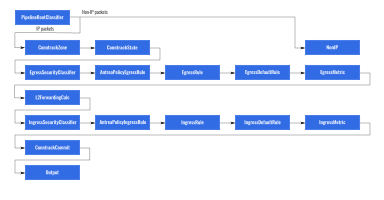

# External Node

## Table of Contents

<!-- toc -->
- [What is ExternalNode?](#what-is-externalnode)
- [Prerequisites](#prerequisites)
- [The ExternalNode resource](#the-externalnode-resource)
  - [Name and Namespace](#name-and-namespace)
  - [Interfaces](#interfaces)
- [Install Antrea Agent on VM](#install-antrea-agent-on-vm)
  - [Prerequisites on Kubernetes cluster](#prerequisites-on-kubernetes-cluster)
  - [Installation on Linux VM](#installation-on-linux-vm)
    - [Prerequisites on Linux VM](#prerequisites-on-linux-vm)
    - [Installation steps on Linux VM](#installation-steps-on-linux-vm)
      - [Service Installation](#service-installation)
      - [Container Installation](#container-installation)
  - [Installation on Windows VM](#installation-on-windows-vm)
    - [Prerequisites on Windows VM](#prerequisites-on-windows-vm)
    - [Installation steps on Windows VM](#installation-steps-on-windows-vm)
- [VM network configuration](#vm-network-configuration)
- [RBAC for antrea-agent](#rbac-for-antrea-agent)
- [Apply Antrea NetworkPolicy to ExternalNode](#apply-antrea-networkpolicy-to-externalnode)
  - [Antrea NetworkPolicy configuration](#antrea-networkpolicy-configuration)
  - [Bypass Antrea NetworkPolicy](#bypass-antrea-networkpolicy)
- [OpenFlow pipeline](#openflow-pipeline)
  - [Non-IP packet](#non-ip-packet)
  - [IP packet](#ip-packet)
- [Limitations](#limitations)
<!-- /toc -->

## What is ExternalNode?

`ExternalNode` is a CRD API that enables Antrea to manage the network connectivity
and security on a Non-Kubernetes Node (like a virtual machine or a bare-metal
server). It supports specifying which network interfaces on the external Node
are expected to be protected with Antrea NetworkPolicy rules. The virtual machine
or bare-metal server represented by an `ExternalNode` resource can be either
Linux or Windows. "External Node" will be used to designate such a virtual
machine or bare-metal server in the rest of this document.

Antrea NetworkPolicies are applied to an external Node by leveraging the
`ExternalEntity` resource. `antrea-controller` creates an `ExternalEntity`
resource for each network interface specified in the `ExternalNode` resource.

`antrea-agent` is running on the external Node, and it controls network
connectivity and security by attaching the network interface(s) to an OVS bridge.
A [new OpenFlow pipeline](#openflow-pipeline) has been implemented, dedicated to
the ExternalNode feature.

You may be interested in using this capability for the below scenarios:

- To apply Antrea NetworkPolicy to an external Node.
- You want the same security configurations on the external Node for all
  Operating Systems.

This guide demonstrates how to configure `ExternalNode` to achieve the above
result.

## Prerequisites

`ExternalNode` is introduced in v1.8 as an alpha feature. The feature gate
`ExternalNode` must be enabled in the `antrea-controller` and `antrea-agent`
configuration. The configuration for `antrea-controller` is modified in the
`antrea-config` ConfigMap as follows for the feature to work:

```yaml
apiVersion: v1
kind: ConfigMap
metadata:
  name: antrea-config
  namespace: kube-system
data:
  antrea-controller.conf: |
    featureGates:
      ExternalNode: true
```

The `antrea-controller` implements the `antrea` Service, which accepts
connections from each `antrea-agent` and is an important part of the
NetworkPolicy implementation. By default, the `antrea` Service has type
`ClusterIP`. Because external Nodes run outside of the Kubernetes cluster, they
cannot directly access the `ClusterIP` address. Therefore, the `antrea` Service
needs to become externally-accessible, by changing its type to `NodePort` or
`LoadBalancer`.

Since `antrea-agent` is running on an external Node which is not managed by
Kubernetes, a configuration file needs to be present on each machine where the
`antrea-agent` is running, and the path to this file will be provided to the
`antrea-agent` as a command-line argument. Refer to the [sample configuration](../build/yamls/externalnode/conf/antrea-agent.conf)
to learn the`antrea-agent` configuration options when running on an external Node.

A further [section](#install-antrea-agent-on-vm) will provide detailed steps
for running the `antrea-agent` on a VM.

## The ExternalNode resource

An example `ExternalNode` resource:

```yaml
apiVersion: crd.antrea.io/v1alpha1
kind: ExternalNode
metadata:
  name: vm1
  namespace: vm-ns
  labels:
    role: db
spec:
  interfaces:
    - ips: [ "172.16.100.3" ]
      name: ""
```

Note: **Only one interface is supported for Antrea v1.8**.

### Name and Namespace

The `name` field in an `ExternalNode` uniquely identifies an external Node.
The `ExternalNode` name is provided to `antrea-agent` via an environment
variable `NODE_NAME`, otherwise `antrea-agent` will use the hostname to find
the `ExternalNode` resource if `NODE_NAME` is not set.

`ExternalNode` resource is `Namespace` scoped. The `Namespace` is provided to
`antrea-agent` with option `externalNodeNamespace` in
[antrea-agent.conf](../build/yamls/externalnode/conf/antrea-agent.conf).

```yaml
externalNodeNamespace: vm-ns
```

### Interfaces

The `interfaces` field specifies the list of the network interfaces expected to
be guarded by Antrea NetworkPolicy. At least one interface is required. Interface
`name` or `ips` is used to identify the target interface. **The field `ips`
must be provided in the CRD**, but `name` is optional. Multiple IPs on a single
interface is supported. In the case that multiple `interfaces` are configured,
`name` must be specified for every `interface`.

`antrea-controller` creates an `ExternalEntity` for each interface whenever an
`ExternalNode` is created. The created `ExternalEntity` has the following
characteristics:

- It is configured within the same Namespace as the `ExternalNode`.
- The `name` is generated according to the following principles:
  - Use the `ExternalNode` name directly, if there is only one interface, and
    interface name is not specified.
  - Use the format `$ExternalNode.name-$hash($interface.name)[:5]` for other
    cases.
- The `externalNode` field is set with the `ExternalNode` name.
- The `owner` is referring to the `ExternalNode` resource.
- All labels added on `ExternalNode` are copied to the `ExternalEntity`.
- Each IP address of the interface is added as an endpoint in the `endpoints`
  list, and the interface name is used as the endpoint name if it is set.

The `ExternalEntity` resource created for the above `ExternalNode` interface
would look like this:

```yaml
apiVersion: crd.antrea.io/v1alpha2
kind: ExternalEntity
metadata:
  labels:
    role: db
  name: vm1
  namespace: vm-ns
  ownerReferences:
    - apiVersion: v1alpha1
      kind: ExternalNode
      name: vm1
      uid: 99b09671-72da-4c64-be93-17185e9781a5
  resourceVersion: "5513"
  uid: 5f360f32-7806-4d2d-9f36-80ce7db8de10
spec:
  endpoints:
    - ip: 172.16.100.3
  externalNode: vm1
```

## Install Antrea Agent on VM

### Prerequisites on Kubernetes cluster

1. Enable `ExternalNode` feature on the `antrea-controller`, and expose the
   antrea Service externally (e.g., as a NodePort Service).
2. Create a Namespace for `antrea-agent`. This document will use `vm-ns` as an
   example Namespace for illustration.

   ```bash
   kubectl create ns vm-ns
   ```

3. Create a ServiceAccount, ClusterRole and ClusterRoleBinding for `antrea-agent`
   as shown below. If you use a Namespace other than `vm-ns`, you need to update
   the [VM RBAC manifest](../build/yamls/externalnode/vm-agent-rbac.yml) and
   change `vm-ns` to the right Namespace.

   ```bash
   kubectl apply -f https://raw.githubusercontent.com/antrea-io/antrea/main/build/yamls/externalnode/vm-agent-rbac.yml
   ```

4. Create `antrea-agent.kubeconfig` file for `antrea-agent` to access the K8S
   API server.

   ```bash
   CLUSTER_NAME="kubernetes"
   SERVICE_ACCOUNT="vm-agent"
   NAMESPACE="vm-ns"
   KUBECONFIG="antrea-agent.kubeconfig"
   APISERVER=$(kubectl config view -o jsonpath="{.clusters[?(@.name==\"$CLUSTER_NAME\")].cluster.server}")
   TOKEN=$(kubectl -n $NAMESPACE get secrets -o jsonpath="{.items[?(@.metadata.name=='${SERVICE_ACCOUNT}-service-account-token')].data.token}"|base64 --decode)
   kubectl config --kubeconfig=$KUBECONFIG set-cluster $CLUSTER_NAME --server=$APISERVER --insecure-skip-tls-verify=true
   kubectl config --kubeconfig=$KUBECONFIG set-credentials antrea-agent --token=$TOKEN
   kubectl config --kubeconfig=$KUBECONFIG set-context antrea-agent@$CLUSTER_NAME --cluster=$CLUSTER_NAME --user=antrea-agent
   kubectl config --kubeconfig=$KUBECONFIG use-context antrea-agent@$CLUSTER_NAME
   # Copy antrea-agent.kubeconfig to the VM
   ```

5. Create `antrea-agent.antrea.kubeconfig` file for `antrea-agent` to access
   the `antrea-controller` API server.

   ```bash
   # Specify the antrea-controller API server endpoint. Antrea-Controller needs
   # to be exposed via the Node IP or a public IP that is reachable from the VM
   ANTREA_API_SERVER="https://172.18.0.1:443"
   ANTREA_CLUSTER_NAME="antrea"
   NAMESPACE="vm-ns"
   KUBECONFIG="antrea-agent.antrea.kubeconfig"
   TOKEN=$(kubectl -n $NAMESPACE get secrets -o jsonpath="{.items[?(@.metadata.name=='${SERVICE_ACCOUNT}-service-account-token')].data.token}"|base64 --decode)
   kubectl config --kubeconfig=$KUBECONFIG set-cluster $ANTREA_CLUSTER_NAME --server=$ANTREA_API_SERVER --insecure-skip-tls-verify=true
   kubectl config --kubeconfig=$KUBECONFIG set-credentials antrea-agent --token=$TOKEN
   kubectl config --kubeconfig=$KUBECONFIG set-context antrea-agent@$ANTREA_CLUSTER_NAME --cluster=$ANTREA_CLUSTER_NAME --user=antrea-agent
   kubectl config --kubeconfig=$KUBECONFIG use-context antrea-agent@$ANTREA_CLUSTER_NAME
   # Copy antrea-agent.antrea.kubeconfig to the VM
   ```

6. Create an `ExternalNode` resource for the VM.

   After preparing the `ExternalNode` configuration yaml for the VM, we can
   apply it in the cluster.

   ```bash
   cat << EOF | kubectl apply -f -
   apiVersion: crd.antrea.io/v1alpha1
   kind: ExternalNode
   metadata:
     name: vm1
     namespace: vm-ns
     labels:
       role: db
   spec:
     interfaces:
       - ips: [ "172.16.100.3" ]
         name: ""
   EOF
   ```

### Installation on Linux VM

#### Prerequisites on Linux VM

OVS needs to be installed on the VM. For more information about OVS installation
please refer to the [getting-started guide](getting-started.md#open-vswitch).

#### Installation steps on Linux VM

`Antrea Agent` can be installed as a native service or can be installed in a container.

##### Service Installation

1. Build `antrea-agent` binary in the root of the Antrea code tree and copy the
   `antrea-agent` binary from the `bin` directory to the Linux VM.

   ```bash
   make docker-bin
   ```

2. Copy configuration files to the VM, including [antrea-agent.conf](../build/yamls/externalnode/conf/antrea-agent.conf),
   which specifies agent configuration parameters;
   `antrea-agent.antrea.kubeconfig` and `antrea-agent.kubeconfig`, which were
   generated in steps 4 and 5 of [Prerequisites on Kubernetes cluster](#prerequisites-on-kubernetes-cluster).

3. Bootstrap `antrea-agent` using one of these 2 methods:

   1. Bootstrap `antrea-agent` using the [installation script](../hack/externalnode/install-vm.sh)
      as shown below (Ubuntu 18.04 and 20.04, and Red Hat Enterprise Linux 8.4).

      ```bash
      ./install-vm.sh --ns vm-ns --bin ./antrea-agent --config ./antrea-agent.conf \
      --kubeconfig ./antrea-agent.kubeconfig \
      --antrea-kubeconfig ./antrea-agent.antrea.kubeconfig --nodename vm1
      ```

   2. Bootstrap `antrea-agent` manually. First edit the `antrea-agent.conf` file
      to set `clientConnection`, `antreaClientConnection` and `externalNodeNamespace`
      to the correct values.

      ```bash
      AGENT_NAMESPACE="vm-ns"
      AGENT_CONF_PATH="/etc/antrea"
      mkdir -p $AGENT_CONF_PATH
      # Copy antrea-agent kubeconfig files
      cp ./antrea-agent.kubeconfig $AGENT_CONF_PATH
      cp ./antrea-agent.antrea.kubeconfig $AGENT_CONF_PATH
      # Update clientConnection and antreaClientConnection
      sed -i "s|kubeconfig: |kubeconfig: $AGENT_CONF_PATH/|g" antrea-agent.conf
      sed -i "s|#externalNodeNamespace: default|externalNodeNamespace: $AGENT_NAMESPACE|g" antrea-agent.conf
      # Copy antrea-agent configuration file
      cp ./antrea-agent.conf $AGENT_CONF_PATH
      ```

      Then create `antrea-agent` service. Below is a sample snippet to start
      `antrea-agent` as a service on Ubuntu 18.04 or later:

      Note: Environment variable `NODE_NAME` needs to be set in the service
      configuration, if the VM's hostname is different from the name defined in
      the `ExternalNode` resource.

      ```bash
      AGENT_BIN_PATH="/usr/sbin"
      AGENT_LOG_PATH="/var/log/antrea"
      mkdir -p $AGENT_BIN_PATH
      mkdir -p $AGENT_LOG_PATH
      cat << EOF > /etc/systemd/system/antrea-agent.service
      Description="antrea-agent as a systemd service"
      After=network.target
      [Service]
      Environment="NODE_NAME=vm1"
      ExecStart=$AGENT_BIN_PATH/antrea-agent \
      --config=$AGENT_CONF_PATH/antrea-agent.conf \
      --logtostderr=false \
      --log_file=$AGENT_LOG_PATH/antrea-agent.log
      Restart=on-failure
      [Install]
      WantedBy=multi-user.target
      EOF
   
      sudo systemctl daemon-reload
      sudo systemctl enable antrea-agent
      sudo systemctl start antrea-agent
      ```

##### Container Installation

1. `Docker` is used as the container runtime for Linux VMs. The Docker image can be built from source code
   or can be downloaded from the Antrea repository.

   1. From Source

      Build `antrea-agent-ubuntu` Docker image in the root of the Antrea code tree.

      ```bash
      make build-agent-ubuntu
      ```

      Note: The image repository name should be `antrea/antrea-agent-ubuntu` and tag should be `latest`.

      Copy the `antrea/antrea-agent-ubuntu:latest` image to the target VM. Please follow
      the below steps.

      ```bash
      # Save it in a tar file
      docker save -o <tar file path in source host machine> antrea/antrea-agent-ubuntu:latest

      # Copy this tar file to the target VM.
      # Then load that image on the target VM.
      docker load -i <path to image tar file>
      ```

   2. Docker Repository

      The released version of `antrea-agent-ubuntu` Docker image can be downloaded from Antrea `Dockerhub`
      repository. Pick a version from the [list of releases](https://github.com/antrea-io/antrea/releases). For any given
      release `<TAG>` (e.g. `v1.15.0`), download `antrea-agent-ubuntu` Docker image as follows:

      ```bash
      docker pull antrea/antrea-agent-ubuntu:<TAG>
      ```

      The [installation script](../hack/externalnode/install-vm.sh) automatically downloads the specific released
      version of `antrea-agent-ubuntu` Docker image on VM by specifying the installation argument `--antrea-version`.
      Also, the script automatically loads that image into Docker. For any given release `<TAG>` (e.g. `v1.15.0`),
      specify it in the --antrea-version argument as follows.

      ```bash
         --antrea-version <TAG>
      ```

2. Copy configuration files to the VM, including [antrea-agent.conf](../build/yamls/externalnode/conf/antrea-agent.conf),
   which specifies agent configuration parameters;
   `antrea-agent.antrea.kubeconfig` and `antrea-agent.kubeconfig`, which were
   generated in steps 4 and 5 of [Prerequisites on Kubernetes cluster](#prerequisites-on-kubernetes-cluster).

3. Bootstrap `antrea-agent` using the [installation script](../hack/externalnode/install-vm.sh)
   as shown below (Ubuntu 18.04, 20.04, and Rhel 8.4).

    ```bash
      ./install-vm.sh --ns vm-ns --config ./antrea-agent.conf \
      --kubeconfig ./antrea-agent.kubeconfig \
      --antrea-kubeconfig ./antrea-agent.antrea.kubeconfig --containerize --antrea-version v1.9.0
    ```

### Installation on Windows VM

#### Prerequisites on Windows VM

1. Enable the Windows Hyper-V optional feature on Windows VM.

   ```powershell
   Install-WindowsFeature Hyper-V-Powershell
   Enable-WindowsOptionalFeature -Online -FeatureName Microsoft-Hyper-V -All -NoRestart
   ```

2. OVS needs to be installed on the VM. For more information about OVS
   installation please refer to the [Antrea Windows documentation](windows.md#1-optional-install-ovs-provided-by-antrea-or-your-own).
3. Download [nssm](https://nssm.cc/download) which will be used to create the
   Windows service for `antrea-agent`.

Note: Only Windows Server 2019 is supported in the first release at the moment.

#### Installation steps on Windows VM

1. Build `antrea-agent` binary in the root of the antrea code tree and copy the
   `antrea-agent` binary from the `bin` directory to the Windows VM.

   ```bash
   #! /bin/bash
   make docker-windows-bin
   ```

2. Copy [antrea-agent.conf](../build/yamls/externalnode/conf/antrea-agent.conf),
   `antrea-agent.kubeconfig` and `antrea-agent.antrea.kubeconfig` files to the
   VM. Please refer to the step 2 of [Installation on Linux VM](#installation-steps-on-linux-vm)
   section for more information.

   ```powershell
   $WIN_AGENT_CONF_PATH="C:\antrea-agent\conf"
   New-Item -ItemType Directory -Force -Path $WIN_AGENT_CONF_PATH
   # Copy antrea-agent kubeconfig files
   Copy-Item .\antrea-agent.kubeconfig $WIN_AGENT_CONF_PATH
   Copy-Item .\antrea-agent.antrea.kubeconfig $WIN_AGENT_CONF_PATH
   # Copy antrea-agent configuration file
   Copy-Item .\antrea-agent.conf $WIN_AGENT_CONF_PATH
   ```

3. Bootstrap `antrea-agent` using one of these 2 methods:

   1. Bootstrap `antrea-agent` using the [installation script](../hack/externalnode/install-vm.ps1)
      as shown below (only Windows Server 2019 is tested and supported).

      ```powershell
      .\Install-vm.ps1 -Namespace vm-ns -BinaryPath .\antrea-agent.exe `
      -ConfigPath .\antrea-agent.conf -KubeConfigPath .\antrea-agent.kubeconfig `
      -AntreaKubeConfigPath .\antrea-agent.antrea.kubeconfig `
      -InstallDir C:\antrea-agent -NodeName vm1
      ```

   2. Bootstrap `antrea-agent` manually. First edit the `antrea-agent.conf` file to
      set `clientConnection`, `antreaClientConnection` and `externalNodeNamespace`
      to the correct values.
      Configure environment variable `NODE_NAME` if the VM's hostname is different
      from the name defined in the `ExternalNode` resource.

      ```powershell
      [Environment]::SetEnvironmentVariable("NODE_NAME", "vm1")
      [Environment]::SetEnvironmentVariable("NODE_NAME", "vm1", [System.EnvironmentVariableTarget]::Machine)
      ```

      Then create `antrea-agent` service using nssm. Below is a sample snippet to start
      `antrea-agent` as a service:

      ```powershell
      $WIN_AGENT_BIN_PATH="C:\antrea-agent"
      $WIN_AGENT_LOG_PATH="C:\antrea-agent\logs"
      New-Item -ItemType Directory -Force -Path $WIN_AGENT_BIN_PATH
      New-Item -ItemType Directory -Force -Path $WIN_AGENT_LOG_PATH
      Copy-Item .\antrea-agent.exe $WIN_AGENT_BIN_PATH
      nssm.exe install antrea-agent $WIN_AGENT_BIN_PATH\antrea-agent.exe --config $WIN_AGENT_CONF_PATH\antrea-agent.conf --log_file $WIN_AGENT_LOG_PATH\antrea-agent.log --logtostderr=false
      nssm.exe start antrea-agent
      ```

## VM network configuration

`antrea-agent` uses the interface IPs or name to find the network interface on
the external Node, and then attaches it to the OVS bridge. The network interface
is attached to OVS as uplink, and a new OVS internal Port is created to take over
the uplink interface's IP/MAC and routing configurations. On Windows, the DNS
configurations are also moved to the OVS internal port from uplink. Before
attaching the uplink to OVS, the network interface is renamed with a suffix
"~", and OVS internal port is configured with the original name of the uplink.
As a result, IP/MAC/routing entries are seen on a network interface configuring
with the same name on the external Node.

The outbound traffic sent from the external Node enters OVS from the internal
port, and finally output from the uplink, and the inbound traffic enters OVS
from the uplink and output to the internal port. The IP packet is processed by
the OpenFlow pipeline, and the non-IP packet is forwarded directly.

The following diagram depicts the OVS bridge and traffic forwarding on an
external Node:


## RBAC for antrea-agent

An external Node is regarded as an untrusted entity on the network. To follow
the least privilege principle, the RBAC configuration for `antrea-agent`
running on an external Node is as follows:

- Only `get`, `list` and `watch` permissions are given on resource `ExternalNode`
- Only `update` permission is given on resource `antreaagentinfos`, and `create`
  permission is moved to `antrea-controller`

For more details please refer to [vm-agent-rbac.yml](../build/yamls/externalnode/vm-agent-rbac.yml)

`antrea-agent` reports its status by updating the `antreaagentinfo` resource
which is created with the same name as the `ExternalNode`. `antrea-controller`
creates an `antreaagentinfo` resource for each new `ExternalNode`, and then
`antrea-agent` updates it every minute with its latest status. `antreaagentinfo`
is deleted by `antrea-controller` when the `ExternalNode` is deleted.

## Apply Antrea NetworkPolicy to ExternalNode

### Antrea NetworkPolicy configuration

An Antrea NetworkPolicy is applied to an `ExternalNode` by providing an
`externalEntitySelector` in the `appliedTo` field. The `ExternalEntity`
resource is automatically created for each interface of an `ExternalNode`.
`ExternalEntity` resources are used by `antrea-controller` to process the
NetworkPolicies, and each `antrea-agent` (including those running on external
Nodes) receives the appropriate internal AntreaNetworkPolicy objects.

Following types of (from/to) network peers are supported in an Antrea
NetworkPolicy applied to an external Node:

- ExternalEntities selected by an `externalEntitySelector`
- An `ipBlock`
- A FQDN address in an egress rule

Following actions are supported in an Antrea NetworkPolicy applied to an
external Node:

- Allow
- Drop
- Reject

Below is an example of applying an Antrea NetworkPolicy to the external Nodes
labeled with `role=db` to reject SSH connections from IP "172.16.100.5" or from
other external Nodes labeled with `role=front`:

```yaml
apiVersion: crd.antrea.io/v1beta1
kind: NetworkPolicy
metadata:
  name: annp1
  namespace: vm-ns
spec:
  priority: 9000.0
  appliedTo:
    - externalEntitySelector:
        matchLabels:
          role: db
  ingress:
    - action: Reject
      ports:
        - protocol: TCP
          port: 22
      from:
        - externalEntitySelector:
            matchLabels:
              role: front
        - ipBlock:
            cidr: 172.16.100.5/32
```

### Bypass Antrea NetworkPolicy

In some cases, users may want some particular traffic to bypass Antrea
NetworkPolicy rules on an external Node, e.g.,the SSH connection from a special
host to the external Node. `policyBypassRules` can be added in the agent
configuration to define traffic that needs to bypass NetworkPolicy enforcement.
Below is a configuration example:

```yaml
policyBypassRules:
  - direction: ingress
    protocol: tcp
    cidr: 1.1.1.1/32
    port: 22
```

The `direction` can be `ingress` or `egress`. The supported protocols include:
`tcp`,`udp`, `icmp` and `ip`. The `cidr` gives the peer address, which is the
destination in an `egress` rule, and the source in an `ingress` rule. For `tcp`
and `udp` protocols, the `port` is required to specify the destination port.

## OpenFlow pipeline

A new OpenFlow pipeline is implemented by `antrea-agent` dedicated for
`ExternalNode` feature.



### Non-IP packet

`NonIPTable` is a new OpenFlow table introduced only on external Nodes,
which is dedicated to all non-IP packets. A non-IP packet is forwarded between
the pair ports directly, e.g., a non-IP packet entering OVS from the uplink
interface is output to the paired internal port, and a packet from the internal
port is output to the uplink.

### IP packet

A new OpenFlow pipeline is set up on external Nodes to process IP packets.
Antrea NetworkPolicy enforcement is the major function in this new pipeline, and
the OpenFlow tables used are similar to the Pod pipeline. No L3 routing is
provided on an external Node, and a simple L2 forwarding policy is implemented.
OVS connection tracking is used to assist the NetworkPolicy function; as a result
only the first packet is validated by the OpenFlow entries, and the subsequent
packets in an accepted connection are allowed directly.

- Egress/Ingress Tables

Table `XgressSecurityClassifierTable` is installed in both `stageEgressSecurity`
and `stageIngressSecurity`, which is used to install the OpenFlow entries for
the [`policyBypassRules`](#bypass-antrea-networkpolicy) in the agent configuration.

This is an example of the OpenFlow entry for the above configuration:

```yaml
table=IngressSecurityClassifier, priority=200,ct_state=+new+trk,tcp,nw_src=1.1.1.1,tp_dst=22 actions=resubmit(,IngressMetric)
```

Other OpenFlow tables in `stageEgressSecurity` and `stageIngressSecurity` are
the same as those installed on a Kubernetes worker Node. For more details about
these tables, please refer to the general [introduction](design/ovs-pipeline.md)
of Antrea OVS pipeline.

- L2 Forwarding Tables

`L2ForwardingCalcTable` is used to calculate the expected output port of an IP
packet. As the pair ports with the internal port and uplink always exist on the
OVS bridge, and both interfaces are configured with the same MAC address, the
match condition of an OpenFlow entry in `L2ForwardingCalcTable` uses the input
port number but not the MAC address of the packet. The flow actions are:

1) set flag `OutputToOFPortRegMark`, and
2) set the peer port as the `TargetOFPortField`, and
3) enforce the packet to go to stageIngressSecurity.

Below is an example OpenFlow entry in `L2ForwardingCalcTable`

```yaml
table=L2ForwardingCalc, priority=200,ip,in_port=ens224 actions=load:0x1->NXM_NX_REG0[8],load:0x7->NXM_NX_REG1[],resubmit(,IngressSecurityClassifier)
table=L2ForwardingCalc, priority=200,ip,in_port="ens224~" actions=load:0x1->NXM_NX_REG0[8],load:0x8->NXM_NX_REG1[],resubmit(,IngressSecurityClassifier)
```

## Limitations

This feature currently supports only one interface per `ExternalNode` object,
and `ips` must be set in the interface. The support for multiple network
interfaces will be added in the future.

`ExternalNode` name must be unique in the `cluster` scope even though it is
itself a Namespaced resource.
