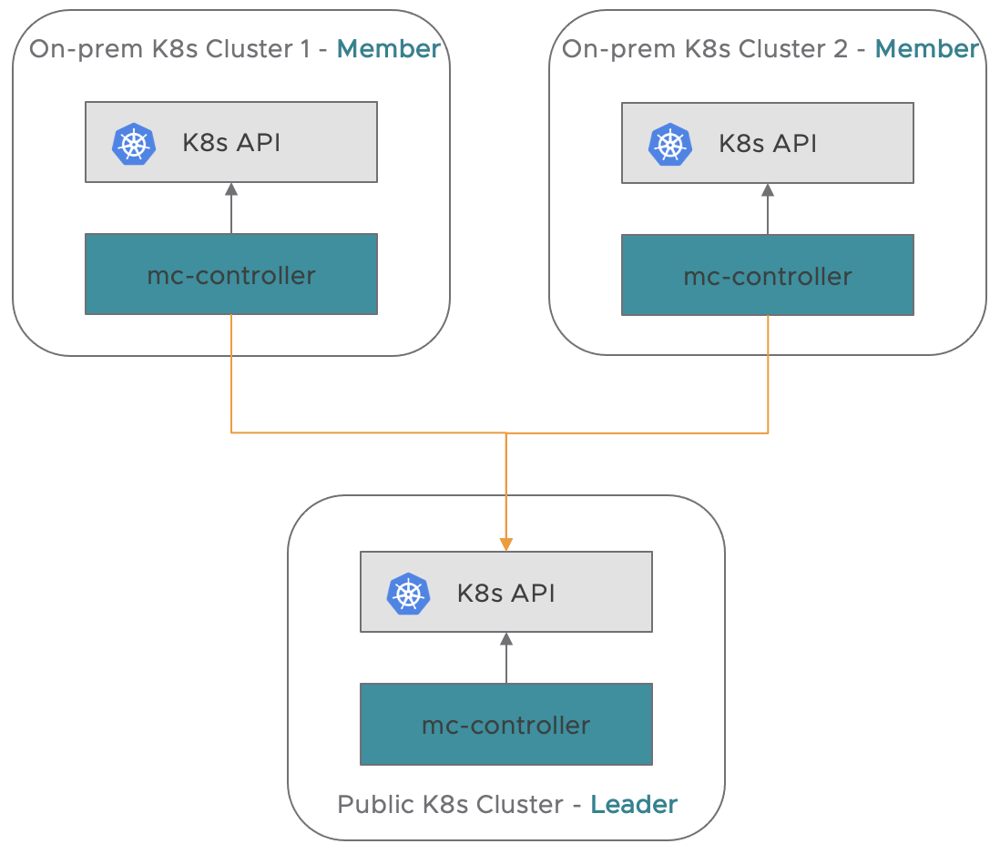

# Antrea Multi-cluster Architecture

Antrea Multi-cluster implements [Multi-cluster Service API](https://github.com/kubernetes/enhancements/tree/master/keps/sig-multicluster/1645-multi-cluster-services-api) for Service communication
across multiple Kubernetes clusters.

The below diagram depicts a basic multi-cluster topology in Antrea.



Given a set of Kubernetes clusters, there will be a leader cluster and several member clusters.
By default, a leader cluster itself is also a member cluster of a ClusterSet. A cluster
can also be configured as a dedicated leader cluster of multiple ClusterSets.

## Terminology

ClusterSet is a placeholder name for a group of clusters with a high degree of mutual
trust and shared ownership that share Services amongst themselves. Within a ClusterSet,
Namespace sameness applies, which means all Namespaces with a given name are considered to
be the same Namespace. The ClusterSet Custom Resource Definition(CRD) defines a ClusterSet
including the leader and member clusters information.

The ClusterClaim CRD is used to claim a cluster itself as a member of a ClusterSet with
unique cluster ID, to claim a ClusterSet with unique ClusterSet ID.

The MemberClusterAnnounce CRD declares a member cluster configuration to the leader cluster.

The Common Area is an abstraction in the Antrea Multi-cluster implementation provides a storage
interface for resource export/import that can be read/written by all member and leader clusters
in the ClusterSet. The Common Area is implemented with a Namespace in the leader cluster for a
given ClusterSet.

## Antrea Multi-cluster Controller

In a member cluster, Antrea Multi-cluster creates a Deployment that runs Antrea Multi-cluster
Controller which is responsible for exporting resource to and importing resource from a leader
cluster in a ClusterSet.

In a leader cluster, Antrea Multi-cluster creates a Deployment that runs Antrea Multi-cluster
Controller which is responsible for converting resources from different member clusters into one
encapsulated resource as long as these resources have the same kind and match Namespace sameness.

In ClusterSet initialization, Antrea Multi-cluster Controller in a member cluster watches
ClusterSet, ClusterClaim, and creates a MemberClusterAnnounce in the leader cluster.

For exporting resources from the member cluster, it watches ServiceExport, Service and Endpoints
resources, encapsulates Services and Endpoints into ResourceExports according to ServiceExports,
and writes the ResourceExports to leader cluster. For resource importing, it watches ResourceImports
from leader cluster, and creates multi-cluster Services and Endpoints with a prefix `antrea-mc-`
plus exported Service name, and also ServiceImports which have the same name as the Service name.

In a leader cluster, for ClusterSet initialization, Antrea Multi-cluster controller watches and
validates the ClusterSet and Clusterclaim. For resource export/import, it watches ResourceExports
and encapsulates them into ResourceImports.

## Service Export and Import


The current multi-cluster implementation supports Service discovery and Service export/import among
member clusters. The above diagram depicts Antrea Multi-cluster resource export/import pipeline.

Given two Services in the member clusters - `foo.ns.cluster1.local` and `foo.ns.cluster2.local`,
multi-cluster Services may be generated by the following the resource export/import pipeline.

* Administrators create resource ServiceExports `foo` in Namespace `ns` in each
of the clusters.
* The Exporters in member clusters `cluster1` and `cluster2` see ServiceExport `foo`, collect
the associated Services and Endpoints, and create ResourceExports for them in the Common Area of the
leader cluster.
* The controller in the leader cluster sees ResourcesExports in the Common Area, computes multi-cluster
Service `cluster1-ns-foo-service`, `cluster2-ns-foo-service` and associated Endpoints
`cluster1-ns-foo-endpoints`, `cluster2-ns-foo-endpoints`.
* The controller creates ResourcesImport enclosing multi-cluster Service `ns-foo-service` and Endpoints
`ns-foo-endpoints` in the Common Area.
* The Importer in each member cluster watches ResourceImports; decapsulates them and gets Service
`ns/antrea-mc-foo`, Endpoints `ns/antrea-mc-foo`, and creates the resources and as well as a
ServiceImport `ns/foo` locally if they don't exist or updates them if the resources have already
been created by the Importer earlier.

## Antrea Multi-cluster Service

Antrea Multi-cluster Controller only supports Service of type ClusterIP at this moment. In
order to support multi-cluster Service access between member clusters, Antrea requires member
clusters' Pod IPs are reachable and no overlapping between all member clusters.

When Antrea Multi-cluster Controller in member cluster watches ResourceImport's creation event
in leader cluster, it will create multi-cluster Service, Endpoints and ServiceImport locally.
The Service Ports definition will be the same as exported Services, the Endpoints will be Pod
IPs from all member clusters. The new created Antrea Multi-cluster Service is just like a regular
Kubernetes Service, so Pods in a member cluster can access the multi-cluster Service as usual without
any extra setting.

## Multi-cluster ClusterNetworkPolicy Replication (ACNP Copy-span)

Antrea Multi-cluster admins can specify certain ClusterNetworkPolicies to be replicated across
the entire ClusterSet. This is especially useful for ClusterSet admins who want all clusters in the
ClusterSet to be applied with a consistent security posture (for example, all namespaces in all
clusters can only communicate with Pods in their own namespaces). For more information regarding
Antrea ClusterNetworkPolicy(ACNP), refer to [this document](../antrea-network-policy.md).

To achieve such ACNP copy-span, admins can, in the acting leader cluster of a Multi-cluster deployment, 
create a ResourceExport of kind `AntreaClusterNetworkPolicy` which contains the ClusterNetworkPolicy spec
they wish to be replicated. The ResourceExport should be created in the Namespace which implements the
Common Area of the ClusterSet. In future releases, some additional tooling may become available to
automate the creation of such ResourceExport and make ACNP replication across cluster eaiser.

```yaml
apiVersion: multicluster.crd.antrea.io/v1alpha1
kind: ResourceExport
metadata:
  name: strict-namespace-isolation-for-test-clusterset
  namespace: antrea-mcs-ns          # Namespace that implements Common Area of test-clusterset
spec:
  kind: AntreaClusterNetworkPolicy  
  name: strict-namespace-isolation  # In each importing cluster, an ACNP of name antrea-mc-strict-namespace-isolation will be created with the spec below
  clusternetworkpolicy:
    priority: 1
    tier: securityops
    appliedTo:
      - namespaceSelector: {}       # Selects all Namespaces in the member cluster
    ingress:
      - action: Pass
        from:
        - namespaces:
            match: Self            # Skip drop rule for traffic from Pods in the same Namespace
        - podSelector:
            matchLabels:
              k8s-app: kube-dns    # Skip drop rule for traffic from the core-dns components
      - action: Drop
        from:
        - namespaceSelector: {}    # Drop from Pods from all other Namespaces
```

The above sample spec will create an ACNP in each member cluster which implements strict namespace
isolation for that cluster. 

Note that because the Tier that an ACNP refers to must exist before the ACNP is applied, an importing
cluster may fail to create the ACNP to be replicated, if the tier in the ResourceExport spec cannot be
found in that particular cluster.
