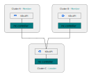
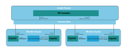
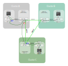

# Antrea Multi-cluster Architecture

Antrea Multi-cluster implements [Multi-cluster Service API](https://github.com/kubernetes/enhancements/tree/master/keps/sig-multicluster/1645-multi-cluster-services-api),
which allows users to create multi-cluster Services that can be accessed cross
clusters in a ClusterSet. Antrea Multi-cluster also supports Antrea
ClusterNetworkPolicy replication. Multi-cluster admins can define
ClusterNetworkPolicies to be replicated across the entire ClusterSet, and
enforced in all member clusters.

An Antrea Multi-cluster ClusterSet includes a leader cluster and multiple member
clusters. Antrea Multi-cluster Controller needs to be deployed in the leader and
all member clusters. A cluster can serve as the leader, and meanwhile also be a
member cluster of the ClusterSet.

The diagram below depicts a basic Antrea Multi-cluster topology with one leader
cluster and two member clusters.

## Terminology

ClusterSet is a placeholder name for a group of clusters with a high degree of mutual
trust and shared ownership that share Services amongst themselves. Within a ClusterSet,
Namespace sameness applies, which means all Namespaces with a given name are considered to
be the same Namespace. The ClusterSet Custom Resource Definition(CRD) defines a ClusterSet
including the leader and member clusters information.

The MemberClusterAnnounce CRD declares a member cluster configuration to the leader cluster.

The Common Area is an abstraction in the Antrea Multi-cluster implementation provides a storage
interface for resource export/import that can be read/written by all member and leader clusters
in the ClusterSet. The Common Area is implemented with a Namespace in the leader cluster for a
given ClusterSet.

## Antrea Multi-cluster Controller

Antrea Multi-cluster Controller implements ClusterSet management and resource
export/import in the ClusterSet. In either a leader or a member cluster, Antrea
Multi-cluster Controller is deployed with a Deployment of a single replica, but
it takes different responsibilities in leader and member clusters.

### ClusterSet Establishment

In a member cluster, Multi-cluster Controller watches and validates the ClusterSet,
and creates a MemberClusterAnnounce CR in the Common Area of the leader cluster to
join the ClusterSet.

In the leader cluster, Multi-cluster controller watches, validates and initializes
the ClusterSet. It also validates the MemberClusterAnnounce CR created by a member
cluster and updates the member cluster's connection status to `ClusterSet.Status`.

### Resource Export and Import

In a member cluster, Multi-cluster controller watches exported resources (e.g.
ServiceExports, Services, Multi-cluster Gateways), encapsulates an exported
resource into a ResourceExport and creates the ResourceExport CR in the Common
Area of the leader cluster.

In the leader cluster, Multi-cluster Controller watches ResourceExports created
by member clusters (in the case of Service and ClusterInfo export), or by the
ClusterSet admin (in the case of Multi-cluster NetworkPolicy), converts
ResourceExports to ResourceImports, and creates the ResourceImport CRs in the
Common Area for member clusters to import them. Multi-cluster Controller also
merges ResourceExports from different member clusters to a single
ResourceImport, when these exported resources share the same kind, name, and
original Namespace (matching Namespace sameness).

Multi-cluster Controller in a member cluster also watches ResourceImports in the
Common Area of the leader cluster, decapsulates the resources from them, and
creates the resources (e.g. Services, Endpoints, Antrea ClusterNetworkPolicies,
ClusterInfoImports) in the member cluster.

For more information about multi-cluster Service export/import, please also check
the [Service Export and Import](#service-export-and-import) section.

## Multi-cluster Service

### Service Export and Import

Antrea Multi-cluster Controller implements Service export/import among member
clusters. The above diagram depicts Antrea Multi-cluster resource export/import
pipeline, using Service export/import as an example.

Given two Services with the same name and Namespace in two member clusters -
`foo.ns.cluster-a.local` and `foo.ns.cluster-b.local`, a multi-cluster Service can
be created by the following resource export/import workflow.

* User creates a ServiceExport `foo` in Namespace `ns` in each of the two
clusters.
* Multi-cluster Controllers in `cluster-a` and `cluster-b` see ServiceExport
`foo`, and both create two ResourceExports for the Service and Endpoints
respectively in the Common Area of the leader cluster.
* Multi-cluster Controller in the leader cluster sees the ResourcesExports in
the Common Area, including the two for Service `foo`: `cluster-a-ns-foo-service`,
`cluster-b-ns-foo-service`; and the two for the Endpoints:
`cluster-a-ns-foo-endpoints`, `cluster-b-ns-foo-endpoints`. It then creates a
ResourceImport `ns-foo-service` for the multi-cluster Service; and a
ResourceImport `ns-foo-endpoints` for the Endpoints, which includes the
exported endpoints of both `cluster-a-ns-foo-endpoints` and
`cluster-b-ns-foo-endpoints`.
* Multi-cluster Controller in each member cluster watches the ResourceImports
from the Common Area, decapsulates them and gets Service `ns/antrea-mc-foo` and
Endpoints `ns/antrea-mc-foo`, and creates the Service and Endpoints, as well as
a ServiceImport `foo` in the local Namespace `ns`.

### Service Access Across Clusters

Since Antrea v1.7.0, the Service's ClusterIP is exported as the multi-cluster
Service's Endpoints. Multi-cluster Gateways must be configured to support
multi-cluster Service access across member clusters, and Service CIDRs cannot
overlap between clusters. Please refer to [Multi-cluster Gateway](#multi-cluster-gateway)
for more information. Before Antrea v1.7.0, Pod IPs are exported as the
multi-cluster Service's Endpoints. Pod IPs must be directly reachable across
clusters for multi-cluster Service access, and Pod CIDRs cannot overlap between
clusters. Antrea Multi-cluster only supports creating multi-cluster Services
for Services of type ClusterIP.

## Multi-cluster Gateway

Antrea started to support Multi-cluster Gateway since v1.7.0. User can choose
one K8s Node as the Multi-cluster Gateway in a member cluster. The Gateway Node
is responsible for routing all cross-clusters traffic from the local cluster to
other member clusters through tunnels. The diagram below depicts Antrea
Multi-cluster connectivity with Multi-cluster Gateways.

Antrea Agent is responsible for setting up tunnels between Gateways of member
clusters. The tunnels between Gateways use Antrea Agent's configured tunnel type.
All member clusters in a ClusterSet need to deploy Antrea with the same tunnel
type.

The Multi-cluster Gateway implementation introduces two new CRDs `Gateway` and
`ClusterInfoImport`. `Gateway` includes the local Multi-cluster Gateway
information including: `internalIP` for tunnels to local Nodes, and `gatewayIP`
for tunnels to remote cluster Gateways. `ClusterInfoImport` includes Gateway
and network information of member clusters, including Gateway IPs and Service
CIDRs. The existing esource export/import pipeline is leveraged to exchange
the cluster network information among member clusters, generating
ClusterInfoImports in each member cluster.

### Multi-cluster Service Traffic Walk

Let's use the ClusterSet in the above diagram as an example. As shown in the
diagram:

1. Cluster A has a client Pod named `pod-a` running on a regular Node, and a
   multi-cluster Service named `antrea-mc-nginx` with ClusterIP `10.112.10.11`
   in the `default` Namespace.
2. Cluster B exported a Service named `nginx` with ClusterIP `10.96.2.22` in
   the `default` Namespace. The Service has one Endpoint `172.170.11.22` which is
   `pod-b`'s IP.
3. Cluster C exported a Service named `nginx` with ClusterIP `10.11.12.33` also
   in the `default` Namespace. The Service has one Endpoint `172.10.11.33` which
   is `pod-c`'s IP.

The multi-cluster Service `antrea-mc-nginx` in cluster A will have two
Endpoints:

* `nginx` Service's ClusterIP `10.96.2.22` from cluster B.
* `nginx` Service's ClusterIP `10.11.12.33` from cluster C.

When the client Pod `pod-a` on cluster A tries to access the multi-cluster
Service `antrea-mc-nginx`, the request packet will first go through the Service
load balancing pipeline on the source Node `node-a2`, with one endpoint of the
multi-cluster Service being chosen as the destination. Let's say endpoint
`10.11.12.33` from cluster C is chosen, then the request packet will be DNAT'd
with IP `10.11.12.33` and tunnelled to the local Gateway Node `node-a1`.
`node-a1` knows from the destination IP (`10.11.12.33`) the packet is
multi-cluster Service traffic destined for cluster C, and it will tunnel the
packet to cluster C's Gateway Node `node-c1`, after performing SNAT and setting
the packet's source IP to its own Gateway IP. On `node-c1`, the packet will go
through the Service load balancing pipeline again with an endpoint of Service
`nginx` being chosen as the destination. As the Service has only one endpoint -
`172.10.11.33` of `pod-c`, the request packet will be DNAT'd to `172.10.11.33`
and tunnelled to `node-c2` where `pod-c` is running. Finally, on `node-c2` the
packet will go through the normal Antrea forwarding pipeline and be forwarded
to `pod-c`.

## Antrea Multi-cluster NetworkPolicy

At this moment, Antrea does not support Pod-level policy enforcement for
cross-cluster traffic. Access towards multi-cluster Services can be regulated
with Antrea ClusterNetworkPolicy `toService` rules. In each member cluster,
users can create an Antrea ClusterNetworkPolicy selecting Pods in that cluster,
with the imported Mutli-cluster Service name and Namespace in an egress
`toService` rule, and the Action to take for traffic matching this rule.
For more information regarding Antrea ClusterNetworkPolicy (ACNP), refer
to [this document](../antrea-network-policy.md).

Multi-cluster admins can also specify certain ClusterNetworkPolicies to be
replicated across the entire ClusterSet. The ACNP to be replicated should
be created as a ResourceExport in the leader cluster, and the resource
export/import pipeline will ensure member clusters receive this ACNP spec
to be replicated. Each member cluster's Multi-cluster Controller will then
create an ACNP in their respective clusters.

## Antrea Traffic Modes

Multi-cluster Gateway supports all of `encap`, `noEncap`, `hybrid`, and
`networkPolicyOnly` modes. In all supported modes, the cross-cluster traffic
is routed by Multi-cluster Gateways of member clusters, and the traffic goes
through Antrea overlay tunnels between Gateways. In `noEncap`, `hybrid`, and
`networkPolicyOnly` modes, even when in-cluster Pod traffic does not go through
tunnels, antrea-agent still creates tunnels between the Gateway Node and other
Nodes, and routes cross-cluster traffic to reach the Gateway through the tunnels.
Specially for [`networkPolicyOnly` mode](../design/policy-only.md), Antrea only
handles multi-cluster traffic routing, while the primary CNI takes care of in-cluster
traffic routing.
