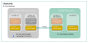

# Antrea Multi-cluster Quick Start

In this quick start guide, we will set up an Antrea Multi-cluster ClusterSet
with two clusters. One cluster will serve as the leader of the ClusterSet, and
meanwhile also join as a member cluster; another cluster will be a member only.
Antrea Multi-cluster supports two types of IP addresses as multi-cluster
Service endpoints - exported Services' ClusterIPs or backend Pod IPs.
We use the default `ClusterIP` endpoint type for multi-cluster Services
in this guide.

The diagram below shows the two clusters and the ClusterSet to be created (for
simplicity, the diagram just shows two Nodes for each cluster).



## Preparation

We assume an Antrea version >= `v1.8.0` is used in this guide, and the Antrea
version is set to an environment variable `TAG`. For example, the following
command sets the Antrea version to `v1.8.0`.

```bash
export TAG=v1.8.0
```

To use the latest version of Antrea Multi-cluster from the Antrea main branch,
you can change the YAML manifest path to: `https://github.com/antrea-io/antrea/tree/main/multicluster/build/yamls/`
when applying or downloading an Antrea YAML manifest.

Antrea must be deployed in both cluster A and cluster B, and the `Multicluster`
feature of `antrea-agent` must be enabled to support multi-cluster Services. As we
use `ClusterIP` endpoint type for multi-cluster Services, an Antrea Multi-cluster
Gateway needs be set up in each member cluster to route Service traffic across clusters,
and two clusters **must have non-overlapping Service CIDRs**. Set the following
configuration parameters in `antrea-agent.conf` of the Antrea deployment
manifest to enable the `Multicluster` feature:

```yaml
kind: ConfigMap
apiVersion: v1
metadata:
  name: antrea-config
  namespace: kube-system
data:
  antrea-agent.conf: |
    featureGates:
      Multicluster: true
    multicluster:
      enableGateway: true
      namespace: ""
```

At the moment, Multi-cluster Gateway only works with the Antrea `encap` traffic
mode, and all member clusters in a ClusterSet must use the same tunnel type.

## Steps with antctl

`antctl` provides a couple of commands to facilitate deployment, configuration,
and troubleshooting of Antrea Multi-cluster. This section describes the steps
to deploy Antrea Multi-cluster and set up the example ClusterSet using `antctl`.
A [further section](#steps-with-yaml-manifests) will describe the steps to
achieve the same using YAML manifests.

To execute any command in this section, `antctl` needs access to the target
cluster's API server, and it needs a kubeconfig file for that. Please refer to
the [`antctl` Multi-cluster manual](antctl.md) to learn more about the
kubeconfig file configuration, and the `antctl` Multi-cluster commands. For
installation of `antctl`, please refer to the [installation guide](../antctl.md#installation).

### Set up Leader and Member in Cluster A

#### Step 1 - deploy Antrea Multi-cluster Controllers for leader and member

Run the following commands to deploy Multi-cluster Controller for the leader
into Namespace `antrea-multicluster` (Namespace `antrea-multicluster` will be
created by the commands), and Multi-cluster Controller for the member into
Namespace `kube-system`.

```bash
kubectl create ns antrea-multicluster
antctl mc deploy leadercluster -n antrea-multicluster --antrea-version $TAG
antctl mc deploy membercluster -n kube-system --antrea-version $TAG
```

You can run the following command to verify the leader and member
`antrea-mc-controller` Pods are deployed and running:

```bash
$ kubectl get all -A -l="component=antrea-mc-controller"
NAMESPACE             NAME                                        READY   STATUS    RESTARTS   AGE
antrea-multicluster   pod/antrea-mc-controller-cd7bf8f68-kh4kz    1/1     Running   0          50s
kube-system           pod/antrea-mc-controller-85dbf58b75-pjj48   1/1     Running   0          48s

NAMESPACE             NAME                                   READY   UP-TO-DATE   AVAILABLE   AGE
antrea-multicluster   deployment.apps/antrea-mc-controller   1/1     1            1           50s
kube-system           deployment.apps/antrea-mc-controller   1/1     1            1           48s
```

#### Step 2 - initialize ClusterSet

Run the following commands to create a ClusterSet with cluster A to be the
leader, generate a join configuration, and create an access token for it:

```bash
antctl mc init --clusterset test-clusterset --clusterid test-cluster-leader -n antrea-multicluster -j join-config.yml
antctl mc create membertoken test-cluster-leader-token -n antrea-multicluster --cluster-id test-cluster-leader -o test-cluster-leader-token.yml
antctl mc join --clusterid test-cluster-leader -n kube-system --config-file join-config.yml --token-secret-file test-cluster-leader-token.yml
```

The `antctl mc init` command initializes the ClusterSet and saves the join
arguments to file `join-config.yml` (specified with the `-j` option). Then,
`antctl mc create membertoken` generates a dedicated token bound to the `test-cluster-leader`
identity. Finally, the `antctl mc join` command uses both to join the ClusterSet.

#### Step 3 - specify Multi-cluster Gateway Node

Last, you need to choose at least one Node in cluster A to serve as the
Multi-cluster Gateway. The Node should have an IP that is reachable from the
cluster B's Gateway Node, so a tunnel can be created between the two Gateways.
For more information about Multi-cluster Gateway, please refer to the
[Multi-cluster User Guide](user-guide.md#multi-cluster-gateway-configuration).

Assuming K8s Node `node-a1` is selected for the Multi-cluster Gateway, run
the following command to annotate the Node with:
`multicluster.antrea.io/gateway=true` (so Antrea can know it is the Gateway
Node from the annotation):

```bash
kubectl annotate node node-a1 multicluster.antrea.io/gateway=true
```

### Set up Cluster B

Let us switch to cluster B. All the `kubectl` and `antctl` commands in the
following steps should be run with the `kubeconfig` for cluster B.

#### Step 1 - deploy Antrea Multi-cluster Controller for member

Run the following command to deploy the member Multi-cluster Controller into
Namespace `kube-system`.

```bash
antctl mc deploy membercluster -n kube-system --antrea-version $TAG
```

You can run the following command to verify the `antrea-mc-controller` Pod is
deployed and running:

```bash
$ kubectl get all -A -l="component=antrea-mc-controller"
NAMESPACE             NAME                                        READY   STATUS    RESTARTS   AGE
kube-system           pod/antrea-mc-controller-85dbf58b75-pjj48   1/1     Running   0          40s

NAMESPACE             NAME                                   READY   UP-TO-DATE   AVAILABLE   AGE
kube-system           deployment.apps/antrea-mc-controller   1/1     1            1           40s
```

#### Step 2 - join ClusterSet

Run the following command to make cluster B join the ClusterSet:

```bash
# In the leader cluster (Cluster A), create a token for cluster B
antctl mc create membertoken test-cluster-member-token -n antrea-multicluster --cluster-id test-cluster-member -o test-cluster-member-token.yml

# In cluster B, join the ClusterSet using the generated configuration and token file
antctl mc join --clusterid test-cluster-member -n kube-system --config-file join-config.yml --token-secret-file test-cluster-member-token.yml
```

`join-config.yml` is generated when initializing the ClusterSet in cluster A, while
`test-cluster-member-token.yml` is generated explicitly for cluster B's `ClusterID`
to satisfy the strict identity validation.

#### Step 3 - specify Multi-cluster Gateway Node

Assuming K8s Node `node-b1` is chosen to be the Multi-cluster Gateway for cluster
B, run the following command to annotate the Node:

```bash
kubectl annotate node node-b1 multicluster.antrea.io/gateway=true
```

## What is Next

So far, we set up an Antrea Multi-cluster ClusterSet with two clusters following
the above sections of this guide. Next, you can start to consume the Antrea
Multi-cluster features with the ClusterSet, including [Multi-cluster Services](user-guide.md#multi-cluster-service),
[Multi-cluster NetworkPolicy](user-guide.md#multi-cluster-networkpolicy), and
[ClusterNetworkPolicy replication](user-guide.md#clusternetworkpolicy-replication),
Please check the relevant Antrea Multi-cluster User Guide sections to learn more.

If you want to add a new member cluster to your ClusterSet, you can follow the
steps for cluster B to do so. For example, you can run the following commands
to join the ClusterSet in a member cluster with ID `test-cluster-member2`:

```bash
# In the leader cluster (Cluster A), create a token for the new member cluster
antctl mc create membertoken test-cluster-member2-token -n antrea-multicluster --cluster-id test-cluster-member2 -o test-cluster-member2-token.yml

# In the new member cluster, join the ClusterSet using the generated configuration and token file
antctl mc join --clusterid test-cluster-member2 -n kube-system --config-file join-config.yml --token-secret-file test-cluster-member2-token.yml
```

## Steps with YAML Manifests

### Set up Leader and Member in Cluster A

#### Step 1 - deploy Antrea Multi-cluster Controllers for leader and member

Run the following commands to deploy Multi-cluster Controller for the leader
into Namespace `antrea-multicluster` (Namespace `antrea-multicluster` will be
created by the commands), and Multi-cluster Controller for the member into
Namespace `kube-system`.

```bash
kubectl apply -f https://github.com/antrea-io/antrea/releases/download/$TAG/antrea-multicluster-leader-global.yml
kubectl create ns antrea-multicluster
kubectl apply -f https://github.com/antrea-io/antrea/releases/download/$TAG/antrea-multicluster-leader-namespaced.yml
kubectl apply -f https://github.com/antrea-io/antrea/releases/download/$TAG/antrea-multicluster-member.yml
```

#### Step 2 - initialize ClusterSet

Antrea provides template YAML manifests to set up a ClusterSet quicker.
You can run the following commands to create a ClusterSet named `test-clusterset`
in the leader cluster.

```bash
kubectl apply -f https://raw.githubusercontent.com/antrea-io/antrea/$TAG/multicluster/config/samples/clusterset_init/leader-clusterset-template.yml
```

Since the leader cluster requires strict identity binding for member access, you must create a
dedicated access token for each member cluster (cluster A and B in our case). You can generate
the required `ServiceAccount`, `Secret`, and `RoleBinding`. These objects belong in the leader
cluster's `antrea-multicluster` Namespace, so that the `RoleBinding` resolves the
`antrea-mc-member-cluster-role` Role and the webhook can look the `ServiceAccount` up:

```yaml
# cluster-a-token.yml
apiVersion: v1
kind: ServiceAccount
metadata:
  name: member-test-cluster-leader-access-sa
  namespace: antrea-multicluster
  annotations:
    multicluster.antrea.io/cluster-id: test-cluster-leader
---
apiVersion: rbac.authorization.k8s.io/v1
kind: RoleBinding
metadata:
  name: member-test-cluster-leader-rolebinding
  namespace: antrea-multicluster
roleRef:
  apiGroup: rbac.authorization.k8s.io
  kind: Role
  name: antrea-mc-member-cluster-role
subjects:
  - kind: ServiceAccount
    name: member-test-cluster-leader-access-sa
    namespace: antrea-multicluster
---
apiVersion: v1
kind: Secret
metadata:
  name: cluster-a-token
  namespace: antrea-multicluster
  annotations:
    kubernetes.io/service-account.name: member-test-cluster-leader-access-sa
type: kubernetes.io/service-account-token
```

```yaml
# cluster-b-token.yml
apiVersion: v1
kind: ServiceAccount
metadata:
  name: member-test-cluster-member-access-sa
  namespace: antrea-multicluster
  annotations:
    multicluster.antrea.io/cluster-id: test-cluster-member
---
apiVersion: rbac.authorization.k8s.io/v1
kind: RoleBinding
metadata:
  name: member-test-cluster-member-rolebinding
  namespace: antrea-multicluster
roleRef:
  apiGroup: rbac.authorization.k8s.io
  kind: Role
  name: antrea-mc-member-cluster-role
subjects:
  - kind: ServiceAccount
    name: member-test-cluster-member-access-sa
    namespace: antrea-multicluster
---
apiVersion: v1
kind: Secret
metadata:
  name: cluster-b-token
  namespace: antrea-multicluster
  annotations:
    kubernetes.io/service-account.name: member-test-cluster-member-access-sa
type: kubernetes.io/service-account-token
```

Next, apply the two manifests to the leader cluster, so that the token Secrets
(and the `ServiceAccount`s) are created there:

```bash
kubectl apply -f cluster-a-token.yml
kubectl apply -f cluster-b-token.yml
```

Then, run the following commands to make cluster A join the ClusterSet also as a
member. The first command converts the `cluster-a-token` Secret created in the
leader cluster into a manifest for cluster A; the token is not usable until the
converted Secret is applied to the member cluster:

```bash
kubectl get secret cluster-a-token -n antrea-multicluster -o yaml | grep -w -e '^apiVersion' -e '^data' -e '^metadata' -e '^ *name:' -e '^kind' -e '  ca.crt' -e '  token:' -e '^type' -e '  namespace' | sed -e 's/kubernetes.io\/service-account-token/Opaque/g' -e 's/antrea-multicluster/kube-system/g' > cluster-a-token-member.yml
kubectl apply -f cluster-a-token-member.yml
curl -L https://raw.githubusercontent.com/antrea-io/antrea/$TAG/multicluster/config/samples/clusterset_init/member-clusterset-template.yml > member-clusterset.yml
sed -e 's/test-cluster-member/test-cluster-leader/g' -e 's/<TOKEN_SECRET_NAME>/cluster-a-token/g' -e 's/<LEADER_APISERVER_IP>/172.10.0.11/g' member-clusterset.yml | kubectl apply -f -
```

Here, `172.10.0.11` is the `kube-apiserver` IP of cluster A. You should replace
it with the `kube-apiserver` IP of your leader cluster.

#### Step 3 - specify Multi-cluster Gateway Node

Assuming K8s Node `node-a1` is selected for the Multi-cluster Gateway, run
the following command to annotate the Node:

```bash
kubectl annotate node node-a1 multicluster.antrea.io/gateway=true
```

### Set up Cluster B

Let us switch to cluster B. All the `kubectl` commands in the following steps
should be run with the `kubeconfig` for cluster B.

#### Step 1 - deploy Antrea Multi-cluster Controller for member

Run the following command to deploy the member Multi-cluster Controller into
Namespace `kube-system`.

```bash
kubectl apply -f https://github.com/antrea-io/antrea/releases/download/$TAG/antrea-multicluster-member.yml
```

You can run the following command to verify the `antrea-mc-controller` Pod is
deployed and running:

```bash
$ kubectl get all -A -l="component=antrea-mc-controller"
NAMESPACE             NAME                                        READY   STATUS    RESTARTS   AGE
kube-system           pod/antrea-mc-controller-85dbf58b75-pjj48   1/1     Running   0          40s

NAMESPACE             NAME                                   READY   UP-TO-DATE   AVAILABLE   AGE
kube-system           deployment.apps/antrea-mc-controller   1/1     1            1           40s
```

#### Step 2 - join ClusterSet

First, convert the `cluster-b-token` Secret which was generated when
initializing the ClusterSet in cluster A, so it becomes a manifest for cluster
B. This command must be run against the leader cluster:

```bash
kubectl get secret cluster-b-token -n antrea-multicluster -o yaml | grep -w -e '^apiVersion' -e '^data' -e '^metadata' -e '^ *name:' -e '^kind' -e '  ca.crt' -e '  token:' -e '^type' -e '  namespace' | sed -e 's/kubernetes.io\/service-account-token/Opaque/g' -e 's/antrea-multicluster/kube-system/g' > cluster-b-token-member.yml
```

Then, run the following commands in cluster B to make it join the ClusterSet:

```bash
kubectl apply -f cluster-b-token-member.yml
curl -L https://raw.githubusercontent.com/antrea-io/antrea/$TAG/multicluster/config/samples/clusterset_init/member-clusterset-template.yml > member-clusterset.yml
sed -e 's/<TOKEN_SECRET_NAME>/cluster-b-token/g' -e 's/<LEADER_APISERVER_IP>/172.10.0.11/g' member-clusterset.yml | kubectl apply -f -
```

`cluster-b-token-member.yml` contains the token for cluster B: it is the
`cluster-b-token` Secret created in the leader cluster, converted to an `Opaque`
Secret to be applied in the member cluster.

#### Step 3 - specify Multi-cluster Gateway Node

Assuming K8s Node `node-b1` is chosen to be the Multi-cluster Gateway for cluster
B, run the following command to annotate the Node:

```bash
kubectl annotate node node-b1 multicluster.antrea.io/gateway=true
```

### Add new member clusters

If you want to add a new member cluster to your ClusterSet, you can follow the
steps for cluster B to do so. First, on the leader cluster, create the
`ServiceAccount`, `RoleBinding`, and `Secret` for the new member, exactly like
`cluster-b-token.yml` above but with the new member's cluster ID, and apply it
(e.g. in a file `cluster-c-token.yml`):

```bash
kubectl apply -f cluster-c-token.yml
```

Convert the new member's token Secret and apply it in the new member cluster:

```bash
kubectl get secret cluster-c-token -n antrea-multicluster -o yaml | grep -w -e '^apiVersion' -e '^data' -e '^metadata' -e '^ *name:' -e '^kind' -e '  ca.crt' -e '  token:' -e '^type' -e '  namespace' | sed -e 's/kubernetes.io\/service-account-token/Opaque/g' -e 's/antrea-multicluster/kube-system/g' > cluster-c-token-member.yml
kubectl apply -f cluster-c-token-member.yml
```

Then, join the ClusterSet in the new member cluster. Remember to update the
member cluster ID to the new member cluster's ID. For example, the following
commands join the ClusterSet in a member cluster with ID `test-cluster-member2`:

```bash
curl -L https://raw.githubusercontent.com/antrea-io/antrea/$TAG/multicluster/config/samples/clusterset_init/member-clusterset-template.yml > member-clusterset.yml
sed -e 's/<LEADER_APISERVER_IP>/172.10.0.11/g' -e 's/<TOKEN_SECRET_NAME>/cluster-c-token/g' -e 's/test-cluster-member/test-cluster-member2/g' member-clusterset.yml | kubectl apply -f -
```
