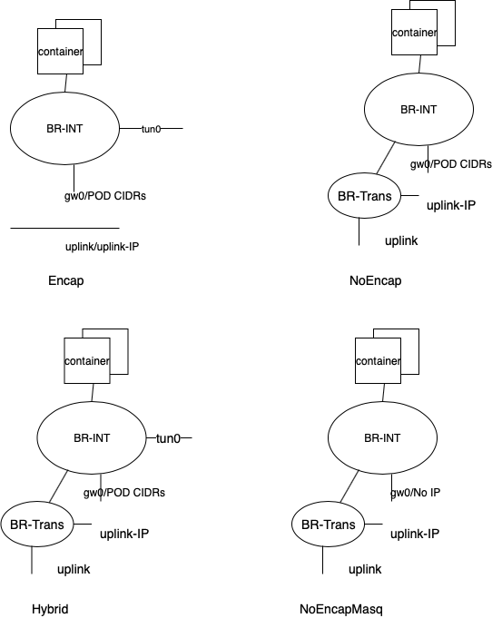
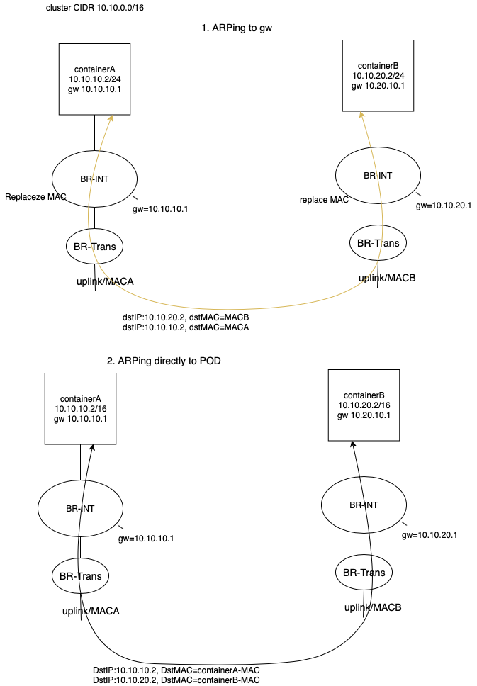

# Support For NoEcapsulation

# Parameters

User may specify in antrea-agent.conf _PortTrafficEncapMode_, It sets the encapsulation mode for inter-node POD traffic. It allows the following values 

Encap: inter-POD traffic are encapsulated, POD to external traffic are masqueraded. This is the default setting.

NoEncap: inter-POD traffic are not encapsulated, POD to external traffic are masqueraded. When in this mode, we assume all cluster CIDR may be used directly over the physical network.

Hybrid: Antrea auto-detect if a peer node is in the same IP subnet of local node, inter-POD traffic to this peer node uses Encap mode; otherwise if peer and local nodes are on the same IP subnet, NoEcap mode is used for inter-POD traffic for this peer node. 

NoEncapMasq: inter-POD traffic are not encapsulated, POD to external traffic are as is. The POD IP is same on-wire source/destination IP. 

When using NoEncap, Hybrid mode, user is also expected specify_ ClusterCIDR, _this is same --cluster-cidr value given to kube-controller-manager.

Lastly when using NoEcap, Hybrid, and NoEncapMasq modes, add the forwarding argument to ovs-start script as

--arg

   create-transport

This triggers ovs-start script to create a transport bridge.

# OVS Bridge Setup

Depends on the OVS bridge(s) setup  may be like following

The encap mode requires no explanation. 

In NoEcap mode, the tun0 port is missing because there are no encapsulated POD traffic and a transport bridge is created is allow br-int to access uplink directly. 

In hybrid mode, both tun0 port and transport bridge are present, because inter-node POD traffic can go either way.

In NoEncapMasq, there is no tun0 port, and there is no POD CIDR blocks assigned to gw0.

# Datapath Flows And Design

Supporting various NoEncap modes in the context of existing Antrea implementation requires answering these questions:

1. How can container send/receive  unencapsulated IP/ARP packets directly to uplink.
2. How was ARPing done for POD CIDR of a peer node.

To address the first issue, we add br-trans to allow uplink access by br-int. Some may feel simpler just by adding uplink directly onto br-int in lieu of br-trans. This may cause security concerns as it exposes container directly to physical traffic.

The above diagram illustrated two alternatives to inter-node POD ARPing. In the first approach, which is similar to Encap mode routing,  containers are given local node CIDR network mask, so ARPing between inter-node PODs does not happen. The traffic are routed in br-int by replacing gw MAC address with node MACA/MACB. The trick is to know for each antrea-agent to know MACs of all nodes.

In the second approach, antrea-agent, when allocation IP,  simply returns cluster CIDR as container’s network mask instead of node pod CIDR. This enables ARPing directly between containers directly. And we will use this option to describe datapath in the following section.

## NoEncap

Significant changes

1.  CNI returns cluster CIDR as network mask
2.  Tunnel port is not added
3. No flows with respect to tunnel ports
4. A lower priority flow in l2ForwardingTable that gives all traffic to patch port

pod -to-pod

-- ARPing is handled by the “normal” flow in ArpResponderTable.

-- On sender,  IP packet is forwarded to patch port via flow from change 4.

-- On receiver, IP packet is received on patch port on br-int

-- On receive, IP packet is forwarded to destination pod via per local pod flows in L2ForwardingTable.

pod-to-external/node

-- APRing is to host gateway

-- On sender, IP packet arrives at host gateway. And is masqueraded before out.

-- When reply reaches sender, IP packet is unmasqueraged.

-- On sender, the reply IP packet is routed to br-int via host gateway

-- On sender, the reply IP packet is forwarded to originalPOD via per local pod flows in L2ForwardingTable.

node-to-pod

-- On sender, IP packet arrives at host gateway

-- On sender,  ARPing for pod is handled by “normal” flow in ArpResponderTable.

-- On sender, IP packet is either forwarded locally or to a peer node depending on L2ForwardingTable flows.

-- On receiver, IP packet is forwarded to destination pod via flows in L2ForwardingTable.

-- On receiver, the reply IP packet reaches host gateway, and it should not be masqueraded because it is a reply.

-- On send, the reply IP packet reaches sender with srcIP as pod IP.

pod-to-service

 -- ARPing is to host gateway

 -- IP packet arrives at host gateway, is load balanced via kube-proxy.

 -- IP packet with pod IP arrives at br-int via host gateway

-- the remaining flow is same as pod-to-pod

Node-to-service

-- After LB action by kube-proxy, same as node-to-pod.

## Hybrid

Significant changes

1. CNI returns cluster CIDR as network mask
2. For each peer node that requires encap, add a flow in ArpResponderTable that returns ARP requests to pods on the peer node with host gateway’s mac address.
3. For each peer node that requires encap, add forwarding flows to peer node via tun0 in L3ForwardTable.
4. A lower priority flow in l2ForwardingTable that gives all traffic to patch port

Pod-to-pod

-- APRing either hit flow by change 2, or hit normal flow in ArpResponderTable

-- IP packet either follow pod-to-pod in NoEncap mode, or existing encap mode.

 

pod-to-external/node

-- same as in NoEncap mode

node-to-pod

-- On sender, IP packet arrives at host gateway

-- On sender,  ARPing for pod is handled by “normal” flow or flow by change 2 in ArpResponderTable.

-- On sender, IP packet is either forwarded locally or to a peer node depending on L3ForwardingTable flows and L2ForwardingTable flows.

-- On receiver, IP packet is forwarded to destination pod via flows in L2ForwardingTable.

-- On receiver, the reply IP packet reaches host gateway, and it should not be masqueraded because it is a reply.

-- On send, the reply IP packet reaches sender with srcIP as pod IP.

Pod-to-service

--  ARPing is to host gateway

 -- IP packet arrives at host gateway, is load balanced via kube-proxy.

 -- IP packet with pod IP arrives at br-int via host gateway

--  the remaining flow is same as pod-to-pod

Node-to-service

-- After LB action by kube-proxy, same as node-to-pod.

## NoEncapMasq

Significant changes

1. Host gateway is not give an IP
2. No tunnel port and associated flows.
3. A lower priority flow in l2ForwardingTable that gives all traffic to patch port

Pod-to-pod

-- ARPing is handled by normal flow in ArpResponder table.

-- IP packet is handled by flows in L2ForwardingTable. To remote pod: flow change 3; and to local pod: per pod flow.

pod-to-external/node

-- ARPing is handled by normal flow in ArpReponder table

-- On sender, IP packet is handled by L2ForwardingTable flow by change 3.

-- On sender, reply IP packet is handled by L2FowardingTable per pod flow.

Node-to-pod

-- ARPing packets arrives at br-int via patch port and is handled by normal flow in ArpResponderTable.

-- On sender, IP packet is sent to physical uplink via br-trans.

-- On receiver, IP packet arrives at br-int via patch port.

-- On receiver, IP packet forwards per pod flow in L2ForwardingTable

-- ON receiver, reply IP packet forwards to patch port per flow by change 3.

-- On sender, reply IP arrives at br-trans.

Pod-to-service

-- ARPing is to some physical network gateway,

-- IP packet arrives at host gateway (with no ip), is load balanced by kube-proxy.

-- The DNATed IP packet is sent to physical uplink via br-trans.

-- the rest follows pod-to-pod

Node-to-service

-- After LB action, same as node-to-pod

<!-- Docs to Markdown version 1.0β17 -->

