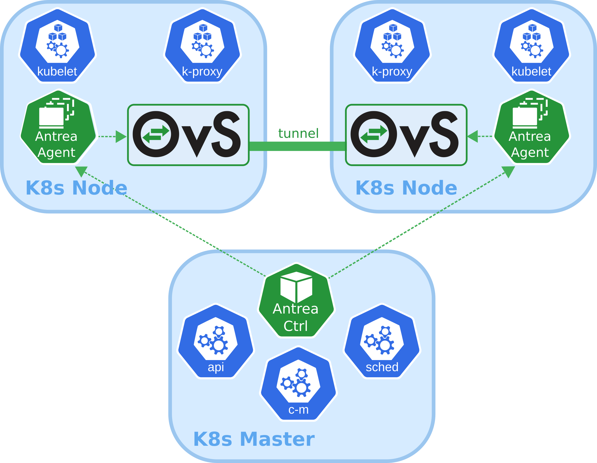

## Overview

Antrea is a [Kubernetes](https://kubernetes.io) networking solution intended
to be Kubernetes native. It operates at Layer3/4 to provide networking and
security services for a Kubernetes cluster, leveraging
[Open vSwitch](https://www.openvswitch.org/) as the networking data plane.

Open vSwitch is a widely adopted high-performance programmable virtual
switch; Antrea leverages it to implement Pod networking and security features.
For instance, Open vSwitch enables Antrea to implement Kubernetes
Network Policies in a very efficient manner.

## Prerequisites

Antrea has been tested with Kubernetes clusters running version 1.16 or later.

* `NodeIPAMController` must be enabled in the Kubernetes cluster.\
  When deploying a cluster with kubeadm the `--pod-network-cidr <cidr>`
  option must be specified.
* Open vSwitch kernel module must be present on every Kubernetes node.

## Getting Started

Getting started with Antrea is very simple, and takes only a few minutes.
See how it's done in the [Getting started](getting-started.md) document.

## Contributing

The Antrea community welcomes new contributors. We are waiting for your PRs!

* Before contributing, please get familiar with our
[Code of Conduct](CODE_OF_CONDUCT.md).
* Check out the Antrea [Contributor Guide](CONTRIBUTING.md) for information
about setting up your development environment and our contribution workflow.
* Learn about Antrea's [Architecture and design](architecture.md).
Your feedback is more than welcome!
* Check out [Open Issues](https://github.com/vmware-tanzu/antrea/issues).
* Join the [Kubernetes Slack](http://slack.k8s.io/) and look for our
[#antrea](https://kubernetes.slack.com/messages/CR2J23M0X) channel.
* Attend the [project weekly meeting](https://VMware.zoom.us/j/823654111),
every two weeks on Tuesday at 4AM GMT (9PM PDT, 6AM CET, 12PM China).
  + [Meeting minutes](https://github.com/vmware-tanzu/antrea/wiki/Community-Meetings)
  + [Meeting recordings](https://www.youtube.com/playlist?list=PLH5zTfQ3otSA6EOYDNb-MvcQRXACdCbQw)
* Join our mailing lists to always stay up-to-date with Antrea development:
  + [projectantrea-announce](https://groups.google.com/forum/#!forum/projectantrea-announce)
for important project announcements.
  + [projectantrea](https://groups.google.com/forum/#!forum/projectantrea)
for updates about Antrea or provide feedback.
  + [projectantrea-dev](https://groups.google.com/forum/#!forum/projectantrea-dev)
to participate in discussions on Antrea development.

Also check out [@ProjectAntrea](https://twitter.com/ProjectAntrea) on Twitter!

## Features

Antrea currently supports the following features:
* IPv4 overlay network for a Kubernetes cluster. Geneve, VXLAN, GRE, or STT can
be used as the encapsulation protocol.
* [Kubernetes Network Policies](https://kubernetes.io/docs/concepts/services-networking/network-policies)
implementation.
* [Octant](https://github.com/vmware-tanzu/octant) UI plugin for monitoring
Antrea components, which publish runtime information as
[CRDs](https://kubernetes.io/docs/concepts/extend-kubernetes/api-extension/custom-resources/).
* [IPsec encyption](ipsec-tunnel.md) of GRE tunnel traffic.

## Roadmap

We are adding features very quickly to Antrea. Check out the list of features we are considering 
on our [Roadmap](ROADMAP.md) page. Feel free to throw your ideas in!

## License

Antrea is licensed under the [Apache License, version 2.0](LICENSE)
