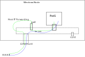

# Running Antrea on Windows

Antrea supports running on Windows worker Nodes. On Windows Nodes, Antrea sets up an overlay
network to forward packets between Nodes and implements NetworkPolicies.

## Design

On Windows, the Host Networking Service (HNS) is a necessary component to support container
networking. For Antrea on Windows, "Transparent" mode is chosen for the HNS network. In this
mode, containers will be directly connected to the physical network through an **external**
Hyper-V switch.

OVS is working as a forwarding extension for the external Hyper-V switch which was created by
HNS. Hence, the packets that are sent from/to the containers can be processed by OVS.
The network adapter used in the HNS Network is also added to the OVS bridge as the uplink
interface. An internal interface for the OVS bridge is created, and the original networking
configuration (e.g., IP, MAC and routing entries) on the host network adapter is moved to
this new interface. Some extra OpenFlow entries are needed to ensure the host traffic can be
forwarded correctly.


SNAT based on OpenFlow is needed to make sure the containers can access the external address.
The SNATed address is using the IP configured on the OVS bridge. Some additional OpenFlow entries
are installed to assist in identifying and forwarding the external traffic.

Antrea implements the Kubernetes ClusterIP Service leveraging OVS. Pod-to-ClusterIP-Service traffic
is load-balanced and forwarded directly inside the OVS pipeline. And kube-proxy is running
on each Windows Node to implement Kubernetes NodePort Service. Kube-proxy captures NodePort Service
traffic and sets up a connection to a backend Pod to forwards the request using this connection.
The forwarded request enters the OVS pipeline through "antrea-gw0" and is then forwarded to the
Pod. To be compatible with OVS, kube-proxy on Windows must be configured to run in **userspace**
mode, and a specific network adapter is required, on which Service IP addresses will be configured
by kube-proxy.

### HNS Network configuration

HNS Network is created during the Antrea Agent initialization phase, and it should be created before
the OVS bridge is created. This is because OVS is working as the Hyper-V Switch Extension, and the
ovs-vswitchd process cannot work correctly until the OVS Extension is enabled on the new created
Hyper-V Switch.

When creating the HNS Network, the local subnet CIDR and the uplink network adapter are required.
Antrea Agent finds the network adapter from the Windows host using the Node's internal IP as a filter,
and retrieves the local Subnet CIDR from the Node spec.

After the HNS Network is created, OVS extension should be enabled at once on the Hyper-V Switch.

### Container network configuration

[**host-local**](https://github.com/containernetworking/plugins/tree/master/plugins/ipam/host-local)
plugin is used to provide IPAM for containers, and the address is allocated from the subnet CIDR
configured on the HNS Network.

Windows HNS Endpoint is leveraged as the vNIC for each container. A single HNS Endpoint with the
IP allocated by the IPAM plugin is created for each Pod. The HNS Endpoint should be attached to all
containers in the same Pod to ensure that the network configuration can be correctly accessed (this
operation is to make sure the DNS configuration is readable from all containers).

One OVS internal port with the same name as the HNS Endpoint is also needed, in order to handle
container traffic with OpenFlow rules. OpenFlow entries are installed to implement Pod-to-Pod,
Pod-to-external and Pod-to-ClusterIP-Service connectivity.

CNIAdd request might be called multiple times for a given Pod. This is because kubelet on Windows
assumes CNIAdd is an idempotent event, and it uses this event to query the Pod networking status.
Antrea needs to identify the container type (sandbox or workload) from the CNIAdd request:
* we create the HNS Endpoint only when the request is for the sandbox container
* we attach the HNS Endpoint no matter whether it is a sandbox container or a workload container.

### Gateway port configuration

The gateway port is created during the Antrea Agent initialization phase, and the address of the interface
should be the first IP in the subnet. The port is an OVS internal port and its default name is "antrea-gw0".

The gateway port is used to help implement L3 connectivity for the containers, including Pod-to-external,
and Node-to-Pod. For the Pod-to-external case, OpenFlow entries are
installed in order to output these packets to the host on the gateway port. To ensure the packet is forwarded
correctly on the host, the IP-Forwarding feature should be enabled on the network adapter of the
gateway port.

A routing entry for traffic from the Node to the local Pod subnet is needed on the Windows host to ensure
that the packet can enter the OVS pipeline on the gateway port. This routing entry is added when "antrea-gw0"
is created.

Every time a new Node joins the cluster, a host routing entry on the gateway port is required, and the
remote subnet CIDR should be routed with the remote gateway address as the nexthop.

### Tunnel port configuration

Tunnel port configuration should be similar to Antrea on Linux:
* tunnel port is added after OVS bridge is created;
* a flow-based tunnel with the appropriate remote address is created for each Node in the cluster with OpenFlow.

The only difference with Antrea on Linux is that the tunnel local address is required when creating the tunnel
port (provided with `local_ip` option). This local address is the one configured on the OVS bridge.

### OVS bridge interface configuration

Since OVS is also responsible for taking charge of the network of the host, an interface for the OVS bridge
is required on which the host network settings are configured. It is created and enabled when creating
the OVS bridge, and the MAC address should be changed to be the same as the uplink interface. Then the IP
address and the route entries originally configured on the uplink interface should also be migrated to
the interface.

The packets that are sent to/from the Windows host should be forwarded on this interface. So the OVS bridge
is also a valid entry point into the OVS pipeline. A special ofport number 65534 (named as LOCAL) for the
OVS bridge is used in OpenFlow spec.

In the OVS `Classifier` table, new OpenFlow entries are needed to match the packets from this interface.
There are two kinds of packets entering OVS pipeline from this interface:
 1) the packet is sent from the Windows host to an external address
 2) the packet is forwarded from the Windows host to the local Pod (e.g., this happens if the traffic is initiated
  from a Pod to a NodePort Service, and the chosen Node is where the Pod is located)

For 1, the packet is always output to the uplink interface directly. For 2, the packet is injected into
the OVS pipeline and output to the backend Pod finally.
 
### OVS uplink interface configuration

After the OVS bridge is created, the original physical adapter is added to the OVS bridge as the uplink interface.
The uplink interface is used to support traffic from Pods accessing external addresses. The packet is always
output to the uplink interface if it is sent to an external address and is entering OVS from the bridge
interface.

We should differentiate the traffic if it is entering OVS from the uplink interface in OVS `Classifier`
table. There are two kinds of packets entering the OVS bridge from the uplink interface:
 1) reply traffic for the traffic that is sent from local Pods to external addresses,
 2) traffic on the host network

For 1, the packets should enter the OVS pipeline and be re-written using SNAT information in connection tracking
context first, and then processed by the OVS pipeline.
For 2, the packets are output to the OVS bridge interface directly.

### SNAT configuration
SNAT is an important feature of the Antrea Agent on Windows Nodes, required to support Pods accessing external
addresses. It is implemented using OpenFlow.

To support this feature, two additional marks are introduced:
* The 17th bit of NXM Register0 is set  for Pod-to-external traffic. This bit is set in the `L3Forwarding` table,
 and is consumed in the `ConntrackCommit` table.
* The SNATed traffic is marked with **0x40** in the ct context. This mark is set in the `ConntrackCommit`
 table when committing the new connection into the ct zone, and is consumed in the `ConntrackState` table
 to identify SNAT relevant packets.

The following changes in the OVS pipeline are needed:

* Identify the packet that is sent from local Pod-to-external address and set the SNAT bit in the register
 in the `L3Forwarding` table. The packet should have these characteristics:
  1) it enters the OVS pipeline from a local Pod;
  2) the destination IP address is not in the cluster Pod CIDRs (Pod subnets of the local or any remote
  Node), and is not the local Node's management IP;
  3) the traffic is not for Services;
  4) it is not the return traffic for a connection from an external IP to a local Pod.
* Implement SNAT rules and commit the new connection to the ct context in the `ConntrackCommit` table. The SNAT
 rule should change the source address to the Node's internal IP.
* Forward the IP packet to the `Conntrack` table if it is from the uplink interface in the `Uplink` table.
 This is to ensure the reply packets from the external address to the Pod will be "unSNAT'd".
* Ensure that the packet is translated based on the NAT information provided when committing the connection by
 using the `nat` argument with the `ct` action.
* Rewrite the destination MAC with the global virtual MAC (aa:bb:cc:dd:ee:ff) in the `ConntrackState` table if
 the packet is from the uplink interface and has the SNAT ct_mark.

Following is an example for SNAT relevant OpenFlow entries.

```text
Classifier Table: 0
table=0, priority=200, in_port=$uplink,ip actions=load:0x4->NXM_NX_REG0[0..15],goto_table:5

Uplink Table: 5
table=5, priority=200, ip,reg0=0x4/0xffff actions=goto_table:30

Conntrack Table: 30
table=30, priority=200, ip actions=ct(table=31,zone=65520,nat)

ConntrackState Table: 31
table=31, priority=210,ct_state=-new+trk,ct_mark=0x40,ip,reg0=0x4/0xffff actions=mod_dl_dst:aa:bb:cc:dd:ee:ff,goto_table:40
table=31, priority=200, ip,reg0=0x4/0xffff actions=output:br-int

L3Forwarding Table: 70
// Forward the packet to L2ForwardingCalculation table if it is traffic to the local Pods.
table=70, priority=200, ip,reg0=0x2/0xffff,nw_dst=10.10.0.0/24 actions=goto_table:80
// Forward the packet to L2ForwardingCalculation table if it is Pod-to-Node traffic.
table=70, priority=200, ip,reg0=0x2/0xffff,nw_dst=$local_nodeIP actions=goto_table:80
// Forward the packet to L2ForwardingCalculation table if it is return traffic of an external-to-Pod connection.
table=70, priority=200, ip,reg0=0x2/0xffff,ct_mark=0x20 actions=goto_table:80
// Add SNAT mark if it is Pod-to-external traffic.
table=70, priority=190, ct_state=+new+trk,ip,reg0=0x2/0xffff actions=load:0x1->NXM_NX_REG0[17], goto_table:80

ConntrackCommit Table: 105
table=105, priority=200, ct_state=+new+trk,ip,reg0=0x20000/0x20000, actions=ct(commit,table=110,zone=65520,nat(src=${nodeIP}:10000-20000),exec(load:0x40->NXM_NX_CT_MARK[])))
```

### Using Windows named pipe for internal connections
Named pipe is used for local connections on Windows Nodes instead of Unix Domain Socket (UDS). It is used in
these scenarios:
* OVSDB connection
* OpenFlow connection
* The connection between CNI plugin and CNI server
 
## Antrea Management on Windows

### Antrea Agent Management
The Antrea Agent is running as a process on the Windows Node, but it is managed using a DaemonSet. The utility
[Rancher Wins](https://github.com/rancher/wins) is used to manage the host process from inside the DaemonSet Pod.
The Antrea Agent is configured using a ConfigMap, and the environment variables are set by kubelet on Windows.

### OVS Management
OVS is running as 2 Windows Services: one for ovsdb-server and one for ovs-vswitchd.

## Traffic walkthrough

### Pod-to-Pod Traffic

The intra-Node Pod-to-Pod traffic and inter-Node Pod-to-Pod traffic are the same as Antrea on Linux.
It is processed and forwarded by OVS, and controlled with OpenFlow entries.

### Service Traffic

Kube-proxy userspace mode is configured to provide NodePort Service function. A specific Network Adapter named
"HNS Internal NIC" is provided to kube-proxy to configure Service addresses. The OpenFlow entries for the
NodePort Service traffic on Windows are the same as those on Linux.

The ClusterIP Service function is implemented by Antrea leveraging OVS. Antrea installs OpenFlow entries
to select the backend endpoint and performs DNAT on the traffic.

### External Traffic

The Pod-to-external traffic is SNATed in OVS using the Node's internal IP first, and then it leaves
the OVS pipeline on the gateway interface. As IP-Forwarding on the gateway interface is enabled, the packet
is forwarded to the OVS bridge interface and enters OVS for the second time.
When the packet enters OVS at the second time, the dMAC is changed to an appropriate value using the host
network stack. And OVS outputs the packet to the uplink interface directly.

The corresponding reply traffic will enter OVS on the uplink interface. It will access the ct zone, and
the destination IP will be translated back to the original Pod's IP within the ct context. Then it will be
output to the Pod.



### Host Traffic

In "Transparent" mode, the Antrea Agent should also process the host traffic when necessary, which includes
packets sent from the host to external addresses, and the ones sent from external addresses to the host.

The host traffic case is similar to Pod-to-external traffic, as the destination IP is not in the cluster
CIDR, but we can differentiate based on the source IP. If the packet is sent from the OVS bridge interface,
and if it is destined to a local Pod, it is output to the uplink interface directly. Reply traffic goes through
conntrack first, then through the rest of the OVS pipeline if the ct_mark is set. If the packet is not set, it
is output to the Windows host on the OVS bridge interface.
