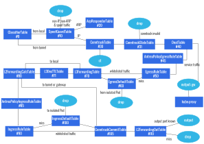

# Antrea OVS Pipeline

## Terminology

* *Node Route Controller*: the [K8s
  controller](https://kubernetes.io/docs/concepts/architecture/controller/)
  which is part of the Antrea agent and watches for updates to Nodes. When a
  Node is added, it updates the local networking configuration (e.g. configure
  the tunnel to the new Node). When a Node is deleted, it performs the necessary
  clean-ups.
* *peer Node*: this is how we refer to other Nodes in the cluster, to which the
  local Node is connected through a Geneve, VXLAN, GRE, or STT tunnel.
* *Global Virtual MAC*: a virtual MAC address which is used as the destination
  MAC for all tunnelled traffic across all Nodes. This simplifies networking by
  enabling all Nodes to use this MAC address instead of the actual MAC address
  of the appropriate remote gateway. This enables each vSwitch to act as a
  "proxy" for the local gateway when receiving tunnelled traffic and directly
  take care of the packet forwarding. At the moment, we use an hard-coded value
  of aa:bb:cc:dd:ee:ff.
* *Antrea-native Policies*: Antrea ClusterNetworkPolicy and Antrea NetworkPolicy
  CRDs, as documented [here](../antrea-network-policy.md).
* *`normal` action*: OpenFlow defines this action to submit a packet to "the
  traditional non-OpenFlow pipeline of the switch". That is, if a flow uses this
  action, then the packets in the flow go through the switch in the same way
  that they would if OpenFlow was not configured on the switch. Antrea uses this
  action to process ARP traffic as a regular learning L2 switch would.
* *table-miss flow entry*: a "catch-all" entry in a OpenFlow table, which is
  used if no other flow is matched. If the table-miss flow entry does not exist,
  by default packets unmatched by flow entries are dropped (discarded).
* *conjunctive match fields*: an efficient way in OVS to implement conjunctive
  matches, that is a match for which we have multiple fields, each one with a
  set of acceptable values. See [OVS
  fields](http://www.openvswitch.org/support/dist-docs/ovs-fields.7.txt) for
  more information.
* *conntrack*: a connection tracking module that can be used by OVS to match on
  the state of a TCP, UDP, ICMP, etc., connection. See the [OVS Conntrack
  tutorial](http://docs.openvswitch.org/en/latest/tutorials/ovs-conntrack/) for
  more information.
* *dmac table*: a traditional L2 switch has a "dmac" table which maps
  learned destination MAC address to the appropriate egress port. It is often
  the same physical table as the "smac" table (which matches on the source MAC
  address and initiate MAC learning if the address is unknown).

**This document currently makes the following assumptions:**

* Antrea is used in encap mode (an overlay network is created between all Nodes)
* AntreaProxy is disabled
* All the Nodes are Linux Nodes

## Dumping the Flows

This guide includes a representative flow dump for every table in the pipeline,
in order to illustrate the function of each table. If you have a cluster running
Antrea, you can dump the flows for a given Node as follows:

```bash
kubectl exec -n kube-system <ANTREA_AGENT_POD_NAME> -c antrea-ovs -- ovs-ofctl dump-flows <BRIDGE_NAME> [--no-stats] [--names]
```

where `<ANTREA_AGENT_POD_NAME>` is the name of the Antrea Agent Pod running on
that Node and `<BRIDGE_NAME>` is the name of the bridge created by Antrea
(`br-int` by default).

## Registers

We use 2 32-bit OVS registers to carry information throughout the pipeline:

* reg0 (NXM_NX_REG0):
  - bits [0..15] are used to store the traffic source (from tunnel: 0, from
    local gateway: 1, from local Pod: 2). It is set in the [ClassifierTable].
  - bit 16 is used to indicate whether the destination MAC address of a packet
    is "known", i.e. corresponds to an entry in [L2ForwardingCalcTable], which
    is essentially a "dmac" table.
* reg1 (NXM_NX_REG1): it is used to store the egress OF port for the packet. It
  is set by [DNATTable] for traffic destined to services and by
  [L2ForwardingCalcTable] otherwise. It is consumed by [L2ForwardingOutTable] to
  output each packet to the correct port.

## Network Policy Implementation

Several tables of the pipeline are dedicated to [K8s Network
Policy](https://kubernetes.io/docs/concepts/services-networking/network-policies/)
implementation ([EgressRuleTable], [EgressDefaultTable], [IngressRuleTable] and
[IngressDefaultTable]).

The Antrea implementation of K8s Network Policy, including the communication
channel between the Controller and Agents, and how a Network Policy is mapped to
OVS flows at each Node, will be described in details in a separate document. For
the present document, we will use the Network Policy example below, and explain
how these simple ingress and egress rules map to individual flows as we describe
the relevant tables of our pipeline.

```yaml
apiVersion: networking.k8s.io/v1
kind: NetworkPolicy
metadata:
  name: test-network-policy
  namespace: default
spec:
  podSelector:
    matchLabels:
      app: nginx
  policyTypes:
  - Ingress
  - Egress
  ingress:
  - from:
    - podSelector:
        matchLabels:
          app: nginx
    ports:
    - protocol: TCP
      port: 80
  egress:
  - to:
    - podSelector:
        matchLabels:
          app: nginx
    ports:
    - protocol: TCP
      port: 80
```

This Network Policy is applied to all Pods with the `nginx` app label in the
`default` namespace. For these Pods, it only allows TCP traffic on port 80 from
and to Pods which also have the `nginx` app label. Because Antrea will only
install OVS flows for this Network Policy on Nodes for which some of the Pods
are the target of the policy, we have scheduled 2 `nginx` Pods on the same
Node. They received IP addresses 10.10.1.2 and 10.10.1.3 from the Antrea CNI, so
you will see these addresses show up in the OVS flows.

## Antrea-native Policies Implementation

In addition to the above tables created for K8s NetworkPolicy, Antrea creates
additional dedicated tables to support the [Antrea-native policies](../antrea-network-policy.md)
([AntreaPolicyEgressRuleTable] and [AntreaPolicyIngressRuleTable]).

Consider the following Antrea ClusterNetworkPolicy (ACNP) in the Application tier as an
example for the remainder of this document.

```yaml
apiVersion: security.antrea.tanzu.vmware.com/v1alpha1
kind: ClusterNetworkPolicy
metadata:
  name: cnp0
spec:
  priority: 10
  tier: application # defaults to application tier if not specified
  appliedTo:
    - podSelector:
        matchLabels:
          app: server
  ingress:
    - action: Drop
      from:
        - podSelector:
            matchLabels:
              app: notClient
      ports:
        - protocol: TCP
          port: 80
  egress:
    - action: Allow
      to:
        - podSelector:
            matchLabels:
              app: dns
      ports:
        - protocol: UDP
          port: 53
```

This ACNP is applied to all Pods with the `app: server` label in all
Namespaces. For these Pods, it drops TCP traffic on port 80 from all
Pods which have the `app: notClient` label. In addition to the ingress rules,
this policy also allows egress UDP traffic on port 53 to all Pods with the
label `app: dns`. Similar to K8s NetworkPolicy, Antrea will only install OVS
flows for this ACNP on Nodes for which some of the Pods are the target of the
policy. Thus, we have scheduled three Pods (appServer, appDns, appNotClient)
on the same Node and they have the following IP addresses:

- appServer: 10.10.1.6
- appNotClient: 10.10.1.7
- appDns: 10.10.1.8

## Tables



### ClassifierTable (0)

This table is used to determine which "category" of traffic (tunnel, local
gateway or local Pod) the packet belongs to. This is done by matching on the
ingress port for the packet. The appropriate value is then written to bits
[0..15] of the NXM_NX_REG0 register: 0 for tunnel, 1 for local gateway and 2 for
local Pod. This information is used by matches in subsequent tables.

If you dump the flows for this table, you may see the following:

```text
1. table=0, priority=200,in_port=antrea-gw0 actions=load:0x1->NXM_NX_REG0[0..15],goto_table:10
2. table=0, priority=200,in_port=antrea-tun0 actions=load:0->NXM_NX_REG0[0..15],goto_table:30
3. table=0, priority=190,in_port="coredns5-8ec607" actions=load:0x2->NXM_NX_REG0[0..15],goto_table:10
4. table=0, priority=190,in_port="coredns5-9d9530" actions=load:0x2->NXM_NX_REG0[0..15],goto_table:10
5. table=0, priority=0 actions=drop
```

Flow 1 is for traffic coming in on the local gateway. Flow 2 is for traffic
coming in through an overlay tunnel (i.e. from another Node). The next two
flows (3 and 4) are for local Pods (in this case Pods from the coredns
deployment).

Local traffic then goes to [SpoofGuardTable], while tunnel traffic from other
Nodes goes to [ConntrackTable]. The table-miss flow entry will drop all
unmatched packets (in practice this flow entry should almost never be used).

### SpoofGuardTable (10)

This table prevents IP and ARP
[spoofing](https://en.wikipedia.org/wiki/Spoofing_attack) from local Pods. For
each Pod (as identified by the ingress port), we ensure that:

* for IP traffic, the source IP and MAC addresses are correct, i.e. match the
  values configured on the interface when Antrea set-up networking for the Pod.
* for ARP traffic, the advertised IP and MAC addresses are correct, i.e. match
  the values configured on the interface when Antrea set-up networking for the
  Pod.

Because Antrea currently relies on kube-proxy to load-balance traffic destined
to services, implementing that kind of IP spoofing check for traffic coming-in
on the local gateway port is not as trivial. Traffic from local Pods destined to
services will first go through the gateway, get load-balanced by the kube-proxy
datapath (DNAT) then sent back through the gateway. This means that legitimate
traffic can be received on the gateway port with a source IP belonging to a
local Pod. We may add some fine-grained rules in the future to accommodate for
this, but for now we just allow all IP traffic received from the gateway. We do
have an ARP spoofing check for the gateway however, since there is no reason for
the host to advertise a different MAC address on antrea-gw0.

If you dump the flows for this table, you may see the following:

```text
1. table=10, priority=200,ip,in_port=antrea-gw0 actions=goto_table:30
2. table=10, priority=200,arp,in_port=antrea-gw0,arp_spa=10.10.0.1,arp_sha=e2:e5:a4:9b:1c:b1 actions=goto_table:20
3. table=10, priority=200,ip,in_port="coredns5-8ec607",dl_src=12:9e:a6:47:d0:70,nw_src=10.10.0.2 actions=goto_table:30
4. table=10, priority=200,ip,in_port="coredns5-9d9530",dl_src=ba:a8:13:ca:ed:cf,nw_src=10.10.0.3 actions=goto_table:30
5. table=10, priority=200,arp,in_port="coredns5-8ec607",arp_spa=10.10.0.2,arp_sha=12:9e:a6:47:d0:70 actions=goto_table:20
6. table=10, priority=200,arp,in_port="coredns5-9d9530",arp_spa=10.10.0.3,arp_sha=ba:a8:13:ca:ed:cf actions=goto_table:20
7. table=10, priority=0 actions=drop
```

After this table, ARP traffic goes to [ARPResponderTable], while IP
traffic goes to [ConntrackTable]. Traffic which does not match
any of the rules described above will be dropped by the table-miss flow entry.

### ARPResponderTable (20)

The main purpose of this table is to reply to ARP requests from the local
gateway asking for the MAC address of a remote peer gateway (another Node's
gateway). This ensures that the local Node can reach any remote Pod, which in
particular is required for service traffic which has been load-balanced to a
remote Pod backend by kube-proxy. Note that the table is programmed to reply to
such ARP requests with a "Global Virtual MAC" ("Global" because it is used by
all Antrea OVS bridges), and not with the actual MAC address of the remote
gateway. This ensures that once the traffic is received by the remote OVS
bridge, it can be directly forwarded to the appropriate Pod without actually
going through the gateway. The Virtual MAC is used as the destination MAC
address for all the traffic being tunnelled.

If you dump the flows for this table, you may see the following:

```text
1. table=20, priority=200,arp,arp_tpa=10.10.1.1,arp_op=1 actions=move:NXM_OF_ETH_SRC[]->NXM_OF_ETH_DST[],mod_dl_src:aa:bb:cc:dd:ee:ff,load:0x2->NXM_OF_ARP_OP[],move:NXM_NX_ARP_SHA[]->NXM_NX_ARP_THA[],load:0xaabbccddeeff->NXM_NX_ARP_SHA[],move:NXM_OF_ARP_SPA[]->NXM_OF_ARP_TPA[],load:0xa0a0101->NXM_OF_ARP_SPA[],IN_PORT
2. table=20, priority=190,arp actions=NORMAL
3. table=20, priority=0 actions=drop
```

Flow 1 is the "ARP responder" for the peer Node whose local Pod subnet is
10.10.1.0/24. If we were to look at the routing table for the local Node, we
would see the following "onlink" route:

```text
10.10.1.0/24 via 10.10.1.1 dev antrea-gw0 onlink
```

A similar route is installed on the gateway (antrea-gw0) interface every time the
Antrea Node Route Controller is notified that a new Node has joined the
cluster. The route must be marked as "onlink" since the kernel does not have a
route to the peer gateway 10.10.1.1: we trick the kernel into believing that
10.10.1.1 is directly connected to the local Node, even though it is on the
other side of the tunnel.

Flow 2 ensures that OVS handle the remainder of ARP traffic as a regular L2
learning switch (using the `normal` action). In particular, this takes care of
forwarding ARP requests and replies between local Pods.

The table-miss flow entry (flow 3) will drop all other packets. This flow should
never be used because only ARP traffic should go to this table, and
ARP traffic will either match flow 1 or flow 2.

### ConntrackTable (30)

The sole purpose of this table is to invoke the `ct` action on all packets and
set the `ct_zone` (connection tracking context) to an hard-coded value, then
forward traffic to [ConntrackStateTable]. If you dump the flows for this table,
you should only see 1 flow:

```text
1. table=30, priority=200,ip actions=ct(table=31,zone=65520)
```

A `ct_zone` is simply used to isolate connection tracking rules. It is similar
in spirit to the more generic Linux network namespaces, but `ct_zone` is
specific to conntrack and has less overhead.

After invoking the ct action, packets will be in the "tracked" (`trk`) state and
all [connection tracking
fields](http://www.openvswitch.org//support/dist-docs/ovs-fields.7.txt) will be
set to the correct value. Packets will then move on to [ConntrackStateTable].

Refer to [this
document](http://docs.openvswitch.org/en/latest/tutorials/ovs-conntrack/) for
more information on connection tracking in OVS.

### ConntrackStateTable (31)

This table handles all "tracked" packets (all packets are moved to the tracked
state by the previous table, [ConntrackTable]). It serves the following
purposes:

* keeps track of connections initiated through the gateway port, i.e. for which
  the first packet of the connection (SYN packet for TCP) was received through
  the gateway. For all reply packets belonging to such connections we overwrite
  the destination MAC to the local gateway MAC to ensure that they get forwarded
  though the gateway port. This is required to handle the following cases:
  - reply traffic for connections from a local Pod to a ClusterIP Service, which
    are handled by kube-proxy and go through DNAT. In this case the destination
    IP address of the reply traffic is the Pod which initiated the connection to
    the Service (no SNAT by kube-proxy). We need to make sure that these packets
    are sent back through the gateway so that the source IP can be rewritten to
    the ClusterIP ("undo" DNAT). If we do not use connection tracking and do not
    rewrite the destination MAC, reply traffic from the backend will go directly
    to the originating Pod without going first through the gateway and
    kube-proxy.  This means that the reply traffic will arrive at the
    originating Pod with the incorrect source IP (it will be set to the
    backend's IP instead of the service IP).
  - when hair-pinning is involved, i.e. for connections between 2 local Pods and
    for which NAT is performed. One example is a Pod accessing a NodePort
    Service for which `externalTrafficPolicy` is set to `Local` using the local
    Node's IP address, as there will be no SNAT for such traffic. Another
    example could be `hostPort` support, depending on how the feature is
    implemented.
* drop packets reported as invalid by conntrack

If you dump the flows for this table, you should see the following:

```text
1. table=31, priority=210,ct_state=-new+trk,ct_mark=0x20,ip,reg0=0x1/0xffff actions=goto_table:40
2. table=31, priority=200,ct_state=+inv+trk,ip actions=drop
3. table=31, priority=200,ct_state=-new+trk,ct_mark=0x20,ip actions=mod_dl_dst:e2:e5:a4:9b:1c:b1,goto_table:40
4. table=31, priority=0 actions=goto_table:40
```

Flows 1 and 3 implement the destination MAC rewrite described above. Note that
at this stage we have not committed any connection yet. We commit all
connections after enforcing Network Policies, in [ConntrackCommitTable]. This is
also when we set the `ct_mark` to `0x20` for connections initiated through the
gateway.

Flow 2 drops invalid traffic. All non-dropped traffic finally goes to the
[DNATTable].

### DNATTable (40)

At the moment this table's only job is to send traffic destined to services
through the local gateway, without any modifications. kube-proxy will then take
care of load-balancing the connections across the different backends for each
service.

If you dump the flows for this table, you should see something like this:

```text
1. table=40, priority=200,ip,nw_dst=10.96.0.0/12 actions=load:0x2->NXM_NX_REG1[],load:0x1->NXM_NX_REG0[16],goto_table:105
2. table=40, priority=0 actions=goto_table:45
```

In the example above, 10.96.0.0/12 is the service CIDR (this is the default
value used by `kubeadm init`). This flow is not actually required for
forwarding, but to bypass [EgressRuleTable] and [EgressDefaultTable] for service
traffic on its way to kube-proxy through the gateway. If we omitted this flow,
such traffic would be unconditionally dropped if a Network Policy is applied on
the originating Pod. For such traffic, we instead enforce Network Policy egress
rules when packets come back through the gateway and the destination IP has been
rewritten by kube-proxy (DNAT to a backend for the service). We cannot output
the service traffic to the gateway port directly as we haven't committed the
connection yet; instead we store the port in NXM_NX_REG1 - similarly to how we
process non-service traffic in [L2ForwardingCalcTable] - and forward it to
[ConntrackCommitTable]. By committing the connection we ensure that reply
traffic (traffic from the service backend which has already gone through
kube-proxy for source IP rewrite) will not be dropped because of Network
Policies.

The table-miss flow entry (flow 2) for this table forwards all non-service
traffic to the next table, [EgressRuleTable].

In the future this table may support an additional mode of operations, in which
it will implement kube-proxy functionality and take care of performing
load-balancing / DNAT on traffic destined to services.

### AntreaPolicyEgressRuleTable (45)

For this table, you will need to keep in mind the ACNP
[specification](#antrea-networkpolicy-crd-implementation)
that we are using.

This table is used to implement the egress rules across all Antrea-native policies,
except for policies that are created in the Baseline Tier. Antrea-native policies
created in the Baseline Tier will be enforced after K8s NetworkPolicies, and their
egress rules are installed in the [EgressDefaultTable] and [EgressRuleTable]
respectively, i.e.

```text
Baseline Tier     ->  EgressDefaultTable(60)
K8s NetworkPolicy ->  EgressRuleTable(50)
All other Tiers   ->  AntreaPolicyEgressRuleTable(45)
```

Since the example ACNP resides in the Application tier, if you dump the flows for
table 45, you should see something like this:

```text
1. table=45, priority=64990,ct_state=-new+est,ip actions=resubmit(,61)
2. table=45, priority=14000,conj_id=1,ip actions=load:0x1->NXM_NX_REG5[],ct(commit,table=61,zone=65520,exec(load:0x1->NXM_NX_CT_LABEL[32..63]))
3. table=45, priority=14000,ip,nw_src=10.10.1.6 actions=conjunction(1,1/3)
4. table=45, priority=14000,ip,nw_dst=10.10.1.8 actions=conjunction(1,2/3)
5. table=45, priority=14000,udp,tp_dst=53 actions=conjunction(1,3/3)
6. table=45, priority=0 actions=resubmit(,50)
```

Similar to [K8s NetworkPolicy implementation](#egressruletable-50),
AntreaPolicyEgressRuleTable also relies on the OVS built-in `conjunction` action to
implement policies efficiently.

The above example flows read as follow: if the source IP address is in set
{10.10.1.6}, and the destination IP address is in the set {10.10.1.8}, and the
destination TCP port is in the set {53}, then use the `conjunction` action with
id 1, which stores the `conj_id` 1 in `ct_label[32..63]` for egress metrics collection
purposes, and forwards the packet to EgressMetricsTable, then [L3ForwardingTable].
Otherwise, go to [EgressRuleTable] if no conjunctive flow above priority 0 is matched.
This corresponds to the case where the packet is not matched by any of the Antrea-native
policy egress rules in any tier (except for the "baseline" tier).

If the `conjunction` action is matched, packets are "allowed" or "dropped"
based on the `action` field of the policy rule. If allowed, they follow a similar
path as described in the following [EgressRuleTable] section.

Unlike the default of K8s NetworkPolicies, Antrea-native policies have no such
default rules. Hence, they are evaluated as-is, and there is no need for a
AntreaPolicyEgressDefaultTable.

### EgressRuleTable (50)

For this table, you will need to keep mind the Network Policy
[specification](#network-policy-implementation) that we are using. We have 2
Pods running on the same Node, with IP addresses 10.10.1.2 to 10.10.1.3. They
are allowed to talk to each other using TCP on port 80, but nothing else.

This table is used to implement the egress rules across all Network Policies. If
you dump the flows for this table, you should see something like this:

```text
1. table=50, priority=210,ct_state=-new+est,ip actions=goto_table:70
2. table=50, priority=200,ip,nw_src=10.10.1.2 actions=conjunction(2,1/3)
3. table=50, priority=200,ip,nw_src=10.10.1.3 actions=conjunction(2,1/3)
4. table=50, priority=200,ip,nw_dst=10.10.1.2 actions=conjunction(2,2/3)
5. table=50, priority=200,ip,nw_dst=10.10.1.3 actions=conjunction(2,2/3)
6. table=50, priority=200,tcp,tp_dst=80 actions=conjunction(2,3/3)
7. table=50, priority=190,conj_id=2,ip actions=load:0x2->NXM_NX_REG5[],ct(commit,table=61,zone=65520,exec(load:0x2->NXM_NX_CT_LABEL[32..63]))
8. table=50, priority=0 actions=goto_table:60
```

Notice how we use the OVS built-in `conjunction` action to implement policies
efficiently. This enables us to do a conjunctive match across multiple
dimensions (source IP, destination IP, port) efficiently without "exploding" the
number of flows. By definition of a conjunctive match, we have at least 2
dimensions. For our use-case we have at most 3 dimensions.

The only requirements on `conj_id` is for it to be a unique 32-bit integer
within the table. At the moment we use a single custom allocator, which is
common to all tables that can have NetworkPolicy flows installed (45, 50,
60, 85, 90 and 100). This is why `conj_id` is set to 2 in the above example
(1 was allocated for the egress rule of our Antrea-native NetworkPolicy example
in the previous section).

The above example flows read as follow: if the source IP address is in set
{10.10.1.2, 10.10.1.3}, and the destination IP address is in the set {10.10.1.2,
10.10.1.3}, and the destination TCP port is in the set {80}, then use the
`conjunction` action with id 2, which goes to EgressMetricsTable, and then
[L3ForwardingTable]. Otherwise, packet goes to [EgressDefaultTable].

If the Network Policy specification includes exceptions (`except` field), then
the table will include multiple flows with conjunctive match, corresponding to
each CIDR that is present in `from` or `to` fields, but not in `except` field.
Network Policy implementation details are not covered in this document.

If the `conjunction` action is matched, packets are "allowed" and forwarded
directly to [L3ForwardingTable]. Other packets go to [EgressDefaultTable]. If a
connection is established - as a reminder all connections are committed in
[ConntrackCommitTable] - its packets go straight to [L3ForwardingTable], with no
other match required (see flow 1 above, which has the highest priority). In
particular, this ensures that reply traffic is never dropped because of a
Network Policy rule. However, this also means that ongoing connections are not
affected if the K8s Network Policies are updated.

One thing to keep in mind is that for service traffic, these rules are applied
after the packets have gone through the local gateway and through kube-proxy. At
this point the ingress port is no longer the Pod port, but the local gateway
port. Therefore we cannot use the port as the match condition to identify if the
Pod has been applied a Network Policy - which is what we do for the
[IngressRuleTable] -, but instead have to use the source IP address.

### EgressDefaultTable (60)

This table complements [EgressRuleTable] for Network Policy egress rule
implementation. In K8s, when a Network Policy is applied to a set of Pods, the
default behavior for these Pods become "deny" (it becomes an [isolated Pod](
https://kubernetes.io/docs/concepts/services-networking/network-policies/#isolated-and-non-isolated-pods)).
This table is in charge of dropping traffic originating from Pods to which a Network
Policy (with an egress rule) is applied, and which did not match any of the
whitelist rules.

Accordingly, based on our Network Policy example, we would expect to see flows
to drop traffic originating from our 2 Pods (10.10.1.2 and 10.10.1.3), which is
confirmed by dumping the flows:

```text
1. table=60, priority=200,ip,nw_src=10.10.1.2 actions=drop
2. table=60, priority=200,ip,nw_src=10.10.1.3 actions=drop
3. table=60, priority=0 actions=goto_table:61
```

This table is also used to implement Antrea-native policy egress rules that are
created in the Baseline Tier. Since the Baseline Tier is meant to be enforced
after K8s NetworkPolicies, the corresponding flows will be created at a lower
priority than K8s default drop flows. For example, a baseline rule to drop
egress traffic to 10.0.10.0/24 will for a namespace will look like the following:

```text
1. table=60, priority=80,ip,nw_src=10.10.1.11 actions=conjunction(5,1/2)
2. table=60, priority=80,ip,nw_src=10.10.1.10 actions=conjunction(5,1/2)
3. table=60, priority=80,ip,nw_dst=10.0.10.0/24 actions=conjunction(5,2)
4. table=60, priority=80,conj_id=5,ip actions=load:0x3->NXM_NX_REG5[],load:0x1->NXM_NX_REG0[20],resubmit(,61)
```

The table-miss flow entry, which is used for non-isolated Pods, forwards
traffic to the next table EgressMetricsTable, then ([L3ForwardingTable]).

### L3ForwardingTable (70)

This is the L3 routing table. It implements the following functionality:

* Tunnelled traffic coming-in from a peer Node and destined to a local Pod is
  directly forwarded to the Pod. This requires setting the source MAC to the MAC
  of the local gateway interface and setting the destination MAC to the Pod's
  MAC address. Then the packets will go to [L3DecTTLTable] for decrementing
  the IP TTL value. Such traffic is identified by matching on the packet's
  destination MAC address (should be set to the Global Virtual MAC for all
  tunnelled traffic) and its destination IP address (should match the IP address
  of a local Pod). We therefore install one flow for each Pod created locally on
  the Node. For example:

```text
table=70, priority=200,ip,dl_dst=aa:bb:cc:dd:ee:ff,nw_dst=10.10.0.2 actions=mod_dl_src:e2:e5:a4:9b:1c:b1,mod_dl_dst:12:9e:a6:47:d0:70,goto_table:71
```

* All tunnelled traffic destined to the local gateway (i.e. for which the
  destination IP matches the local gateway's IP) is forwarded to the gateway
  port by rewriting the destination MAC (from the Global Virtual MAC to the
  local gateway's MAC).

```text
table=70, priority=200,ip,dl_dst=aa:bb:cc:dd:ee:ff,nw_dst=10.10.0.1 actions=mod_dl_dst:e2:e5:a4:9b:1c:b1,goto_table:80
```

* All traffic destined to a remote Pod is forwarded through the appropriate
  tunnel. This means that we install one flow for each peer Node, each one
  matching the destination IP address of the packet against the Pod subnet for
  the Node. In case of a match the source MAC is set to the local gateway MAC,
  the destination MAC is set to the Global Virtual MAC and we set the OF
  `tun_dst` field to the appropriate value (i.e. the IP address of the remote
  gateway). Traffic then goes to [L3DecTTLTable].
  For a given peer Node, the flow may look like this:

```text
table=70, priority=200,ip,nw_dst=10.10.1.0/24 actions=mod_dl_src:e2:e5:a4:9b:1c:b1,mod_dl_dst:aa:bb:cc:dd:ee:ff,load:0x1->NXM_NX_REG1[],load:0x1->NXM_NX_REG0[16],load:0xc0a84d65->NXM_NX_TUN_IPV4_DST[],goto_table:71
```

If none of the flows described above are hit, traffic goes directly to
[L2ForwardingCalcTable]. This is the case for external traffic, whose
destination is outside the cluster (such traffic has already been
forwarded to the local gateway by the local source Pod, and only L2 switching
is required), as well as for local Pod-to-Pod traffic.

```text
table=70, priority=0 actions=goto_table:80
```

### L3DecTTLTable (71)

This is the table to decrement TTL for the IP packets destined to remote Nodes
through a tunnel, or the IP packets received from a tunnel. But for the packets
that enter the OVS pipeline from the local gateway and are destined to a remote
Node, TTL should not be decremented in OVS on the source Node, because the host
IP stack should have already decremented TTL if that is needed.

If you dump the flows for this table, you should see flows like the following:

```text
1. table=71, priority=210,ip,reg0=0x1/0xffff, actions=goto_table:80
2. table=71, priority=200,ip, actions=dec_ttl,goto_table:80
3. table=71, priority=0, actions=goto_table:80
```

The first flow is to bypass the TTL decrement for the packets from the gateway
port.

### L2ForwardingCalcTable (80)

This is essentially the "dmac" table of the switch. We program one flow for each
port (tunnel port, gateway port, and local Pod ports), as you can see if you
dump the flows:

```text
1. table=80, priority=200,dl_dst=aa:bb:cc:dd:ee:ff actions=load:0x1->NXM_NX_REG1[],load:0x1->NXM_NX_REG0[16],goto_table:105
2. table=80, priority=200,dl_dst=e2:e5:a4:9b:1c:b1 actions=load:0x2->NXM_NX_REG1[],load:0x1->NXM_NX_REG0[16],goto_table:105
3. table=80, priority=200,dl_dst=12:9e:a6:47:d0:70 actions=load:0x3->NXM_NX_REG1[],load:0x1->NXM_NX_REG0[16],goto_table:90
4. table=80, priority=200,dl_dst=ba:a8:13:ca:ed:cf actions=load:0x4->NXM_NX_REG1[],load:0x1->NXM_NX_REG0[16],goto_table:90
5. table=80, priority=0 actions=goto_table:105
```

For each port flow (1 through 5 in the example above), we set bit 16 of the
NXM_NX_REG0 register to indicate that there was a matching entry for the
destination MAC address and that the packet must be forwarded. In the last table
of the pipeline ([L2ForwardingOutTable]), we will drop all packets for which
this bit is not set. We also use the NXM_NX_REG1 register to store the egress
port for the packet, which will be used as a parameter to the `output` OpenFlow
action in [L2ForwardingOutTable].

The packets that match local Pods' MAC entries will go to the first table
([AntreaPolicyIngressRuleTable] when AntreaPolicy is enabled, or
[IngressRuleTable] when AntreaPolicy is not enabled) for NetworkPolicy ingress
rules. Other packets will go to [ConntrackCommitTable]. Specifically, packets
to the gateway port or the tunnel port will also go to [ConntrackCommitTable]
and bypass the NetworkPolicy ingress rule tables, as NetworkPolicy ingress rules
are not enforced for these packets on the source Node.

What about L2 multicast / broadcast traffic? ARP requests will never reach this
table, as they will be handled by the OpenFlow `normal` action in the
[ArpResponderTable]. As for the rest, if it is IP traffic, it will hit the
"last" flow in this table and go to [ConntrackCommitTable]; and finally the last
table of the pipeline ([L2ForwardingOutTable]), and get dropped there since bit
16 of the NXM_NX_REG0 will not be set. Traffic which is non-ARP and non-IP
(assuming any can be received by the switch) is actually dropped much earlier in
the pipeline ([SpoofGuardTable]). In the future, we may need to support more
cases for L2 multicast / broadcast traffic.

### AntreaPolicyIngressRuleTable (85)

This table is very similar to [AntreaPolicyEgressRuleTable], but implements
the ingress rules of Antrea-native Policies. Depending on the tier to which the policy
belongs to, the rules will be installed in a table corresponding to that tier.
The ingress table to tier mappings is as follows:

```text
Baseline Tier     ->  IngressDefaultTable(100)
K8s NetworkPolicy ->  IngressRuleTable(90)
All other Tiers   ->  AntreaPolicyIngressRuleTable(85)
```

Again for this table, you will need to keep in mind the ACNP
[specification](#antrea-networkpolicy-crd-implementation) that we are using.
Since the example ACNP resides in the Application tier, if you dump the flows
for table 85, you should see something like this:

```text
1. table=85, priority=64990,ct_state=-new+est,ip actions=resubmit(,105)
2. table=85, priority=14000,conj_id=4,ip actions=load:0x4->NXM_NX_REG3[],load:0x1->NXM_NX_REG0[20],resubmit(,101)
3. table=85, priority=14000,ip,nw_src=10.10.1.7 actions=conjunction(4,1/3)
4. table=85, priority=14000,ip,reg1=0x19c actions=conjunction(4,2/3)
5. table=85, priority=14000,tcp,tp_dst=80 actions=conjunction(4,3/3)
6. table=85, priority=0 actions=resubmit(,90)
```

As for [AntreaPolicyEgressRuleTable], flow 1 (highest priority) ensures that for
established connections packets go straight to IngressMetricsTable,
then [L2ForwardingOutTable], with no other match required.

The rest of the flows read as follows: if the source IP address is in set
{10.10.1.7}, and the destination OF port is in the set {412} (which
correspond to IP addresses {10.10.1.6}), and the destination TCP port
is in the set {80}, then use `conjunction` action with id 4, which loads
the `conj_id` 4 into NXM_NX_REG3, a register used by Antrea internally to
indicate the disposition of the packet is Drop, and forward the packet to
IngressMetricsTable for it to be dropped.

Otherwise, go to [IngressRuleTable] if no conjunctive flow above priority 0 is matched.
This corresponds to the case where the packet is not matched by any of the Antrea-native
policy ingress rules in any tier (except for the "baseline" tier).
One notable difference is how we use OF ports to identify the destination of
the traffic, while we use IP addresses in [AntreaPolicyEgressRuleTable] to
identify the source of the traffic. More details regarding this can be found
in the following [IngressRuleTable] section.

As seen in [AntreaPolicyEgressRuleTable], the default action is to evaluate K8s
Network Policy [IngressRuleTable] and a AntreaPolicyIngressDefaultTable does not exist.

### IngressRuleTable (90)

This table is very similar to [EgressRuleTable], but implements ingress rules
for Network Policies. Once again, you will need to keep mind the Network Policy
[specification](#network-policy-implementation) that we are using. We have 2
Pods running on the same Node, with IP addresses 10.10.1.2 to 10.10.1.3. They
are allowed to talk to each other using TCP on port 80, but nothing else.

If you dump the flows for this table, you should see something like this:

```text
1. table=90, priority=210,ct_state=-new+est,ip actions=goto_table:101
2. table=90, priority=210,ip,nw_src=10.10.1.1 actions=goto_table:105
3. table=90, priority=200,ip,nw_src=10.10.1.2 actions=conjunction(3,1/3)
4. table=90, priority=200,ip,nw_src=10.10.1.3 actions=conjunction(3,1/3)
5. table=90, priority=200,ip,reg1=0x3 actions=conjunction(3,2/3)
6. table=90, priority=200,ip,reg1=0x4 actions=conjunction(3,2/3)
7. table=90, priority=200,tcp,tp_dst=80 actions=conjunction(3,3/3)
8. table=90, priority=190,conj_id=3,ip actions=load:0x3->NXM_NX_REG6[],ct(commit,table=101,zone=65520,exec(load:0x3->NXM_NX_CT_LABEL[0..31]))
9. table=90, priority=0 actions=goto_table:100
```

As for [EgressRuleTable], flow 1 (highest priority) ensures that for established
connections - as a reminder all connections are committed in
[ConntrackCommitTable] - packets go straight to IngressMetricsTable,
then [L2ForwardingOutTable], with no other match required.

Flow 2 ensures that traffic from the local gateway cannot be dropped because of
Network Policies. This ensures that K8s [liveness
probes](https://kubernetes.io/docs/tasks/configure-pod-container/configure-liveness-readiness-startup-probes/)
can go through.

The rest of the flows read as follows: if the source IP address is in set
{10.10.1.2, 10.10.1.3}, and the destination OF port is in the set {3, 4} (which
correspond to IP addresses {10.10.1.2, 10.10.1.3}, and the destination TCP port
is in the set {80}, then use `conjunction` action with id 3, which stores the
`conj_id` 3 in `ct_label[0..31]` for egress metrics collection purposes, and forwards
the packet to IngressMetricsTable, then [L2ForwardingOutTable]. Otherwise, go to
[IngressDefaultTable]. One notable difference is how we use OF ports to identify
the destination of the traffic, while we use IP addresses in [EgressRuleTable]
to identify the source of the traffic. We do this as an increased security measure
in case a local Pod is misbehaving and trying to access another local Pod using
the correct destination MAC address but a different destination IP address to bypass
an egress Network Policy rule. This is also why the Network Policy ingress rules
are enforced after the egress port has been determined.

### IngressDefaultTable (100)

This table is similar in its purpose to [EgressDefaultTable], and it complements
[IngressRuleTable] for Network Policy ingress rule implementation. In K8s, when
a Network Policy is applied to a set of Pods, the default behavior for these
Pods become "deny" (it becomes an [isolated
Pod](https://kubernetes.io/docs/concepts/services-networking/network-policies/#isolated-and-non-isolated-pods)). This
table is in charge of dropping traffic destined to Pods to which a Network
Policy (with an ingress rule) is applied, and which did not match any of the
whitelist rules.

Accordingly, based on our Network Policy example, we would expect to see flows
to drop traffic destined to our 2 Pods (3 and 4), which is confirmed by dumping
the flows:

```text
1. table=100, priority=200,ip,reg1=0x3 actions=drop
2. table=100, priority=200,ip,reg1=0x4 actions=drop
3. table=100, priority=0 actions=goto_table:105
```

Similar to the [EgressDefaultTable], this table is also used to implement
Antrea-native policy ingress rules that are created in the Baseline Tier.
Since the Baseline Tier is meant to be enforced after K8s NetworkPolicies, the
corresponding flows will be created at a lower priority than K8s default drop flows.
For example, a baseline rule to isolate ingress traffic for a namespace will look
like the following:

```text
table=100, priority=80,ip,reg1=0xb actions=conjunction(6,2/3)
table=100, priority=80,ip,reg1=0xc actions=conjunction(6,2/3)
table=100, priority=80,ip,nw_src=10.10.1.9 actions=conjunction(6,1/3)
table=100, priority=80,ip,nw_src=10.10.1.7 actions=conjunction(6,1/3)
table=100, priority=80,tcp,tp_dst=8080 actions=conjunction(6,3/3)
table=100, priority=80,conj_id=6,ip actions=load:0x6->NXM_NX_REG3[],load:0x1->NXM_NX_REG0[20],resubmit(,101)
```

The table-miss flow entry, which is used for non-isolated Pods, forwards
traffic to the next table ([ConntrackCommitTable]).

### ConntrackCommitTable (105)

As mentioned before, this table is in charge of committing all new connections
which are not dropped because of Network Policies. If you dump the flows for this
table, you should see something like this:

```text
1. table=105, priority=200,ct_state=+new+trk,ip,reg0=0x1/0xffff actions=ct(commit,table=110,zone=65520,exec(load:0x20->NXM_NX_CT_MARK[]))
2. table=105, priority=190,ct_state=+new+trk,ip actions=ct(commit,table=110,zone=65520)
3. table=105, priority=0 actions=goto_table:110
```

Flow 1 ensures that we commit connections initiated through the gateway
interface and mark them with a `ct_mark` of `0x20`. This ensures that
[ConntrackStateTable] can perform its functions correctly and rewrite the
destination MAC address to the gateway's MAC address for connections which
require it. Such connections include Pod-to-ClusterIP traffic. Note that the
`0x20` mark is applied to *all* connections initiated through the gateway
(i.e. for which the first packet of the connection was received through the
gateway) and that [ConntrackStateTable] will perform the destination MAC address
for the reply traffic of *all* such connections. In some cases (the ones
described for [ConntrackStateTable]), this rewrite is necessary. For others
(e.g. a connection from the host to a local Pod), this rewrite is not necessary
but is also harmless, as the destination MAC is already correct.

Flow 2 commits all other new connections.

All traffic then goes to the next table ([L2ForwardingOutTable]).

### L2ForwardingOutTable (110)

It is a simple table and if you dump the flows for this table, you should only
see 2 flows:

```text
1. table=110, priority=200,ip,reg0=0x10000/0x10000 actions=output:NXM_NX_REG1[]
2. table=110, priority=0, actions=drop
```

The first flow outputs all unicast packets to the correct port (the port was
resolved by the "dmac" table, [L2ForwardingCalcTable]). IP packets for which
[L2ForwardingCalcTable] did not set bit 16 of NXM_NX_REG0 will be dropped.

[ClassifierTable]: #classifiertable-0
[SpoofGuardTable]: #spoofguardtable-10
[ARPResponderTable]: #arprespondertable-20
[ConntrackTable]: #conntracktable-30
[ConntrackStateTable]: #conntrackstatetable-31
[DNATTable]: #dnattable-40
[AntreaPolicyEgressRuleTable]: #antreapolicyegressruletable-45
[EgressRuleTable]: #egressruletable-50
[EgressDefaultTable]: #egressdefaulttable-60
[L3ForwardingTable]: #l3forwardingtable-70
[L3DecTTLTable]: #l3decttltable-71
[L2ForwardingCalcTable]: #l2forwardingcalctable-80
[AntreaPolicyIngressRuleTable]: #antreapolicyingressruletable-85
[IngressRuleTable]: #ingressruletable-90
[IngressDefaultTable]: #ingressdefaulttable-100
[ConntrackCommitTable]: #conntrackcommittable-105
[L2ForwardingOutTable]: #l2forwardingouttable-110
