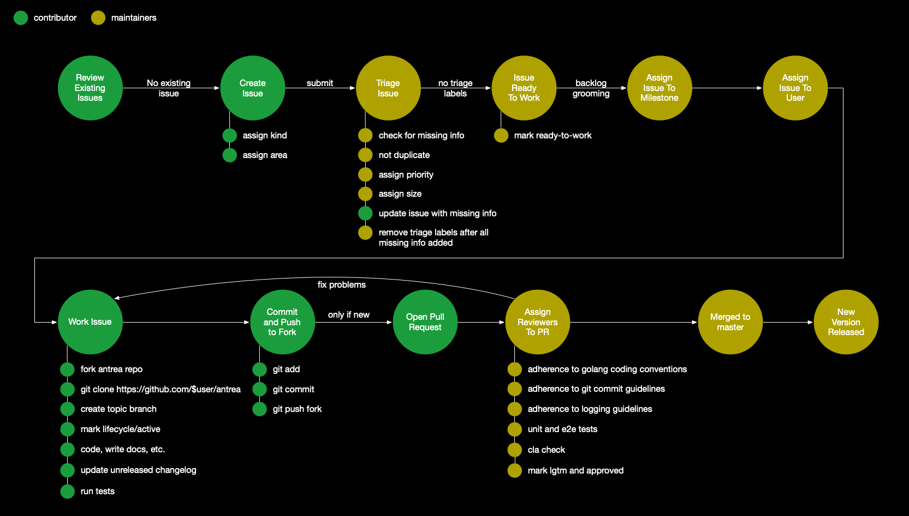

# Issue Management

This document further describes the developer workflow and how issues are
managed as introduced in [CONTRIBUTING.md](../CONTRIBUTING.md). Please read
[CONTRIBUTING.md](../CONTRIBUTING.md) first before proceeding.

- [Issue Management](#issue-management)
  - [Developer Workflow Overview](#developer-workflow-overview)
  - [Creating New Issues and PRs](#creating-new-issues-and-prs)
  - [Good First Issues and Help Wanted](#good-first-issues-and-help-wanted)
  - [Issue and PR Triage Process](#issue-and-pr-triage-process)
    - [Issue Triage](#issue-triage)
    - [PR Triage](#pr-triage)
  - [Working an Issue](#working-an-issue)
  - [Issue and PR Labels](#issue-and-pr-labels)
    - [Issue Kinds](#issue-kinds)
      - [API Change](#api-change)
      - [Bug](#bug)
      - [Cleanup](#cleanup)
      - [Feature](#feature)
      - [Deprecation](#deprecation)
      - [Design](#design)
      - [Documentation](#documentation)
      - [Failing Test](#failing-test)
      - [Support](#support)
    - [Area](#area)
    - [Size](#size)
    - [Triage](#triage)
    - [Lifecycle](#lifecycle)
    - [Priority](#priority)

## Developer Workflow Overview

The purpose of this workflow is to formalize a lightweight set of processes that
will optimize issue triage and management which will lead to better release
predictability and community responsiveness for support and feature
enhancements. Additionally, Antrea must prioritize issues to ensure interlock
alignment and compatibility with other projects including Kubernetes. The
processes described here will aid in accomplishing these goals.

## Creating New Issues and PRs

Creating new issues and PRs is covered in detail in
[CONTRIBUTING.md](../CONTRIBUTING.md).

## Good First Issues and Help Wanted

We use `good first issue` and `help wanted` labels to indicate issues we would
like contribution on. These two labels were borrowed from the Kubernetes project
and represent the same context as described in [Help Wanted and Good First Issue
Labels](https://kubernetes-contributor.netlify.com/guide/help-wanted/).

We do not yet support the automation mentioned in the Kubernetes help guild.

To summarize:

* `good first issue` -- issues intended for first time contributors. Members
  should keep an eye out for these pull requests and shepherd it through our
  processes.
* `help wanted` -- issues that represent clearly laid out tasks that are
  generally tractable for new contributors. The solution has already been
  designed and requires no further discussion from the community. This label
  indicates we need additional contributors to help move this task along.

## Issue and PR Triage Process

When new issues or PRs are created, the maintainers must triage the issue
to ensure the information is valid, complete, and properly categorized and
prioritized.

### Issue Triage

An issue is triaged in the following way:

1. Ensure the issue is not a duplicate. Do a quick search against existing
   issues to determine if the issue has been or is currently being worked on. If
   you suspect the issue is a duplicate, apply the [`triage/duplicate`](#triage) label.
2. Ensure that the issue has captured all the information required for the given
   issue [`kind/<kind>`](#issue-kinds). If information or context is needed, apply the
   `triage/needs-information`.
3. Apply any missing [`area/<area>`](#area) labels. An issue can relate to more
   than one area.
4. Apply a [`priority/<priority>`](#priority) label. This may require further
   discussion during the community meeting if the priority cannot be determined.
   If undetermined, do not apply a priority. Issues with unassigned priorities
   will be selected for review.
5. Apply a [`size/<size>`](#size) label if known. This may require further
   discussion, a research spike or review by the assigned contributor who will
   be working on this issue. This is only an estimate of the complexity and size
   of the issue.

Once an issue has been triaged, a comment should be left for original submitter
to respond to any applied triage labels.

If all triage labels have been addressed and the issue is ready to be worked,
apply the label `ready-to-work` so the issue can be assigned to a milestone and
worked by a contributor.

If it is determined an issue will not be resolved or not fixed, apply the
`triage/unresolved` label and leave a reason in a comment for the original
submitter. Unresolved issues can be closed after giving the original submitter
an opportunity to appeal the reason supplied.

### PR Triage

A PR is triaged in the following way:

1. Automation will ensure that the submitter has signed the [CLA](../CONTRIBUTING.md#cla).
2. Automation will run CI tests against the submission to ensure compliance.
3. Apply [`size/<size>`](#size) label to the submission. (TODO: we plan to
   automate this with a GitHub action and apply size based on lines of code).
4. Ensure that the PR references an existing issue (exceptions to this should be
   rare). If the PR is missing this or needs any additional information, note it
   in the comment and apply the `triage/needs-information` label.
5. The PR should have the same `area/<area>`, `kind/<kind>`, and `lifecycle/<lifecycle>` labels as that of
   the referenced issue. (TODO: we plan to automate this with a GitHub action
   and apply labels automatically)

## Working an Issue

When starting work on an issue, assign the issue to yourself if it has not
already been assigned and apply the `lifecycle/active` label to signal that the
issue is actively being worked on.

Making code changes is covered in detail in
[CONTRIBUTING.md](../CONTRIBUTING.md#github-workflow).

If the issue kind is a `kind/bug`, ensure that the issue can be reproduced. If
not, assign the `triage/not-reproducible` and request feedback from the original
submitter.

## Issue and PR Labels

This section describes the label metadata we use to track issues and PRs. For a
definitive list of all GitHub labels used within this project, please see
[github-labels.md](github-labels.md).

### Issue Kinds

An issue kind describes the kind of contribution being requested or submitted.
In some cases, the kind will also influence how the issue or PR is triaged and
worked.

#### API Change

A `kind/api-change` label categorizes an issue or PR as related to adding, removing,
or otherwise changing an API.

All API changes must be reviewed by maintainers in addition to the standard code
review and approval workflow.

To create an API change issue or PR:

* label your issue or PR with `kind/api-change`
* describe in the issue or PR body which API you are changing, making sure to include
  * API endpoint and schema (endpoint, Version, APIGroup, etc.)
  * Is this a breaking change?
  * Can new or older clients opt-in to this API?
  * Is there a fallback? What are the implications of not supporting this API version?
  * How is an upgrade handled? If automatically, we need to ensure proper tests
    are created. If we require a manual upgrade procedure, this needs to be
    noted so that the release notes and docs can be updated appropriately.

Before starting any work on an API change it is important that you have proper
review and approval from the project maintainers.

#### Bug

A `kind/bug` label categorizes an issue or PR as related to a bug.

Any problem encountered when building, configuring, or running Antrea could be a
potential case for submitting a bug.

To create a bug issue or bug fix PR:

* label your issue or PR with `kind/bug`
* describe your bug in the issue or PR body making sure to include:
  * version of Antrea
  * version of Kubernetes
  * version of OS and any relevant environment or system configuration
  * steps and/or configuration to reproduce the bug
  * any tests that demonstrate the presence of the bug
* please attach any relevant logs or diagnostic output

#### Cleanup

A `kind/cleanup` label categorizes an issue or PR as related to cleaning up
code, process, or technical debt.

To create a cleanup issue or PR:

* label your issue or PR with `kind/cleanup`
* describe your cleanup in the issue or PR body being sure to include
  * what is being cleaned
  * for what reason it is being cleaned (technical debt, deprecation, etc.)

Examples of a cleanup include:
* Adding comments to describe code execution
* Making code easier to read and follow
* Removing dead code related to deprecated features or implementations

#### Feature

A `kind/feature` label categorizes an issue or PR as related to a new feature.

To create a feature issue or PR:

* label your issue or PR with `kind/feature`
* describe your proposed feature in the issue or PR body being sure to include
  * a use case for the new feature
  * list acceptance tests for the new feature
  * describe any dependencies for the new feature
* depending on the size and impact of the feature
  * a design proposal may need to be submitted
  * the feature may need to be discussed in the community meeting

Before you begin work on your feature it is import to ensure that you have
proper review and approval from the project maintainers.

Examples of a new feature include:
* Adding a new set of metrics for enabling additional telemetry.
* Adding additional supported transport layer protocol options for network policy.
* Adding support for IPsec.

#### Deprecation

A `kind/deprecation` label categorizes an issue or PR as related to feature
marked for deprecation.

To create a deprecation issue or PR:

* label your issue or PR with `kind/deprecation`
* title the issue or PR with the feature you are deprecating
* describe the deprecation in the issue or PR body making sure to:
  * explain why the feature is being deprecated
  * discuss time-to-live for the feature and when deprecation will take place
  * discuss any impacts to existing APIs

#### Design

A `kind/design` label categorizes issue or PR as related to design.

A design issue or PR is for discussing larger architectural and design proposals.
Approval of a design proposal may result in multiple additional feature,
api-change, or cleanup issues being created to implement the design.

To create a design issue:

* label your issue or PR with `kind/design`
* describe the design in the issue or PR body

Before creating additional issues or PRs that implement the proposed design it is
important to get feedback and approval from the maintainers. Design feedback
could include some of the following:

* needs additional detail
* no, this problem should be solved in another way
* this is desirable but we need help completing other issues or PRs first; then we will
  consider this design

#### Documentation

A `kind/documentation` label categorizes issue or PR as related to a
documentation.

To create a documentation issue or PR:

* label your issue or PR with `kind/documentation`
* title the issue with a short description of what you are documenting
* provide a brief summary in the issue or PR body of what you are documenting. In some
  cases, it might be useful to include a checklist of changed documentation
  files to indicate your progress.

#### Failing Test

A `kind/failing-test` label categorizes issue or PR as related to a consistently
or frequently failing test.

To create a failing test issue or PR:

* label your issue or PR with `kind/failing-test`

TODO: As more automation is used in the continuous integration pipeline, we will
be able to automatically generate an issue for failing tests.

#### Support

A `kind/support` label categorizes issue as related to a support request.

To create a support issue or PR:

* label your issue or PR with `kind/support`
* title the issue or PR with a short description of your support request
* answer all of the questions in the support issue template
* to provide comprehensive information about your cluster that will be useful in
  identifying and resolving the issue, you may want to consider producing a
  ["support bundle"](antctl.md/#collecting-support-information) and uploading it
  to a publicly-accessible location. **Be aware that the generated support
  bundle includes a lot of information, including logs, so please ensure that
  you do not share anything sensitive.**

### Area

Area labels begin with `area/<area>` and identify areas of interest or functionality
to which an issue relates. An issue or PR could have multiple areas. These labels are
used to sort issues and PRs into categories such as:

* operating systems
* cloud platform, 
* functional area,
* operating or legal area (i.e., licensing), 
* etc.

A list of areas is maintained in [`github-labels.md`](github-labels.md).

An area may be changed, added or deleted during issue or PR triage.

### Size

Size labels begin with `size/<size>` and estimate the relative complexity or work
required to resolve an issue or PR. 

TODO: For submitted PRs, the size can be automatically calculated and the
appropriate label assigned.

Size labels are specified according to lines of code; however, some issues may
not relate to lines of code submission such as documentation. In those cases,
use the labels to apply an equivalent complexity or size to the task at hand.

Size labels include:

* `size/XS` -- denotes a extra small issue, or PR that changes 0-9 lines, ignoring generated files
* `size/S` -- denotes a small issue, or PR that changes 10-29 lines, ignoring generated files
* `size/M` -- denotes a medium issue, or PR that changes 30-99 lines, ignoring generated files
* `size/L` -- denotes a large issue, or PR that changes 100-499 lines, ignoring generated files
* `size/XL` -- denotes a very large issue, or PR that changes 500+ lines, ignoring generated files

Size labels are defined in [`github-labels.md`](github-labels.md).

### Triage

As soon as new issues are submitted, they must be triaged until they are ready to
work. The maintainers may apply the following labels during the issue triage
process:

* `triage/duplicate`  -- indicates an issue is a duplicate of other open issue
* `triage/needs-information` -- indicates an issue needs more information in order to work on it
* `triage/not-reproducible` -- indicates an issue can not be reproduced as described
* `triage/unresolved` -- indicates an issue that can not or will not be resolved

Triage labels are defined in [`github-labels.md`](github-labels.md).

### Lifecycle

To track the state of an issue, the following labels will be assigned.

* `lifecycle/active` -- indicates that an issue or PR is actively being worked on by a contributor
* `lifecycle/frozen` -- indicates that an issue or PR should not be auto-closed due to staleness
* `lifecycle/stale` -- denotes an issue or PR has remained open with no activity and has become stale

The following schedule will be used to determine an issue's lifecycle:

* after 180 days of inactivity, an issue will be automatically marked as `lifecycle/stale`
* after an extra 180 days of inactivity, an issue will be automatically closed
* any issue marked as `lifecycle/frozen` will prevent automatic transitions to
  stale and prevent auto-closure
* commenting on an issue will remove the `lifecycle/stale` label

Issue lifecycle management ensures that the project backlog remains fresh and
relevant. Project maintainers and contributors will need to revisit issues to
periodically assess their relevance and progress.

TODO: Additional CI automation (GitHub actions) will be used to automatically
apply and manage some of these lifecycle labels.

Lifecycle labels are defined in [`github-labels.md`](github-labels.md).

### Priority

A priority label signifies the overall priority that should be given to an
issue or PR. Priorities are considered during backlog grooming and help to
determine the number of features included in a milestone.

* `priority/awaiting-more-evidence` -- lowest priority. Possibly useful, but not yet enough support to actually get it done.
* `priority/backlog` -- higher priority than priority/awaiting-more-evidence.
* `priority/critical-urgent` -- highest priority. Must be actively worked on as someone's top priority right now.
* `priority/important-longterm` -- important over the long term, but may not be staffed and/or may need multiple releases to complete.
* `priority/import-soon` -- must be staffed and worked on either currently, or very soon, ideally in time for the next release.

