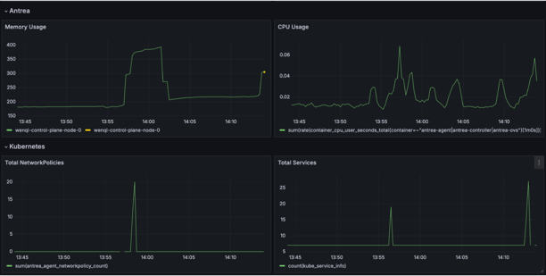

# Introduction

The purpose of this Kubernetes CNI scale testing tool is to evaluate the performance and scalability of
CNI within Kubernetes clusters.

The following sections detail these features and explain how to use the tool.

```shell
Usage of ./bin/antrea-scale:
      --config string              Config file of scale test cases list (default "test/performance/scale.yml")
      --kubeConfigPath string      Path of cluster kubeconfig
      --templateFilesPath string   Template YAML files path of test cases (default "test/performance/assets")
      --timeout int                Timeout limit (minutes) of the whole scale test (default 10)
      --v string                    (default "2")
```

## Scalability

Whether it's a cluster with a single node or hundreds of nodes, you can execute tests with just
a command line.

```shell
make antrea-scale
./bin/antrea-scale --kubeConfigPath=/root/.kube/config --timeout=120 --config=./test/performance/scale.yml
```

## Configurability

You can easily configure the test parameters to meet various testing scenarios through a YAML file.

```yaml
real_node: true
repeat_times: 1
namespace_num: 5
pods_num_per_ns: 10
svc_num_per_ns: 4
np_num_per_ns: 5
skip_deploy_workload: false
teardown: false
scales:
  - name: "ScaleUpWorkloadPods"
    package: "test/performance/framework"
    repeat_times: 1
  - name: "ScaleService"
    package: "test/performance/framework"
    repeat_times: 1
  - name: "ScaleRestartAgent"
    package: "test/performance/framework"
    repeat_times: 1
  - name: "RestartController"
    package: "test/performance/framework"
    repeat_times: 1
  - name: "ScaleNetworkPolicy"
    package: "test/performance/framework"
    repeat_times: 1
```

## Flexibility & Assemblability

The configuration file can be divided into two parts:
the first part controls the scale of the test,

```yaml
real_node: true
repeat_times: 1
namespace_num: 5
pods_num_per_ns: 10
svc_num_per_ns: 4
np_num_per_ns: 5
skip_deploy_workload: false
teardown: false
```

and the second part controls different test cases through the combination and arrangement of
individual test cases.

```yaml
scales:
  - name: "ScaleNetworkPolicy"
    package: "test/performance/framework"
    repeat_times: 1
  - name: "ScaleRestartAgent"
    package: "test/performance/framework"
    repeat_times: 1
```

For example, if we want to test whether the startup speed of the agent is affected after creating
NetworkPolicy on a large scale cluster, we can place "ScaleNetworkPolicy" after "ScaleRestartAgent".

Also, we can control the number of tests by setting the `repeat_times` field.

## Efficient resource utilization(Antrea simulator agent)

A significant concern is that large-scale testing requires a vast amount of cluster resources.
We can use simulated agents to conduct tests to save resources and achieve the goal of scaling
tests with fewer resources.

If we want to test the performance of the Antrea Controller with limited node resources, we can
use the "realNode" parameter. Once disabled, the system will use simulated Antrea agent.
The simulator can watch the Antrea controller just like the real agent does, and it makes us
able to simulate a large number of agents in a smaller number of nodes. It is useful for Antrea
scalability testing, without having to create a very large cluster.

## Multiple platforms(Different CNIs)

Additionally, for some common functional features, it's essential to compare the performance
differences between different CNIs to understand our shortcomings or advantages.
The scale test tool can run tests on different Kubernetes platforms and compare the performance
metrics of different CNIs.

For example, if you want to test the scale performance of other CNIs with the following cases:

```yaml
scales:
  - name: "ScaleUpWorkloadPods"
    package: "test/performance/framework"
    repeat_times: 1
  - name: "ScaleService"
    package: "test/performance/framework"
    repeat_times: 1
  - name: "ScaleNetworkPolicy"
    package: "test/performance/framework"
    repeat_times: 1
```

Note that you should deploy the Kubernetes cluster and CNI firstly then execute the test tool.

## Measure and monitoring

The Antrea scale test tool also integrates monitoring tools, with Prometheus and Grafana,
it's easy to view metrics such as CPU/Memory usage and the number of Pods/Networks during the
testing process.



### deploy monitoring

With just one simple step, by executing a script, you can activate the monitoring system,
providing convenient access to observe the resource consumption and an array of pertinent metrics
across each node within the cluster during the testing phase.

```shell
cd test/performance/monitoring
./deploy.sh --kubeconfig path/to/.kube/config 
```

Then you can access grafana via `http://$ip:3100` with `admin/admin`.
For more information, please refer `./deploy.sh --help`.

## Expanding test cases

Regarding the extensibility of the testing framework, we've designed a model in which test data is
separated from the framework. We expect the scale test tool to make it easy to add test cases
for new features.

You only need to design the test cases, add a separate YAML file, write and register the
test cases.

The detailed steps can be broken down into the following three steps:

1. Add a YAML file in the specified file path: `test/performance/assets`.

2. Write and register the test cases.

3. Configure the test cases to the file and execute the tests.
